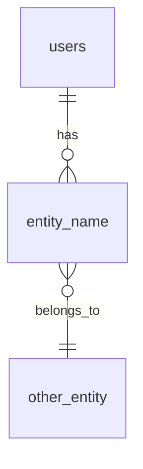

# Data Models

**Database schema specification for {BRAND_NAME}**

## Overview

This document defines the complete database schema including tables, relationships, and Row-Level Security policies.

## Core Tables

### users
Primary user table for authentication and profile data.

```sql
CREATE TABLE users (
  id UUID PRIMARY KEY DEFAULT gen_random_uuid(),
  email TEXT UNIQUE NOT NULL,
  display_name TEXT,
  avatar_url TEXT,
  created_at TIMESTAMPTZ DEFAULT NOW(),
  updated_at TIMESTAMPTZ DEFAULT NOW()
);

-- RLS Policy
ALTER TABLE users ENABLE ROW LEVEL SECURITY;

CREATE POLICY "Users can view own profile"
  ON users FOR SELECT
  USING (auth.uid() = id);

CREATE POLICY "Users can update own profile"
  ON users FOR UPDATE
  USING (auth.uid() = id);
```

### {entity_name}
Description of this entity and its purpose.

```sql
CREATE TABLE {entity_name} (
  id UUID PRIMARY KEY DEFAULT gen_random_uuid(),
  user_id UUID REFERENCES users(id) ON DELETE CASCADE,
  -- Add columns here
  created_at TIMESTAMPTZ DEFAULT NOW(),
  updated_at TIMESTAMPTZ DEFAULT NOW()
);

-- RLS Policy
ALTER TABLE {entity_name} ENABLE ROW LEVEL SECURITY;

CREATE POLICY "Policy description"
  ON {entity_name} FOR SELECT
  USING (/* condition */);
```

## Relationships



## Indexes

```sql
-- Performance indexes
CREATE INDEX idx_entity_user ON {entity_name}(user_id);
CREATE INDEX idx_entity_created ON {entity_name}(created_at DESC);
```

## Migration Strategy

1. Run migrations in order
2. Back-populate data if needed
3. Enable RLS policies after data migration
4. Test with sample queries

## Table Summary

| Table | Purpose | RLS | Indexes |
|-------|---------|-----|---------|
| users | User accounts | Yes | email, id |
| {entity} | Description | Yes | user_id |

---

*Template from Onyx Design System*
