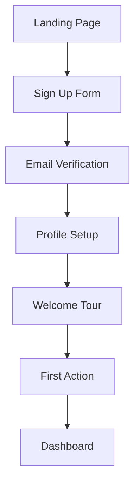
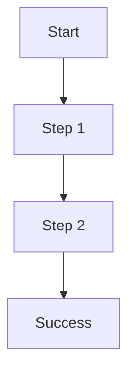

# User Journey Maps

**User flow documentation for {BRAND_NAME}**

## Journey Template

### Journey: {Journey Name}

**User Goal:** What the user wants to accomplish

**Entry Points:**
- Where users start this journey

**Success Criteria:**
- How we know the journey succeeded

---

## Core Journeys

### 1. New User Onboarding

**Goal:** Get new users set up and engaged

**Steps:**

| Step | Screen | User Action | System Response |
|------|--------|-------------|-----------------|
| 1 | Landing | Click "Get Started" | Show sign up form |
| 2 | Sign Up | Enter email/password | Create account, send verification |
| 3 | Verification | Click email link | Verify account, redirect to setup |
| 4 | Profile Setup | Complete profile | Save profile, show tour |
| 5 | Tour | Complete tour | Mark complete, show dashboard |

**Success Metrics:**
- Completion rate: >60%
- Time to complete: <5 minutes
- Drop-off points monitored

---

### 2. {Journey Name}

**Goal:** [User goal]

**Steps:**

| Step | Screen | User Action | System Response |
|------|--------|-------------|-----------------|
| 1 | | | |
| 2 | | | |
| 3 | | | |

---

## Error Paths

### Common Error Scenarios

| Scenario | User Experience | Recovery Path |
|----------|-----------------|---------------|
| Network error | Show retry option | Auto-retry with exponential backoff |
| Validation error | Inline field errors | Clear guidance on fixing |
| Session expired | Redirect to login | Return to previous page after login |

---

## Mobile Considerations

- Touch-friendly tap targets
- Swipe gestures where appropriate
- Reduced form fields on mobile
- Bottom sheet patterns for actions

---

*Template from Onyx Design System*
