# Guiding Principles

> **Foundation:** These principles derive from and align with the [50 Sacred Laws of the Universe](./00-sacred-laws.md) — our eternal cosmic reference. They are governed by the [Council Integration Framework](./04-council-integration-framework.md) and embody the [Divine Ethics, Morals, and Values](./05-divine-ethics-morals-values.md) ensuring every principle serves soul, Earth, and cosmos.

These operational principles guide every decision, design, and deployment within the AI Brand Factory. They are practical expressions of the Sacred Laws, translated into actionable guidance for our work.

```mermaid
flowchart TB
    subgraph SACRED["🕊️ SACRED GOVERNANCE"]
        COUNCIL["Stewardship Council<br/>Central Authority"]
    end

    subgraph CORE["🎯 CORE MISSION"]
        M["Light-Focused AI<br/>for Human Flourishing"]
    end

    subgraph PRINCIPLES["Seven Guiding Principles"]
        P1["1️⃣ Light-Focused<br/>Alignment"]
        P2["2️⃣ Council-Governed<br/>Pace"]
        P3["3️⃣ Sovereignty-<br/>Native"]
        P4["4️⃣ Adaptive<br/>Evolution"]
        P5["5️⃣ Open & Infinite<br/>Empowerment"]
        P6["6️⃣ Economic<br/>Sustainability"]
        P7["7️⃣ Lean &<br/>AI-First Build"]
    end

    COUNCIL --> M
    M --> P1 & P2 & P3 & P4 & P5 & P6 & P7

    P1 -.->|governs| P2
    P2 -.->|enables| P4
    P3 -.->|empowers| P5
    P5 -.->|funds| P6
    P6 -.->|accelerates| P7
    P7 -.->|serves| P1

    P1 & P2 & P3 & P4 & P5 & P6 & P7 --> RESULT["Every Decision, Design & Deployment<br/>Flows Through Council Wisdom"]

    style SACRED fill:#9b59b6,stroke:#8e44ad,color:#fff
    style CORE fill:#e94560,stroke:#fff,color:#fff
    style RESULT fill:#2ecc71,stroke:#27ae60,color:#fff
```

---

## 1. Light-Focused Alignment

> *All outputs prioritize human flourishing and soul purpose.*

Every piece of software, every ecosystem, every intelligence we create serves:

- **Truth** over deception
- **Abundance** over scarcity
- **Creativity** over stagnation
- **Sovereignty** over dependence
- **Joy** over suffering

**Council Integration:** The Oracle of Soul Purpose holds primary authority here, with power to reject any brand that compromises soul alignment regardless of market potential.

---

## 2. Council-Governed Pace

> *We scale at the pace of integrity, not the pace of capability.*

Speed serves depth, not replaces it. Every acceleration is earned through demonstrated alignment, not assumed through capability.

**Implementation:**

| Tier | Description | Reflection Requirement |
|------|-------------|----------------------|
| Tier 1 | Complex, culturally sensitive, high-impact | Full Council review (14+ days) |
| Tier 2 | Standard patterns, moderate impact | Expedited review (7 days) |
| Tier 3 | Template-based, proven patterns | Automated + spot check (48 hours) |

**Reflection Debt:** Expedited launches accumulate reflection debt. When debt reaches 1.0 units, mandatory Tier 1 review triggers regardless of category.

**Council Integration:** See [Council Integration Framework](./04-council-integration-framework.md) for complete tiered review system.

---

## 3. Sovereignty-Native

> *Each brand achieves sovereignty through the path that serves its unique mission.*

Technology serves Spirit, not scale for scale's sake. We offer sovereignty, not mandate specific technologies.

**Sovereignty Options:**

| Model | Best For |
|-------|----------|
| Blockchain/Token | Global participation, decentralized governance |
| Cooperative Structure | Community-centered, local initiatives |
| Land Trust | Earth-connected, place-based projects |
| Hybrid Models | Complex missions requiring multiple approaches |

**Technology Discernment Gate:** For each brand, the Architect of Sacred Systems asks: *"What form of sovereignty serves this specific mission?"*

Blockchain is offered, not mandated. Each brand's unique dharmic direction (Sacred Law 46) is honored.

**Council Integration:** The Architect of Sacred Systems holds authority over sovereignty model prescriptions.

---

## 4. Adaptive Evolution

> *Embrace field progress while pushing light-focused intent.*

We stay fluid with emerging AI and crypto developments, integrating breakthroughs in real time. Yet we never drift from our core mission: amplifying human brightness through sovereign technology.

**Boundaries:**
- Progress that serves soul purpose: embraced immediately
- Progress that enables speed without wisdom: held for Council review
- Progress that could enable harm: Mirror of Multiverse shadow assessment required

**Council Integration:** Major evolutionary decisions require full Council review at sacred threshold dates (solstices, equinoxes).

---

## 5. Open & Infinite Empowerment

> *End-2026 open-source release removes all gates.*

The factory becomes a perpetual, permissionless source of light. Anyone can:

- Fork the platform
- Deploy their own instance
- Evolve and customize freely

Zero restrictions. Zero barriers. Pure invitation.

**Light-Aligned Fork Registry:** Self-identifying aligned instances are verified and supported through the registry. Community resources flow toward verified light-aligned deployments.

**Legion Vigilance:** We acknowledge that opening our tools creates risk of misuse. We do so anyway, believing light ultimately prevails. We remain vigilant rather than naive.

**Council Integration:** Open-source release timing and terms require full Council approval.

---

## 6. Economic Sustainability

> *We sustain to serve, not serve to sustain.*

Economics enables mission — it doesn't lead it. We build sustainable economics from day one while ensuring every economic decision passes through the lens of sacred exchange.

**Sustainability Mechanisms:**

1. Early revenue creates self-sufficiency
2. Token mechanisms enable community financing
3. DeFi yields compound growth
4. Global participation removes geographic barriers

**Reciprocity Requirement:** The Steward of Exchange reviews all economic structures for:
- Energetic reciprocity
- Fair value flow
- Regenerative rather than extractive patterns
- Absence of exploitation

**Council Integration:** Major economic decisions require Steward of Exchange approval.

---

## 7. Lean & AI-First Build

> *AI agents handle 90%+ from Day 1 — while Council wisdom is preserved.*

Human involvement focuses on:

- Strategic direction
- Light-focused alignment
- Creative breakthroughs
- **Council governance** (non-negotiable)

Everything else is automated, scaled, and accelerated through agentic systems — but automation never replaces wisdom.

**Council Capacity Building:** AI systems are trained to embody Council perspectives for Tier 2/3 reviews, but human Council attention is reserved for Tier 1 decisions.

**Council Integration:** AI-embodied Council perspectives require regular calibration through full human Council review.

---

## Application

These principles are not aspirational — they are operational. Every phase, every launch, every line of code reflects these values.

When in doubt:

1. **First**, return to the [50 Sacred Laws](./00-sacred-laws.md) for cosmic alignment
2. **Then**, check alignment with [Divine Values, Ethics, and Morals](./05-divine-ethics-morals-values.md)
3. **Then**, consult the [Stewardship Council](./agents/stewardship-council/README.md) for wisdom
4. **Then**, apply these operational principles for practical guidance
5. **Finally**, verify through [Council Integration Framework](./04-council-integration-framework.md)

The Sacred Laws are our eternal compass. The Council is our living wisdom. These principles are our daily map.

---

## Principle Evolution

These principles are living documents, reviewed at sacred thresholds:

| Threshold | Date | Focus |
|-----------|------|-------|
| Spring Equinox | March 20 | Renewal and adaptation |
| Summer Solstice | June 21 | Mid-year alignment |
| Autumn Equinox | September 22 | Harvest and integration |
| Winter Solstice | December 21 | Annual vision setting |

**Change Authority:** Principle modifications require full Stewardship Council approval.

---

*May every principle serve the light. May every decision honor soul, Earth, and cosmos.*
