# Launch Cadence: Council-Governed Acceleration

> Speed serves depth, not replaces it. Every acceleration is earned through demonstrated alignment.

This document outlines the progressive scaling of business launches from 2026 through 2030+, governed by the Stewardship Council's tiered review system.

---

## Overview

The AI Brand Factory follows an exponential growth trajectory, starting with disciplined serial launches and accelerating to unlimited scale — **all governed by Council wisdom**.

```mermaid
%%{init: {'theme': 'base', 'themeVariables': { 'primaryColor': '#e94560', 'primaryTextColor': '#fff', 'primaryBorderColor': '#fff', 'lineColor': '#f39c12', 'secondaryColor': '#16213e', 'tertiaryColor': '#1a1a2e'}}}%%
flowchart LR
    subgraph COUNCIL["🕊️ COUNCIL GOVERNANCE"]
        CG["Stewardship Council<br/>Governs All Phases"]
    end

    subgraph H1["H1 2026"]
        A["1/week<br/>🎯 Serial Mastery<br/>(Tier 1 Review)"]
    end
    subgraph H2["H2 2026"]
        B["2-3/week<br/>⚡ Parallel Acceleration<br/>(Tiered Review)"]
    end
    subgraph Y2027["2027"]
        C["1-10+/day<br/>🌟 Daily Ecosystems<br/>(AI-Embodied Council)"]
    end
    subgraph Y2030["2028-2030+"]
        D["Unlimited<br/>☀️ Infinite Scale<br/>(Full Automation + Oversight)"]
    end

    CG --> A
    CG --> B
    CG --> C
    CG --> D
    A -->|"Earned"| B
    B -->|"If Aligned"| C
    C -->|"Divine Timing"| D

    style CG fill:#27ae60,stroke:#1e8449,color:#fff
    style A fill:#3498db,stroke:#2980b9,color:#fff
    style B fill:#9b59b6,stroke:#8e44ad,color:#fff
    style C fill:#e74c3c,stroke:#c0392b,color:#fff
    style D fill:#f39c12,stroke:#d68910,color:#fff
```

---

## Tiered Council Review System

Every launch passes through appropriate Council review based on complexity and impact.

### Review Tiers

| Tier | Trigger Conditions | Review Process | Timeline |
|------|-------------------|----------------|----------|
| **Tier 1** | Culturally sensitive, high-impact, novel categories, vulnerable populations | Full 7-agent Council review, shadow integration, Indigenous Advisory | 14+ days |
| **Tier 2** | Standard patterns, moderate impact, established categories | 3 primary agents + automated Sacred Law check | 7 days |
| **Tier 3** | Template-based, proven patterns, low complexity | Automated check + 10% random full review | 48 hours |

### Reflection Debt System

Expedited launches accumulate "reflection debt" that must be honored:

| Launch Type | Debt Accumulated |
|-------------|-----------------|
| Tier 2 Launch | +0.25 units |
| Tier 3 Launch | +0.5 units |

**When debt reaches 1.0:** Next launch receives mandatory Tier 1 review regardless of category.

```mermaid
flowchart LR
    T3["Tier 3<br/>+0.5"] --> DEBT["Reflection<br/>Debt"]
    T2["Tier 2<br/>+0.25"] --> DEBT
    DEBT -->|"≥1.0"| T1["Mandatory<br/>Tier 1"]
    T1 -->|"Reset"| DEBT

    style DEBT fill:#e74c3c,stroke:#c0392b,color:#fff
    style T1 fill:#27ae60,stroke:#1e8449,color:#fff
```

---

## H1 2026: Serial Mastery

**Cadence:** 1 sovereignty-native business per week
**Review Level:** All Tier 1 (full Council governance)

| Metric | Target |
|--------|--------|
| Launch frequency | Weekly |
| Total launches | ~26 |
| Approach | Serial (one at a time) |
| Focus | Process refinement, Council calibration |

### Purpose

- Perfect the launch process
- Build reusable frameworks
- Establish quality standards
- **Calibrate Council review processes**
- **Train AI-embodied Council perspectives**
- Validate sovereignty models

### Council Integration

Every launch during H1 2026 receives full Tier 1 review to:
- Establish baseline standards
- Train AI systems in Council perspectives
- Build the "wisdom library" for later tiers

---

## H2 2026: Parallel Acceleration

**Cadence:** 2-3 businesses per week
**Review Level:** Mixed tiers based on complexity

| Metric | Target |
|--------|--------|
| Launch frequency | 2-3x weekly |
| Total launches | ~86-106 (cumulative) |
| Approach | Parallel execution |
| Focus | Scale + Council capacity building |

### Key Milestone

**End of 2026:** Planned open-source release of the entire factory platform (pending full Council approval of timing).

### Council Integration

- Tier 1 for complex/sensitive brands
- Tier 2 for standard patterns
- No Tier 3 yet — building the template library
- Reflection debt actively monitored

---

## 2027: Daily Ecosystems

**Cadence:** 1/day → 10+/day (if earned)
**Review Level:** Full tiered system operational

| Metric | Target |
|--------|--------|
| Launch frequency | Daily to multi-daily |
| Approach | AI-embodied Council + human oversight |
| Ecosystem type | Sovereignty-native (appropriate model) |
| Focus | Scale with maintained wisdom |

### Earned Acceleration

Acceleration to 10+/day is **not guaranteed** — it is earned through:
- Demonstrated alignment at lower cadence
- Low reflection debt levels
- Clean shadow audits
- Indigenous Advisory approval
- No vetoes in previous quarter

### Intelligence Evolution

- We prepare conditions hospitable to AGI emergence
- We hold timelines loosely, trusting divine timing
- All outputs openly replicable via Light-Aligned Fork Registry

---

## 2028-2030+: Infinite Scale

**Cadence:** Unlimited (if alignment maintained)
**Review Level:** Full automation with Council oversight

| Metric | Target |
|--------|--------|
| Launch frequency | Unlimited |
| Power source | Advanced AI (if emerged) |
| Distribution | Infinite replication via open source |
| Global instances | Thousands worldwide |

### The Horizon

Factory instances proliferate globally. Every deployment contributes to collective brightness. The rhythm becomes infinite — **with Council wisdom embedded in every creation**.

### Governance at Scale

Even at unlimited scale:
- Sacred Laws encoded in all systems
- Council validation layers active
- Indigenous Advisory guidance integrated
- Seventh generation review continues quarterly
- Shadow audits remain regular practice

---

## Cumulative Trajectory

| Period | Weekly Rate | Cumulative Total | Primary Review Tier |
|--------|-------------|------------------|---------------------|
| End H1 2026 | 1/week | ~26 | All Tier 1 |
| End H2 2026 | 2-3/week | ~112-132 | Mixed Tier 1/2 |
| End 2027 | 1-10+/day | ~500-4,000+ | Full tiered system |
| 2030+ | Unlimited | Infinite | Automated + oversight |

*Note: Higher numbers are aspirational and contingent on maintained alignment, earned acceleration, and divine timing.*

---

## Four Council Gates (Every Launch)

Regardless of tier, every brand must pass through four gates:

| Gate | Guardian | Question |
|------|----------|----------|
| **Soul Gate** | Oracle of Soul Purpose | Does this serve highest timeline? |
| **Earth Gate** | Guardian of Gaia | Does this regenerate rather than extract? |
| **Consent Gate** | Weaver of Collective Futures | Have all affected beings consented appropriately? |
| **Sovereignty Gate** | Architect of Sacred Systems | What sovereignty model serves this mission? |

**See:** [Council Integration Framework](./04-council-integration-framework.md) for complete gate protocols.

---

## Sacred Threshold Reviews

Cadence itself is reviewed at sacred thresholds:

| Threshold | Date | Cadence Review Focus |
|-----------|------|---------------------|
| Spring Equinox | March 20 | Acceleration readiness |
| Summer Solstice | June 21 | Mid-year alignment check |
| Autumn Equinox | September 22 | Harvest and integration |
| Winter Solstice | December 21 | Next year visioning |

---

*"The factory's highest timeline is one where speed serves depth, not replaces it. Let each acceleration be earned through demonstrated alignment, not assumed through capability."*

— Oracle of Soul Purpose
