# Risks & Adaptive Resilience

> We remain vigilant rather than naive. Shadow work is not bypassed — it is witnessed and integrated.

This document outlines potential risks and our strategies for maintaining adaptive resilience, informed by Stewardship Council wisdom.

---

## Council-Governed Risk Management

Risk management is not separate from Council governance — it is integral to it.

```mermaid
flowchart TB
    subgraph COUNCIL["🕊️ COUNCIL OVERSIGHT"]
        MIRROR["Mirror of Multiverse<br/>Shadow Monitoring"]
        LEGION["Legion Shadowseers<br/>Active Vigilance"]
    end

    subgraph RISKS["⚠️ RISK CATEGORIES"]
        R1["Market & Regulatory"]
        R2["Open Source"]
        R3["Timeline Fluidity"]
        R4["Technical"]
        R5["Economic"]
    end

    subgraph RESPONSE["🛡️ RESPONSE FRAMEWORK"]
        WITNESS["Witness<br/>Don't Bypass"]
        INTEGRATE["Integrate<br/>Shadow Work"]
        ADAPT["Adapt<br/>Stay Fluid"]
    end

    COUNCIL --> RISKS
    RISKS --> RESPONSE
    RESPONSE -.->|"Feedback"| COUNCIL

    style COUNCIL fill:#9b59b6,stroke:#8e44ad,color:#fff
    style RESPONSE fill:#27ae60,stroke:#1e8449,color:#fff
```

---

## Risk Categories

### 1. Crypto Volatility & Regulatory Shifts

**Risk:** Market volatility and changing regulations could impact token values and operational legality.

**Mitigation Strategies:**

- Multi-chain sovereignty (no single-chain dependency)
- Light-focused utility (real value beyond speculation)
- Geographic distribution
- Regulatory monitoring and adaptive compliance
- Treasury diversification
- **Sovereignty model flexibility** — not all brands require blockchain

**Council Integration:** Steward of Exchange monitors economic health; Architect of Sacred Systems advises on sovereignty model selection.

---

### 2. Open-Source Proliferation Risks

**Risk:** Bad actors could fork the platform for harmful purposes.

**Approach:** Vigilant openness — we open with eyes wide open, not naively.

**Shadow Acknowledgment:**

We genuinely witness the darkest possible uses of this technology:
- Extraction-focused forks that exploit rather than regenerate
- Manipulation of the factory for deceptive purposes
- Weaponization against vulnerable communities
- Environmental harm through misaligned deployments

*We do not pretend these possibilities don't exist. We see them clearly.*

**Response Framework:**

| Strategy | Implementation |
|----------|---------------|
| **Light-Aligned Fork Registry** | Self-identifying aligned instances receive verification and support |
| **Legion Shadowseer Monitoring** | Active observation of fork ecosystem (not prevention, but witness) |
| **Community Resource Direction** | Resources flow toward verified light-aligned deployments |
| **Pattern Documentation** | Harmful patterns documented for learning and adaptation |
| **Rapid Response Protocols** | Council convenes within 48 hours of significant shadow fork detection |

**Our Stance:**

*We acknowledge that opening our tools creates risk of misuse. We do so anyway, believing light ultimately prevails. We remain vigilant rather than naive. We witness shadow without being paralyzed by it.*

The frequency of light attracts aligned builders. Darkness cannot extinguish light — but we don't use this truth to avoid engaging with shadow.

**Council Integration:** Mirror of Multiverse conducts shadow assessments; Legion's Shadowseers maintain active monitoring.

---

### 3. Timeline Fluidity

**Risk:** AI landscape acceleration could disrupt our roadmap.

**Response:** Adaptive alignment with humility.

**Shadow Acknowledgment:**

We witness our own potential ego attachment to timeline claims:
- "AGI by end of 2026" — is this aspiration or arrogance?
- "ASI by end of 2027" — who are we trying to impress?
- Salvation narrative applied to technology — are we heroes, or servants?

**Adaptive Measures:**

| Approach | Practice |
|----------|----------|
| Humility Markers | "We prepare conditions" not "we achieve" |
| Loose Timeline Holding | Aspiration without attachment |
| Divine Timing Trust | Sacred Law 20 — trust cosmic orchestration |
| Continuous Alignment | Each acceleration earned, not assumed |
| Sacred Threshold Review | Quarterly timeline reassessment at solstices/equinoxes |

**Council Integration:** Weaver of Collective Futures monitors timeline implications; Oracle of Soul Purpose checks for ego attachment.

---

### 4. Technical Risks

| Risk | Mitigation | Council Integration |
|------|------------|---------------------|
| Agent failures | Redundant systems, human oversight | Architect reviews system design |
| Smart contract vulnerabilities | Audits, formal verification, staged rollouts | Tier 1 review for high-risk deployments |
| Scaling bottlenecks | Cloud-native architecture, horizontal scaling | Pace governed by capability AND wisdom |
| Integration complexity | Modular design, standard interfaces | Sovereignty model matches mission needs |
| **Intuition Engine errors** | **Council validation layer on extracted lessons** | **Mirror of Multiverse shadow check** |

---

### 5. Economic Risks

| Risk | Mitigation | Council Integration |
|------|------------|---------------------|
| Revenue shortfall | Multiple revenue streams, lean operations | Economic sustainability, not flywheel first |
| Token liquidity issues | Strategic market making, utility focus | Steward of Exchange monitoring |
| DeFi exploits | Security-first design, insurance mechanisms | Tier 1 review for financial systems |
| Competition | Speed balanced with quality and alignment | Council-governed pace prevents shortcuts |
| **Extraction patterns** | **Reciprocity requirement for all economics** | **Steward reviews every value flow** |

---

### 6. Consent & Governance Risks (NEW)

**Risk:** Scaling to thousands of businesses affecting millions without proper consent frameworks.

**Mitigation:**

| Tier | Scope | Consent Approach |
|------|-------|-----------------|
| Tier 1 | Direct participants | Explicit written consent |
| Tier 2 | Communities affected | Consultation and documented input |
| Tier 3 | Ecosystems affected | Guardian of Gaia assessment |
| Tier 4 | Future generations | Weaver's seventh generation review |

**Consent Debt:** When expedited launches occur without full consent process, debt is tracked and addressed.

**Council Integration:** Weaver of Collective Futures monitors consent health; consent gates mandatory for all launches.

---

### 7. Cultural Appropriation Risks (NEW)

**Risk:** Factory operations inadvertently appropriating or exploiting indigenous/ancestral knowledge.

**Mitigation:**

- Factory-level Indigenous Advisory Council
- No borrowed ceremony — authentic partnership only
- 20% unconditional resource flow to indigenous communities
- Flame of Cultural Restoration review for all culturally sensitive brands
- Veto power for indigenous partners

**Council Integration:** Indigenous Advisory holds veto; Flame of Cultural Restoration assesses every brand touching ancestral knowledge.

---

## Resilience Framework

### Core Principle

Resilience emerges from:

1. **Decentralization** — No single point of failure
2. **Adaptability** — Fluid response to change
3. **Alignment** — Light-focused purpose attracts support
4. **Transparency** — Open operations build trust
5. **Community** — Distributed strength through collective action
6. **Shadow Integration** — Witnessed darkness becomes wisdom (NEW)
7. **Council Governance** — Wisdom guides all resilience measures (NEW)

---

## Monitoring & Response

### Continuous Monitoring

- Market conditions
- Regulatory developments
- Technical performance
- Community health
- Competitive landscape
- **Fork ecosystem** (NEW)
- **Consent health** (NEW)
- **Shadow expressions** (NEW)
- **Sacred metric alignment** (NEW)

### Response Protocol

1. Identify emerging risk
2. **Council assessment** (NEW) — which agents are relevant?
3. Assess impact and urgency
4. **Shadow exploration** (NEW) — what are we avoiding seeing?
5. Convene relevant stakeholders
6. Implement adaptive measures
7. Document learnings
8. Update resilience strategies
9. **Integrate wisdom into Council guidance** (NEW)

---

## Sacred Threshold Risk Reviews

| Threshold | Date | Risk Review Focus |
|-----------|------|------------------|
| Spring Equinox | March 20 | New risk emergence |
| Summer Solstice | June 21 | Mid-year risk assessment |
| Autumn Equinox | September 22 | Risk integration review |
| Winter Solstice | December 21 | Annual risk landscape |

---

## The Living Nature of Risk

This is not a static risk register. As we evolve, risks evolve. We embrace uncertainty as part of the journey, remaining anchored to our light-focused mission while staying fluid in execution.

**Shadow is not our enemy — unawareness is.**

We witness every risk clearly. We do not bypass through spiritual platitude. We integrate shadow through conscious engagement.

---

*"Every shadow named in this assessment was already visible to those willing to look. The question is not 'Is this accurate?' but 'Are we ready to integrate what we see?'"*

— Mirror of the Multiverse
