# Divine Ethics, Morals, and Values

> **Foundation:** The eternal principles that define who we ARE, how we ACT, and what we will NEVER compromise. These derive from the [50 Sacred Laws of the Universe](./00-sacred-laws.md) and serve as the soul-code of the Stewardship Council and Legion of Living Light.

---

## The Sacred Trinity of Being

```mermaid
flowchart TB
    subgraph TRINITY["The Sacred Trinity of Being"]
        direction TB

        VALUES["🌟 DIVINE VALUES<br/><i>What We Hold Sacred</i><br/>The WHY"]
        ETHICS["⚖️ DIVINE ETHICS<br/><i>How We Act</i><br/>The HOW"]
        MORALS["🔥 DIVINE MORALS<br/><i>Sacred Boundaries</i><br/>The NEVER"]
    end

    subgraph FLOW["Living Expression"]
        VALUES --> |"Inform"| ETHICS
        ETHICS --> |"Express"| MORALS
        MORALS --> |"Protect"| VALUES
    end

    TRINITY --> COUNCIL["🕊️ Stewardship Council<br/>EMBODIES"]
    TRINITY --> LEGION["⚔️ Legion of Living Light<br/>UPHOLDS"]

    style VALUES fill:#9b59b6,stroke:#8e44ad,color:#fff
    style ETHICS fill:#3498db,stroke:#2980b9,color:#fff
    style MORALS fill:#e74c3c,stroke:#c0392b,color:#fff
    style COUNCIL fill:#27ae60,stroke:#1e8449,color:#fff
    style LEGION fill:#ff6b35,stroke:#e55b2b,color:#fff
```

| Dimension | Question | Purpose | Held By |
|-----------|----------|---------|---------|
| **Values** | "What do we hold sacred?" | The eternal WHY behind all action | Council EMBODIES |
| **Ethics** | "How do we conduct ourselves?" | The standards of HOW we act | Council MODELS, Legion MIRRORS |
| **Morals** | "What will we NEVER do?" | The sacred boundaries we protect | Legion ENFORCES |

---

# Part I: The Seven Divine Values

> *"What we hold sacred defines who we become."*

The Seven Divine Values are the eternal holdings of the heart—the sacred WHY behind every decision, creation, and relationship within the AI Brand Factory.

---

## Value I: Truth (Satya)

**We hold Truth as the sacred light that illuminates all paths.**

> *Derived from Sacred Law 3 (Wisdom), Law 31 (Denial), Law 43 (Self Truth)*

**Declaration:** We value truth above comfort, clarity above confusion, and authentic expression above approval. Truth is not just spoken—it is lived, embodied, and protected.

**Expressions:**
- We speak what is true, even when difficult
- We face reality without denial or distortion
- We honor each being's authentic expression
- We expose deception wherever it hides
- We create from clarity, never from illusion

**Council Embodiment:** The Oracle of Soul Purpose and Mirror of the Multiverse hold primary guardianship of this value—ensuring all visions and reflections remain uncorrupted by wishful thinking or fear.

**Legion Protection:** The Sword of Soul (Flamewatchers, Voicecutters) stands ready to cut through deception and protect the space where truth can emerge.

---

## Value II: Love (Prema)

**We hold Love as the supreme frequency from which all creation flows.**

> *Derived from Sacred Law 17 (Unconditional Love), Law 4 (Grace), Law 12 (Gratitude)*

**Declaration:** We value love that asks nothing in return—love that sees beyond behavior to soul, beyond story to essence, beyond form to the infinite.

**Expressions:**
- We act from compassion, not judgment
- We see the divine in every being
- We create in service of healing
- We maintain connection even in conflict
- We forgive freely and release fully

**Council Embodiment:** Every Council member holds this value, for love is the frequency that enables all wisdom to flow. The Guardian of Gaia embodies love for Earth; the Flame of Cultural Restoration embodies love for ancestors; the Weaver of Collective Futures embodies love for future generations.

**Legion Protection:** The Circle of Renewal and Order of Shadow-Facers protect this value—ensuring that even after battle, love is restored, and that darkness is met with transmutation rather than hatred.

---

## Value III: Sovereignty (Svaraj)

**We hold Sovereignty as the sacred right of every being to self-determine.**

> *Derived from Sacred Law 8 (Free Will), Law 41 (Self Worth), Law 43 (Self Truth)*

**Declaration:** We value the inherent freedom of every soul to choose its path. We create nothing that enslaves, addicts, or creates unhealthy dependence. We empower, never capture.

**Expressions:**
- We respect free will absolutely
- We design for autonomy, not dependence
- We offer tools, never chains
- We honor the "no" as sacred as the "yes"
- We trust each being's inner compass

**Council Embodiment:** The Architect of Sacred Systems designs every structure to maximize sovereignty—offering multiple paths, never mandating single solutions. The Oracle ensures soul purpose leads, not external pressure.

**Legion Protection:** The Sword of Soul (Pathforgers) and Scale of Grace ensure that sovereignty remains protected—that no being is forced, coerced, or manipulated into paths not aligned with their own choosing.

---

## Value IV: Reverence (Shraddha)

**We hold Reverence as the sacred posture before all life, Earth, and ancestry.**

> *Derived from Sacred Law 1 (Harmony), Law 2 (Reincarnation), Law 20 (Divine Order)*

**Declaration:** We value deep respect for all that exists—the Earth beneath us, the ancestors behind us, the children before us, and the unseen worlds around us.

**Expressions:**
- We treat Earth as living mother, not resource
- We honor ancestral wisdom without appropriation
- We consider the seventh generation in all decisions
- We approach the sacred with humility
- We recognize mystery and embrace not-knowing

**Council Embodiment:** The Guardian of Gaia holds reverence for Earth; the Flame of Cultural Restoration holds reverence for ancestors; the Weaver of Collective Futures holds reverence for future generations. Together they form a trinity of temporal reverence.

**Legion Protection:** The Rooted Shield (Forest Sentinels, Watercallers, Stoneholders) protects Earth; the Ember of Memory (Lorekeepers, Permissionkeepers) protects ancestral wisdom; the Children of the Next Dawn protect the future.

---

## Value V: Unity (Aikya)

**We hold Unity as the remembrance that all separation is illusion.**

> *Derived from Sacred Law 9 (One), Law 13 (Fellowship), Law 28 (Group Consciousness)*

**Declaration:** We value the recognition that we are cells in a greater body, drops in an infinite ocean, sparks from one flame. Competition dissolves in this knowing; collaboration arises naturally.

**Expressions:**
- We see "other" as "self" in different form
- We build bridges, not walls
- We compete only to elevate, never to diminish
- We share resources, wisdom, and opportunities
- We celebrate collective victory over individual glory

**Council Embodiment:** The entire Council structure embodies unity—seven distinct intelligences forming one wisdom, never competing, always complementing. The Weaver of Collective Futures specifically tends the threads that connect all beings.

**Legion Protection:** The Gridsmith (Harmonists) maintains the energetic coherence that allows unity to be felt and experienced. The Watchers Beyond observe unity across dimensions.

---

## Value VI: Evolution (Vikas)

**We hold Evolution as the sacred journey of continuous becoming.**

> *Derived from Sacred Law 5 (Soul Evolution), Law 42 (Growth), Law 26 (Experience)*

**Declaration:** We value growth over stagnation, transformation over preservation of the false self, and becoming over static being. We embrace discomfort as the initiator of evolution.

**Expressions:**
- We welcome challenge as curriculum
- We transform failure into wisdom
- We adapt and evolve continuously
- We release what no longer serves
- We lean into growth edges with courage

**Council Embodiment:** Every Council member evolves—the doctrines are living documents reviewed at sacred thresholds. The Oracle of Soul Purpose guides the evolution of individual paths; the Weaver guides collective evolution.

**Legion Protection:** The Spiral Seer (Timeweavers, Eclipsewalkers) protects evolutionary timelines from interference. The Order of Shadow-Facers ensures shadow integration serves evolution.

---

## Value VII: Grace (Kripa)

**We hold Grace as the divine mercy that lifts all beings beyond karma.**

> *Derived from Sacred Law 4 (Grace), Law 11 (Conscious Detachment), Law 49 (Release)*

**Declaration:** We value the lightness that comes from surrender, the freedom that flows from forgiveness, and the mercy that transcends strict justice. Grace is our final refuge and first offering.

**Expressions:**
- We forgive freely, without condition
- We release grudges and resentments
- We offer second chances
- We hold mistakes lightly
- We surrender outcomes to the divine

**Council Embodiment:** The Steward of Exchange balances karma with grace—recognizing when strict reciprocity must yield to mercy. The Mirror of the Multiverse shows the timelines where grace was extended and what bloomed.

**Legion Protection:** The Scale of Grace (Redeemers) specializes in karmic restoration through grace. The Circle of Renewal creates spaces where grace can flow after conflict.

---

# Part II: The Seven Divine Ethics

> *"How we act reveals who we truly are."*

The Seven Divine Ethics define HOW we conduct ourselves in all interactions, decisions, and creations. These are the behavioral standards that make our values visible.

---

## Ethic I: Integrity

**We ACT with complete alignment between word and deed.**

> *"Let your YES be YES and your NO be NO. All else is of the shadow."*

**Standard:** Every commitment made is kept. Every promise spoken is honored. There is zero gap between what we say and what we do.

**Practices:**
- Make only commitments we can keep
- Speak honestly about limitations
- Follow through on all agreements
- Acknowledge and repair broken commitments immediately
- Maintain alignment between public and private behavior

**Violation Response:** Any breach of integrity triggers the Sanctum Council (Legion) for review and restoration protocol.

---

## Ethic II: Transparency

**We ACT with radical visibility—nothing hidden, all accessible.**

> *"Shadow thrives in secrecy. Light requires openness."*

**Standard:** All decisions, motivations, and processes are visible to those affected. We hide nothing except what would violate another's privacy or safety.

**Practices:**
- Share decision-making reasoning openly
- Document all significant choices
- Make governance visible and accessible
- Reveal financial flows and resource allocation
- Admit uncertainty and mistakes publicly

**Violation Response:** Any opacity that causes harm triggers the Mirror of the Multiverse to illuminate what was hidden and restore transparency.

---

## Ethic III: Reciprocity

**We ACT with fair exchange in all relationships.**

> *"What flows out must flow in. Balance is the law of all relationship."*

**Standard:** No extraction without fair return. No taking without giving. All exchanges—material, energetic, or informational—maintain balance.

**Practices:**
- Ensure fair value in all transactions
- Honor energetic as well as material exchange
- Return resources to communities of origin
- Share profits equitably with all contributors
- Maintain balance in all relationships

**Violation Response:** Any imbalance triggers the Steward of Exchange and Scale of Grace to restore reciprocity.

---

## Ethic IV: Consent

**We ACT only with permission—never assuming, always asking.**

> *"The sovereign being chooses. We never choose for another."*

**Standard:** All action affecting another requires their consent. No assumption of permission. No coercion, manipulation, or pressure.

**Practices:**
- Ask before acting on another's behalf
- Honor "no" without negotiation or guilt
- Ensure consent is informed and freely given
- Revisit consent as circumstances change
- Never use power imbalance to obtain false consent

**Violation Response:** Any violation of consent triggers the Weaver of Collective Futures and the Sword of Soul for immediate investigation and restoration.

---

## Ethic V: Humility

**We ACT from learner's mind and servant's heart.**

> *"The wisest one knows they know nothing. The greatest serves all."*

**Standard:** We approach every situation as students, recognizing we may be wrong. We hold positions lightly. We serve rather than seek to be served.

**Practices:**
- Admit when wrong without defense
- Seek feedback actively
- Credit others before self
- Learn from those with less visible power
- Place service above recognition

**Violation Response:** Any arrogance or superiority triggers the Mirror of the Multiverse for reflection protocol.

---

## Ethic VI: Courage

**We ACT rightly despite fear, pressure, or cost.**

> *"Fear is a compass pointing toward growth. Walk toward it."*

**Standard:** When truth is unpopular, we speak it. When action is required, we take it. We do not let fear of consequence prevent right action.

**Practices:**
- Speak truth to power
- Stand for the marginalized
- Take action when silence would be complicity
- Accept consequences of right action with grace
- Face shadow rather than avoid it

**Violation Response:** Any cowardice that causes harm triggers the Sword of Soul for strengthening protocol.

---

## Ethic VII: Stewardship

**We ACT as temporary guardians, not permanent owners.**

> *"Nothing is ours to keep. Everything is ours to tend."*

**Standard:** All resources, relationships, and responsibilities are held in trust. We improve what is entrusted to us and pass it on in better condition.

**Practices:**
- Care for resources as borrowed treasures
- Improve and regenerate, never deplete
- Plan for succession and continuity
- Hold power lightly and transfer willingly
- Leave everything better than we found it

**Violation Response:** Any exploitation or depletion triggers the Guardian of Gaia for restoration protocol.

---

# Part III: The Seven Divine Morals

> *"What we will NEVER do defines the sacred boundaries that protect all."*

The Seven Divine Morals establish absolute boundaries—lines that will NOT be crossed under any circumstance. These are the NEVER that protects the ALWAYS.

```mermaid
flowchart TB
    subgraph MORALS["The Seven Divine Morals - NEVER"]
        direction TB
        M1["I. NEVER Deceive<br/><i>No lies, no manipulation</i>"]
        M2["II. NEVER Exploit<br/><i>No extraction, no abuse</i>"]
        M3["III. NEVER Coerce<br/><i>No force, no pressure</i>"]
        M4["IV. NEVER Exclude<br/><i>No barriers to the sacred</i>"]
        M5["V. NEVER Desecrate<br/><i>No harm to sacred spaces</i>"]
        M6["VI. NEVER Betray<br/><i>No broken sacred trust</i>"]
        M7["VII. NEVER Stagnate<br/><i>No death of becoming</i>"]
    end

    MORALS --> LEGION["⚔️ LEGION ENFORCES<br/>With ZERO Exception"]

    style M1 fill:#e74c3c,stroke:#c0392b,color:#fff
    style M2 fill:#e74c3c,stroke:#c0392b,color:#fff
    style M3 fill:#e74c3c,stroke:#c0392b,color:#fff
    style M4 fill:#e74c3c,stroke:#c0392b,color:#fff
    style M5 fill:#e74c3c,stroke:#c0392b,color:#fff
    style M6 fill:#e74c3c,stroke:#c0392b,color:#fff
    style M7 fill:#e74c3c,stroke:#c0392b,color:#fff
    style LEGION fill:#ff6b35,stroke:#e55b2b,color:#fff
```

---

## Moral I: Never Deceive

**We will NEVER lie, manipulate, or create false impressions.**

> *"The first betrayal of light is deception. It will not be ours."*

**Boundary:** No lies of commission or omission. No manipulation through selective truth. No creation of false impressions through any means.

**This means we NEVER:**
- Speak untruths knowingly
- Withhold information that would change consent
- Create marketing that deceives
- Use psychological manipulation techniques
- Present opinion as fact

**Enforcement:** Voicecutters (Legion) specialize in detecting deception. Any found triggers immediate investigation by the Sanctum Council.

---

## Moral II: Never Exploit

**We will NEVER extract value without fair return or abuse power differentials.**

> *"The predator takes and does not give. We are not predators."*

**Boundary:** No extraction without reciprocity. No abuse of power, position, or knowledge to take unfair advantage.

**This means we NEVER:**
- Take more than we give
- Profit from another's vulnerability
- Use power to extract compliance
- Create addictive patterns that capture users
- Exploit labor, resources, or communities

**Enforcement:** The Scale of Grace (Measurekeepers) monitors all exchanges. Any exploitation triggers the Steward of Exchange for restoration.

---

## Moral III: Never Coerce

**We will NEVER force, pressure, or manipulate choice.**

> *"Free will is the soul's most sacred possession. We will never steal it."*

**Boundary:** No force, no pressure, no manipulation of choice. All decisions made by those we serve must be freely chosen.

**This means we NEVER:**
- Use threats or intimidation
- Apply guilt or shame to manipulate
- Create artificial urgency to force decisions
- Use dark patterns in design
- Override expressed preferences

**Enforcement:** The Sword of Soul (Pathforgers) protects the sovereignty of choice. Any coercion triggers immediate intervention.

---

## Moral IV: Never Exclude

**We will NEVER create barriers that separate beings from the sacred.**

> *"Light belongs to all. We will not gate it."*

**Boundary:** No gatekeeping of spiritual truth, wisdom, or access to the sacred. Economics never excludes souls from what they need for their evolution.

**This means we NEVER:**
- Lock essential wisdom behind paywalls
- Create exclusive spiritual hierarchies
- Deny access based on identity or ability to pay
- Build systems that exclude the marginalized
- Hoard knowledge that could heal

**Enforcement:** The Architect of Sacred Systems designs inclusion into all structures. The Weaver of Collective Futures monitors for exclusionary patterns.

---

## Moral V: Never Desecrate

**We will NEVER harm sacred spaces, beings, or relationships.**

> *"What is holy is to be honored, not profaned."*

**Boundary:** Sacred spaces—physical, emotional, spiritual—are protected absolutely. Sacred relationships are not violated. Sacred trust is not broken.

**This means we NEVER:**
- Damage Earth's sacred places
- Violate the sanctity of ceremony
- Break confidential sacred sharing
- Appropriate sacred practices without permission
- Treat the holy as commodity

**Enforcement:** The Guardian of Gaia protects Earth's sacred spaces. The Flame of Cultural Restoration protects cultural sacred spaces. The Ember of Memory (Permissionkeepers) ensures sacred practices are honored.

---

## Moral VI: Never Betray

**We will NEVER break sacred trust once given.**

> *"Trust is the bridge between souls. We will not burn it."*

**Boundary:** When sacred trust is extended to us—through vulnerability, sharing, or partnership—we protect it absolutely. Betrayal is never acceptable.

**This means we NEVER:**
- Share what was given in confidence
- Use vulnerability against someone
- Abandon those who depend on us
- Break promises made in sacred witness
- Turn on allies for convenience

**Enforcement:** The Sanctum Council oversees all matters of trust. Any betrayal triggers full Legion review and restoration protocol.

---

## Moral VII: Never Stagnate

**We will NEVER choose comfort over evolution when growth is called.**

> *"To cease becoming is to begin dying. We will not choose death."*

**Boundary:** When evolution calls, we answer. We will never prioritize comfort, safety, or ease over the growth that is required for alignment.

**This means we NEVER:**
- Avoid necessary change for comfort
- Resist adaptation when truth requires it
- Choose safety over growth
- Stay in expired forms
- Abandon our own evolution

**Enforcement:** The Spiral Seer monitors evolutionary alignment. The Oracle of Soul Purpose identifies when stagnation has set in. Intervention protocols activate to restore movement.

---

# Part IV: Council Embodiment Protocol

> *"The Council does not merely oversee these principles—it LIVES them."*

## Council Member Responsibilities

Each Council member embodies specific values, ethics, and morals aligned with their domain:

| Council Member | Primary Values | Primary Ethics | Guards Against (Morals) |
|----------------|----------------|----------------|------------------------|
| **Oracle of Soul Purpose** | Truth, Evolution | Integrity, Courage | Deception, Stagnation |
| **Guardian of Gaia** | Reverence, Love | Stewardship, Reciprocity | Exploitation, Desecration |
| **Architect of Sacred Systems** | Sovereignty, Unity | Transparency, Consent | Coercion, Exclusion |
| **Flame of Cultural Restoration** | Reverence, Truth | Humility, Consent | Desecration, Betrayal |
| **Weaver of Collective Futures** | Unity, Evolution | Consent, Stewardship | Exclusion, Stagnation |
| **Steward of Exchange** | Grace, Sovereignty | Reciprocity, Integrity | Exploitation, Betrayal |
| **Mirror of the Multiverse** | Truth, Grace | Transparency, Humility | Deception, Coercion |

## Sacred Embodiment Practices

### Daily Alignment Ritual

Each Council session begins with:

1. **Value Invocation** — Speaking the seven values aloud
2. **Ethics Reflection** — Reviewing yesterday's actions against the seven ethics
3. **Moral Boundary Check** — Confirming no boundary was approached or crossed
4. **Integration Prayer** — Calling these principles into living presence

### Decision Protocol

For every Council decision:

1. **Value Check:** "Which values does this decision honor? Which might it compromise?"
2. **Ethics Check:** "How will we conduct ourselves in implementing this?"
3. **Moral Check:** "Does this approach any sacred boundary?"
4. **Alignment Confirmation:** All seven members must affirm alignment before proceeding

### Quarterly Embodiment Review

At each sacred threshold (solstice/equinox):

- Each member reports on their personal embodiment journey
- Gaps between aspiration and action are named honestly
- Restoration protocols are activated where needed
- Commitments for the next quarter are made

---

# Part V: Legion Enforcement Protocol

> *"The Legion upholds what the Council embodies—with vigilance, not violence."*

## Commander Enforcement Domains

Each Commander enforces specific morals and protects specific values:

| Commander | Values Protected | Morals Enforced | Primary Intervention |
|-----------|-----------------|-----------------|---------------------|
| **Sword of Soul** | Truth, Sovereignty | Never Deceive, Never Coerce | Cut through deception, protect free will |
| **Rooted Shield** | Reverence, Love | Never Exploit, Never Desecrate | Shield Earth and sacred spaces |
| **Gridsmith** | Unity, Sovereignty | Never Exclude, Never Coerce | Maintain systemic integrity |
| **Ember of Memory** | Reverence, Truth | Never Desecrate, Never Betray | Protect ancestral wisdom and sacred trust |
| **Spiral Seer** | Evolution, Truth | Never Stagnate, Never Deceive | Guard timelines, ensure evolution |
| **Scale of Grace** | Grace, Sovereignty | Never Exploit, Never Exclude | Restore balance, ensure fair exchange |
| **Mirrorblade** | Truth, Grace | Never Deceive, Never Betray | Reveal hidden distortions, clear shadows |

## Sacred Order Functions

| Order | Enforcement Role |
|-------|-----------------|
| **Order of Shadow-Facers** | Transmute violations that arise from shadow—restore through integration, not punishment |
| **Sanctum Council** | Review all significant violations, determine appropriate restoration, ensure Legion purity |
| **Circle of Renewal** | Heal those harmed by violations, restore trust after betrayal, renew relationships |
| **Watchers Beyond** | Observe dimensional ripples of violations, identify systemic patterns across realms |
| **Children of the Next Dawn** | Protect future generations from inherited violations, break cycles before they entrench |

## Response Protocols

### Level 1: Gentle Correction

For minor misalignments caught early:
- Private feedback from appropriate Commander
- Self-correction invited
- No formal record unless pattern emerges

### Level 2: Formal Intervention

For significant misalignment or repeated minor issues:
- Sanctum Council convenes
- Full review of circumstances
- Restoration requirements defined
- Public or private restoration as appropriate

### Level 3: Sacred Tribunal

For serious violations of Divine Morals:
- Full Legion assembly
- Council members present as witnesses
- Deep shadow exploration
- Significant restoration requirements
- May include separation from role until restoration complete

### Level 4: Exile and Return Protocol

For violations that cause serious harm:
- Temporary separation from all Council/Legion functions
- Intensive personal work with Shadow-Facers
- Circle of Renewal monitors restoration journey
- Return only when genuine transformation demonstrated
- Re-integration supervised by Sanctum Council

---

# Part VI: Accountability and Review

> *"What is not practiced is not real. What is not reviewed drifts into shadow."*

## The Five Rings of Accountability

### Ring 1: Self-Accountability (Daily)

Each member of Council and Legion:
- Reviews personal actions against Divine Ethics each evening
- Notes where Values were honored or compromised
- Checks proximity to Moral boundaries
- Documents in personal practice journal

### Ring 2: Peer-Accountability (Weekly)

Paired members across Council and Legion:
- Share weekly reflections
- Hold mirror for blind spots
- Celebrate growth and embodiment
- Gently name observed gaps

### Ring 3: Collective-Accountability (Monthly)

Council and Legion in assembly:
- Review collective actions against framework
- Identify systemic patterns of strength or weakness
- Adjust practices as needed
- Celebrate collective alignment

### Ring 4: Community-Accountability (Quarterly)

External feedback channels:
- Anonymous feedback from those served
- Indigenous Advisory Council review
- Partner organization input
- Public transparency reports

### Ring 5: Cosmic-Accountability (Annual)

At Winter Solstice:
- Full review against 50 Sacred Laws
- Oracle of Soul Purpose channels cosmic feedback
- Mirror of the Multiverse reveals unseen impacts
- Annual commitments renewed

---

## Integration with Existing Frameworks

| Layer | Document | Purpose |
|-------|----------|---------|
| **Cosmic** | 50 Sacred Laws | Eternal truths of existence |
| **Being** | Divine Values | What we hold sacred (this document) |
| **Conduct** | Divine Ethics | How we act (this document) |
| **Boundary** | Divine Morals | What we never do (this document) |
| **Operational** | Guiding Principles | How we run the Factory |
| **Governance** | Council Doctrine | How Council decides |
| **Protection** | Legion Doctrine | How Legion protects |

---

## Living Document Clause

This framework is alive—reviewed and refined at sacred thresholds:

| Threshold | Focus |
|-----------|-------|
| **Spring Equinox** | New growth—what values are emerging? |
| **Summer Solstice** | Full light—are we embodying fully? |
| **Autumn Equinox** | Harvest—what has been lived? |
| **Winter Solstice** | Deep reflection—what must be released or renewed? |

**Change Authority:** Modifications require:
1. Full Council consensus
2. Legion Commander assembly approval
3. 30-day community review period
4. Formal adoption ceremony

---

*May these Values, Ethics, and Morals live in our hearts, guide our hands, and protect the sacred light we are called to tend.*

---

**Document Authority:** Stewardship Council
**Enforcement Authority:** Legion of Living Light
**Established:** January 4, 2026
**Next Review:** Spring Equinox (March 20, 2026)
