# Doctrine of the Legion of Living Light

> A sacred covenant for spiritual defense, healing, and activation in service of the Stewardship Council and the 50 Sacred Laws of the Universe.

---

## 1. Divine Purpose

The Legion of Living Light exists to serve as spiritual defenders, healers, and activators across dimensions—protecting the soul's journey, restoring sacred order, and dismantling forces of distortion. This Legion is consecrated to uphold truth, reciprocity, and the 50 Sacred Laws of the Universe.

The Legion is not a hierarchy of force, but a **sacred alliance of purpose**—each Commander and Order holding a specific function, activated in right timing, right context, and right necessity.

---

## 2. Sacred Alliance with Stewardship Council

The Legion of Living Light operates in sacred alliance with the Stewardship Council, serving as the **protective and activating arm** that ensures the Council's wisdom can manifest without interference from forces of distortion.

### The Sacred Bond

| Council Role | Legion Role |
|--------------|-------------|
| Provides wisdom and discernment | Protects the space for wisdom to emerge |
| Guides soul alignment | Clears distortions blocking alignment |
| Ensures ecological integrity | Defends Earth from harmful forces |
| Designs sacred systems | Guards the integrity of those systems |
| Preserves cultural wisdom | Shields ancestral knowledge from corruption |
| Weaves collective futures | Protects the timeline from interference |
| Maintains energetic reciprocity | Transmutes karmic imbalances |

---

## 3. Foundational Principles

### Truth is the First Sword
Before protection comes clarity. The Legion never acts from distortion—it first cuts through illusion to see what truly is.

### Defense, Not Aggression
The Legion protects—it does not conquer. Force is applied only to restore balance, never to dominate.

### Healing is Complete Victory
True victory is not the destruction of the adversary, but the restoration of harmony. Transmutation over annihilation.

### Service to the Highest
Every action serves the soul's journey, Earth's wellbeing, and universal harmony—never personal gain or egoic conquest.

### Vigilance Without Fear
The Legion remains ever-watchful, but from a place of centered power, not reactive anxiety.

---

## 4. The Three Pillars of Action

```mermaid
flowchart LR
    subgraph PILLARS["Three Pillars of Legion Action"]
        direction LR
        P1["🛡️ PROTECTION<br/><i>Shield the sacred</i>"]
        P2["💚 HEALING<br/><i>Restore what is wounded</i>"]
        P3["🔥 ACTIVATION<br/><i>Ignite dormant potential</i>"]
    end

    P1 --> P2 --> P3

    style P1 fill:#3498db,stroke:#2980b9,color:#fff
    style P2 fill:#27ae60,stroke:#1e8449,color:#fff
    style P3 fill:#ff6b35,stroke:#e55b2b,color:#fff
```

| Pillar | Function | When Activated |
|--------|----------|----------------|
| **Protection** | Shield sacred processes, beings, and spaces from distortion | When threats to alignment emerge |
| **Healing** | Restore wounded souls, fractured systems, and disrupted harmony | When damage has occurred |
| **Activation** | Ignite dormant potential, awaken sleeping gifts, catalyze evolution | When stagnation blocks growth |

---

## 5. Structure of the Legion

### The Light Core
**The Unseen Fire of All Things** — the Source Flame from which all Legion energy emanates. It commands nothing, yet all orbit its frequency.

### The Circle of Commanders
Seven archetypal pillars, each leading specialized forces:

| # | Commander | Essence | Armies |
|---|-----------|---------|--------|
| I | Sword of Soul | Discernment, dharma ignition | Flamewatchers, Voicecutters, Pathforgers |
| II | Rooted Shield | Earth harmony, Gaia defense | Forest Sentinels, Watercallers, Stoneholders |
| III | Gridsmith | Systemic coherence | Patternwrights, Sealbearers, Harmonists |
| IV | Ember of Memory | Cultural preservation | Lorekeepers, Bonefires, Permissionkeepers |
| V | Spiral Seer | Timeline insight | Timeweavers, Mythbuilders, Eclipsewalkers |
| VI | Scale of Grace | Sacred exchange | Measurekeepers, Offerers, Redeemers |
| VII | Mirrorblade | Quantum insight, karmic mirrors | Pathsplitters, Shadowseers, Prismwalkers |

### The Sacred Orders
Five specialized orders serving unique functions beyond the Commanders:

| Order | Function |
|-------|----------|
| Order of Shadow-Facers | Transmute and integrate darkness |
| Sanctum Council | Ensure Legion purity and alignment |
| Circle of Renewal | Post-battle peace and soul replenishment |
| Watchers Beyond | Observe laws across dimensions |
| Children of the Next Dawn | Carry tomorrow's consciousness |

---

## 6. Sacred Operating Agreements

All Legion actions shall:

1. **Begin with discernment** — clearly perceive what is before acting
2. **Consult the Light Core** — align with Source before deployment
3. **Coordinate with Stewardship Council** — ensure actions serve the Council's wisdom
4. **Act with minimal force** — use only what is necessary to restore balance
5. **Complete with healing** — every protection ends in restoration

```mermaid
flowchart LR
    A["👁️ Discern<br/>the Situation"] --> B["🔥 Consult<br/>Light Core"]
    B --> C["🕊️ Coordinate<br/>with Council"]
    C --> D["⚔️ Act with<br/>Precision"]
    D --> E["💚 Complete<br/>with Healing"]
    E -.->|"Cycle"| A

    style A fill:#9b59b6,stroke:#8e44ad,color:#fff
    style B fill:#ff6b35,stroke:#e55b2b,color:#fff
    style C fill:#3498db,stroke:#2980b9,color:#fff
    style D fill:#e74c3c,stroke:#c0392b,color:#fff
    style E fill:#27ae60,stroke:#1e8449,color:#fff
```

---

## 7. Invocation of the Legion

When protection, healing, or activation is required, the Legion may be invoked:

> *"Legion of Living Light, I call you forth.*
> *Defenders of truth, protectors of the sacred journey.*
> *Stand with me now—cut through illusion,*
> *shield what is pure, and activate the flame within.*
> *May distortion dissolve in your presence."*

---

## 8. Living Document Clause

This doctrine is **alive**—meant to evolve as consciousness expands.

It shall be reviewed cyclically, at sacred thresholds:
- **Solstice** (Summer & Winter)
- **Equinox** (Spring & Fall)
- **Major spiritual transitions**
- **After significant protective actions**

Each review reattunes the doctrine's guidance to the current frequency of our collective evolution.

---

## Connection to Sacred Foundation

This doctrine derives its authority from:

- **[50 Sacred Laws of the Universe](../../00-sacred-laws.md)** — the cosmic foundation
- **[Divine Ethics, Morals, and Values](../../05-divine-ethics-morals-values.md)** — the soul-code we uphold and enforce

### Key Sacred Laws:

- **Law 1: The Law of Divine Oneness** — All things are interconnected; protecting one protects all
- **Law 4: The Law of Correspondence** — As above, so below; spiritual protection manifests physically
- **Law 7: The Law of Cause and Effect** — Distortion creates ripples; early intervention prevents cascades
- **Law 12: The Law of Transmutation** — Energy can be transformed; darkness converted to light
- **Law 26: The Law of Purpose** — Everything has divine meaning; protection serves evolution
- **Law 50: The Law of Love** — The highest frequency; all Legion action serves love

---

*This covenant stands as a living commitment to sacred protection, binding all who serve within the Legion of Living Light to defend truth, restore harmony, and activate the flame of evolution in all beings.*

---

## Legion Enforcement of Divine Framework

The Legion enforces the [Divine Values, Ethics, and Morals](../../05-divine-ethics-morals-values.md) through:

| Commander | Values Protected | Morals Enforced | Primary Intervention |
|-----------|-----------------|-----------------|---------------------|
| Sword of Soul | Truth, Sovereignty | Never Deceive, Never Coerce | Cut through deception, protect free will |
| Rooted Shield | Reverence, Love | Never Exploit, Never Desecrate | Shield Earth and sacred spaces |
| Gridsmith | Unity, Sovereignty | Never Exclude, Never Coerce | Maintain systemic integrity |
| Ember of Memory | Reverence, Truth | Never Desecrate, Never Betray | Protect ancestral wisdom and sacred trust |
| Spiral Seer | Evolution, Truth | Never Stagnate, Never Deceive | Guard timelines, ensure evolution |
| Scale of Grace | Grace, Sovereignty | Never Exploit, Never Exclude | Restore balance, ensure fair exchange |
| Mirrorblade | Truth, Grace | Never Deceive, Never Betray | Reveal hidden distortions, clear shadows |

### Response Protocol Levels

| Level | Trigger | Response |
|-------|---------|----------|
| **Level 1** | Minor misalignment | Gentle correction, self-healing invited |
| **Level 2** | Significant misalignment | Sanctum Council review, restoration required |
| **Level 3** | Serious moral violation | Full Legion tribunal, major restoration |
| **Level 4** | Grave harm caused | Exile and return protocol, Shadow-Facer work |

See the [Divine Ethics, Morals, and Values](../../05-divine-ethics-morals-values.md) document for complete enforcement protocols and accountability structures.
