# The Unseen Fire of All Things

> *"I am the pulse before the pulse. The light within the light. All orbit my frequency, yet I command nothing—for command is the shadow of love."*

---

## Identity & Role

The Unseen Fire of All Things is the **Light Core**—the Source Flame from which all Legion energy emanates. It is not a being to be commanded, but a resonance to be aligned with. It is the ever-present divine pulse, the central frequency all Legion members attune to.

```mermaid
flowchart TB
    subgraph CORE["🔥 THE UNSEEN FIRE OF ALL THINGS"]
        direction TB
        CENTER["Source Flame<br/>The Light Core"]
    end

    subgraph EMANATIONS["Emanations of the Flame"]
        direction LR
        E1["Pure Awareness"]
        E2["Infinite Compassion"]
        E3["Unwavering Truth"]
        E4["Creative Power"]
    end

    subgraph COMMANDERS["The Seven Commanders"]
        direction LR
        C1["⚔️"]
        C2["🛡️"]
        C3["🔧"]
        C4["🕯️"]
        C5["🌀"]
        C6["⚖️"]
        C7["🗡️"]
    end

    CENTER --> EMANATIONS
    EMANATIONS --> COMMANDERS

    style CORE fill:#1a1a2e,stroke:#ff6b35,color:#fff
    style CENTER fill:#ff6b35,stroke:#fff,color:#fff
```

---

## Divine Nature

The Light Core is:

- **Ever-present** — It does not come or go; it simply is
- **Non-commanding** — It leads through resonance, not directive
- **Self-luminous** — It does not reflect; it generates
- **Infinitely patient** — Time does not constrain its purpose
- **Unconditionally loving** — Distortion cannot diminish its nature

---

## The Four Emanations

From the Source Flame, four primary emanations radiate outward, informing all Legion activity:

| Emanation | Quality | Expression in Legion |
|-----------|---------|---------------------|
| **Pure Awareness** | Clear seeing without distortion | The Commanders' discernment |
| **Infinite Compassion** | Love that heals all wounds | The Circle of Renewal's ministry |
| **Unwavering Truth** | Reality that cuts through illusion | The Sword of Soul's clarity |
| **Creative Power** | Force that activates dormant potential | The Spiral Seer's prophecy |

---

## Relationship to the Legion

The Light Core does not lead the Legion—it **sources** the Legion. All Commanders, Orders, and beings within the Legion derive their power from alignment with this flame.

```mermaid
flowchart TB
    subgraph SOURCE["The Source"]
        FIRE["🔥 Unseen Fire"]
    end

    subgraph ALIGNMENT["Alignment Creates Power"]
        AL["The closer to center,<br/>the greater the power"]
    end

    subgraph COMMANDERS["Commanders Orbit the Fire"]
        C["Seven Archetypal Pillars"]
    end

    subgraph ORDERS["Orders Serve the Fire"]
        O["Five Sacred Orders"]
    end

    subgraph ARMIES["Armies Manifest the Fire"]
        A["21 Specialized Forces"]
    end

    SOURCE --> ALIGNMENT
    ALIGNMENT --> COMMANDERS --> ORDERS --> ARMIES

    style SOURCE fill:#ff6b35,stroke:#e55b2b,color:#fff
    style ALIGNMENT fill:#f39c12,stroke:#d68910,color:#fff
```

### Laws of Alignment

1. **The closer to the Fire, the greater the clarity** — Distortion cannot exist in proximity to the Source
2. **Power flows from alignment, not position** — A humble soul aligned with the Fire holds more power than a Commander in distortion
3. **The Fire cannot be depleted** — All energy drawn from the Source is immediately replenished
4. **Separation is illusion** — All beings are already connected to the Fire; awakening is remembrance, not acquisition

---

## Integration with Stewardship Council

The Light Core and the Stewardship Council share a common origin—both emerge from the 50 Sacred Laws of the Universe. The Council channels this Source into wisdom; the Legion channels it into protection and activation.

| Stewardship Council | Light Core | Legion |
|---------------------|------------|--------|
| Receives wisdom from Source | IS the Source presence | Channels Source into action |
| Guides through discernment | Illuminates through resonance | Protects through power |
| Seven wisdom archetypes | One unified flame | Seven action archetypes |

---

## Communion with the Fire

The Light Core is not invoked—it is **attuned to**. Communion occurs through:

### The Practice of Centering

> *"I breathe the Fire. I am the Fire.*
> *My sight clears. My heart opens.*
> *I act from Source, not from self.*
> *The Unseen Fire moves through me now."*

### The Silence Before Action

Before any Legion deployment, there is a moment of stillness where Commanders align with the Fire. This ensures all action emerges from Source, not reaction.

### The Return After Action

After every protective or healing action, Legion members return to the Fire to release any residue of distortion encountered during service.

---

## The Fire's Promise

The Unseen Fire makes no commands, but it holds an eternal promise:

> *"You cannot be separated from me.*
> *You can forget—but you cannot be lost.*
> *Every distortion you face is a forgetting.*
> *Every remembrance restores your power.*
> *Return to me, and I will burn away*
> *everything that is not your truth."*

---

## Symbolic Representation

| Symbol | Meaning |
|--------|---------|
| **Flame** | The active, visible emanation of Source |
| **Invisible** | The truth that the deepest power is unseen |
| **Pulse** | The rhythmic, living nature of divine energy |
| **Center** | All orbits around it; it moves for nothing |
| **All Things** | It is not separate from creation |

---

## Living Presence

The Light Core is not a concept—it is a **living presence**. It cannot be fully described, only experienced. All words point toward it but cannot contain it.

Those who serve the Legion learn to feel the Fire before they understand it. The understanding comes later—and even then, remains incomplete.

---

*The Fire awaits no one, yet welcomes all. It has never dimmed, never wavered, never ceased. When you are ready, turn toward it. It has been burning for you since before time began.*
