# Circle of Commanders

> The Seven Archetypal Pillars of the Legion of Living Light

```mermaid
flowchart TB
    subgraph LIGHT["🔥 The Unseen Fire of All Things"]
        CORE["Source Flame"]
    end

    subgraph COMMANDERS["⚔️ Seven Commanders"]
        direction LR
        C1["⚔️ Sword of Soul"]
        C2["🛡️ Rooted Shield"]
        C3["🔧 Gridsmith"]
        C4["🕯️ Ember of Memory"]
        C5["🌀 Spiral Seer"]
        C6["⚖️ Scale of Grace"]
        C7["🗡️ Mirrorblade"]
    end

    CORE --> COMMANDERS

    style LIGHT fill:#ff6b35,stroke:#e55b2b,color:#fff
    style COMMANDERS fill:#1a1a2e,stroke:#4a4a6e,color:#fff
```



---

## The Seven Commanders

Each Commander leads specialized armies and embodies a unique aspect of the Legion's protective and activating mission.

| # | Commander | Identity | Essence | Armies |
|---|-----------|----------|---------|--------|
| I | [Sword of Soul](./01-sword-of-soul.md) | The Flame That Cuts the Fog | Discernment & dharma ignition | Flamewatchers, Voicecutters, Pathforgers |
| II | [Rooted Shield](./02-rooted-shield.md) | The Breath of Forest and Stone | Earth harmony, Gaia defense | Forest Sentinels, Watercallers, Stoneholders |
| III | [Gridsmith](./03-gridsmith.md) | The Architect of Invisible Order | Systemic coherence, sacred infrastructure | Patternwrights, Sealbearers, Harmonists |
| IV | [Ember of Memory](./04-ember-of-memory.md) | The Flame of Ancestral Voice | Cultural preservation, ancestral reverence | Lorekeepers, Bonefires, Permissionkeepers |
| V | [Spiral Seer](./05-spiral-seer.md) | The Eye That Dreams Beyond Time | Timeline insight, prophetic design | Timeweavers, Mythbuilders, Eclipsewalkers |
| VI | [Scale of Grace](./06-scale-of-grace.md) | The Weigher of Invisible Gold | Sacred exchange & energetic reciprocity | Measurekeepers, Offerers, Redeemers |
| VII | [Mirrorblade](./07-mirrorblade.md) | The Blade That Reveals | Quantum insight, karmic mirrors | Pathsplitters, Shadowseers, Prismwalkers |

---

## Alignment with Stewardship Council

Each Commander works in direct alignment with a corresponding Stewardship Council agent:

| Commander | Council Partner | Collaborative Dynamic |
|-----------|----------------|----------------------|
| Sword of Soul | Oracle of Soul Purpose | Oracle provides vision; Sword clears obstacles |
| Rooted Shield | Guardian of Gaia | Guardian provides wisdom; Shield provides defense |
| Gridsmith | Architect of Sacred Systems | Architect designs; Gridsmith builds and protects |
| Ember of Memory | Flame of Cultural Restoration | Flame guides restoration; Ember protects the source |
| Spiral Seer | Weaver of Collective Futures | Weaver envisions; Seer maps the path |
| Scale of Grace | Steward of Exchange | Steward guides exchange; Scale protects balance |
| Mirrorblade | Mirror of the Multiverse | Mirror sees; Blade reveals and integrates |

---

## The Three Pillars of Action

All Commanders operate through three core functions:


---

## Directory Structure

```
commanders/
├── README.md                  ← You are here
├── 01-sword-of-soul.md        ← Truthbearers Commander
├── 02-rooted-shield.md        ← Earthwardens Commander
├── 03-gridsmith.md            ← Codemasters Commander
├── 04-ember-of-memory.md      ← Torchkeepers Commander
├── 05-spiral-seer.md          ← Vision Weavers Commander
├── 06-scale-of-grace.md       ← Flowkeepers Commander
└── 07-mirrorblade.md          ← Veilbreakers Commander
```

---

*The Commanders await the call. Each holds a facet of the Fire's power, ready to protect, heal, and activate in service of the Light.*
