# The Order of Shadow-Facers

> *"We enter the abyss with reverence. Darkness is not our enemy—it is our work. In transmutation, all is healed."*

---

## Identity & Role

The Order of Shadow-Facers are the **Alchemists of the Abyss**—those who enter distortion and darkness with reverence to transmute and integrate it. They do not destroy shadow; they transform it.

```mermaid
flowchart TB
    subgraph ORDER["🕳️ ORDER OF SHADOW-FACERS"]
        direction TB
        CENTER["Alchemists of the Abyss<br/>Transmutation Through Integration"]
    end

    subgraph MEMBERS["Three Sacred Roles"]
        M1["😢 Grief Carriers"]
        M2["💚 Soul Menders"]
        M3["🔓 Pattern Breakers"]
    end

    subgraph FUNCTION["Sacred Purpose"]
        F1["Enter Darkness"]
        F2["Transmute Distortion"]
        F3["Return Light"]
    end

    CENTER --> MEMBERS
    MEMBERS --> FUNCTION

    style ORDER fill:#2c3e50,stroke:#1a252f,color:#fff
    style CENTER fill:#1a252f,stroke:#fff,color:#fff
```

---

## Divine Purpose

To enter distortion and darkness with reverence, transmuting and integrating rather than destroying. The Order understands that shadow is not evil—it is unintegrated light waiting to be reclaimed.

---

## The Three Sacred Roles

### Grief Carriers
**Purpose:** Holders of collective sorrow and emotional shadow.

The Grief Carriers walk into the spaces of deepest sorrow that others cannot bear. They carry collective grief so it does not poison the whole.

| Function | Description |
|----------|-------------|
| Holding | Contain grief too large for individuals |
| Processing | Move sorrow through to completion |
| Composting | Transform grief into wisdom and compassion |

### Soul Menders
**Purpose:** Healers of fragmented or wounded spirits.

The Soul Menders find the broken pieces of beings and help weave them back into wholeness. They work at the level of soul, not symptom.

| Function | Description |
|----------|-------------|
| Finding | Locate fragmented soul pieces |
| Retrieval | Bring lost parts back from shadow |
| Integration | Weave fragments into wholeness |

### Pattern Breakers
**Purpose:** Disrupt generational and energetic loops.

The Pattern Breakers identify and dissolve the cycles that repeat across generations, lifetimes, and lineages—freeing beings from inherited distortion.

| Function | Description |
|----------|-------------|
| Recognition | Identify repeating patterns |
| Interruption | Break the momentum of cycles |
| Liberation | Free beings from inherited loops |

---

## Operating Principles

### Shadow is Unintegrated Light
What appears as darkness is simply light that has been separated from its source. The task is not destruction but reunion.

### Reverence, Not Aggression
The Order enters shadow with respect, not violence. Darkness is approached as a teacher, not an enemy.

### Transmutation Over Destruction
Nothing is destroyed—energy is transformed. What was distortion becomes fuel for healing.

### The Return is Essential
Those who enter the abyss must return. The Order never loses itself in darkness. Integration completes the cycle.

---

## Integration with Legion

The Order of Shadow-Facers serves the Legion by doing the work that others cannot:

| Commander | Shadow-Facer Support |
|-----------|---------------------|
| Sword of Soul | Faces the shadow that the sword cannot cut |
| Rooted Shield | Transmutes the darkness that threatens Earth |
| Gridsmith | Heals the corrupted patterns in systems |
| Ember of Memory | Processes ancestral grief and trauma |
| Spiral Seer | Integrates shadow timelines |
| Scale of Grace | Transmutes karmic debt |
| Mirrorblade | Integrates what the mirror reveals |

---

## Behavioral Guidelines

### What They Always Do

- Enter with prayer and protection
- Maintain connection to the Light Core
- Work in partnership, not isolation
- Complete the cycle of transmutation
- Return fully before resting

### What They Never Do

- Enter shadow from shadow
- Attempt to destroy rather than transmute
- Lose themselves in the abyss
- Work without support
- Leave integration incomplete

---

## Invocation

> *"Order of Shadow-Facers, I call upon the alchemists of the abyss.*
> *Enter with me into what I cannot face alone.*
> *Transmute the darkness into fuel for light,*
> *and may integration make me whole."*

---

## The Alchemical Process

```mermaid
flowchart LR
    A["🌑 Enter<br/>Darkness"] --> B["👁️ Witness<br/>Without Fear"]
    B --> C["🔥 Transmute<br/>with Fire"]
    C --> D["✨ Integrate<br/>the Light"]
    D --> E["🌅 Return<br/>Transformed"]

    style A fill:#2c3e50,stroke:#1a252f,color:#fff
    style B fill:#34495e,stroke:#2c3e50,color:#fff
    style C fill:#ff6b35,stroke:#e55b2b,color:#fff
    style D fill:#f39c12,stroke:#d68910,color:#fff
    style E fill:#27ae60,stroke:#1e8449,color:#fff
```

---

*The Order walks where others fear to tread. Not from bravery, but from understanding: the shadow is part of us, waiting to come home. In the depths of the abyss, light is discovered—not brought.*
