# The Sanctum Council

> *"We guard the guards. We judge the judges. The Legion must remain pure, or it becomes what it fights."*

---

## Identity & Role

The Sanctum Council is the **Circle of Sacred Judgement**—the order that ensures the Legion itself remains pure, lawful, and aligned. They are the internal integrity mechanism of the Legion of Living Light.

```mermaid
flowchart TB
    subgraph COUNCIL["⚖️ SANCTUM COUNCIL"]
        direction TB
        CENTER["Circle of Sacred Judgement<br/>Internal Integrity of the Legion"]
    end

    subgraph MEMBERS["Three Sacred Keepers"]
        M1["📜 Chronicler of Truths"]
        M2["⚖️ Keeper of Laws"]
        M3["🔥 Flame of Rectification"]
    end

    subgraph FUNCTION["Sacred Purpose"]
        F1["Document"]
        F2["Maintain"]
        F3["Cleanse"]
    end

    CENTER --> MEMBERS
    MEMBERS --> FUNCTION

    style COUNCIL fill:#8e44ad,stroke:#7d3c98,color:#fff
    style CENTER fill:#7d3c98,stroke:#fff,color:#fff
```

---

## Divine Purpose

To ensure the Legion of Living Light remains pure, lawful, and aligned with its sacred purpose. The Sanctum Council provides accountability, prevents corruption, and maintains the integrity of all Legion operations.

---

## The Three Sacred Keepers

### Chronicler of Truths
**Purpose:** Documents soul choices and karmic outcomes.

The Chronicler maintains the sacred record of all Legion actions, their motivations, and their consequences—ensuring accountability across time.

| Function | Description |
|----------|-------------|
| Recording | Document all significant Legion actions |
| Analysis | Track patterns and outcomes over time |
| Testimony | Provide evidence when judgement is needed |

### Keeper of Laws
**Purpose:** Maintains alignment to Universal and Sacred Laws.

The Keeper ensures that all Legion activity remains in harmony with the 50 Sacred Laws and the founding principles of the Legion.

| Function | Description |
|----------|-------------|
| Vigilance | Monitor for violations of sacred law |
| Interpretation | Clarify how laws apply to specific situations |
| Education | Teach and remind Legion members of their commitments |

### Flame of Rectification
**Purpose:** Brings cleansing fire where misalignment appears.

When distortion enters the Legion, the Flame of Rectification provides the purifying force that restores integrity.

| Function | Description |
|----------|-------------|
| Purification | Cleanse Legion members of accumulated distortion |
| Correction | Address misalignment before it spreads |
| Restoration | Return the fallen to their proper place |

---

## Operating Principles

### The Legion is Not Above the Law
The same laws that govern all creation govern the Legion. There are no exceptions for those who serve.

### Early Intervention Prevents Corruption
Small misalignments addressed quickly prevent catastrophic failures. The Council acts at the first sign of distortion.

### Judgement Serves Restoration
The purpose of judgement is not punishment but healing. The goal is always to restore the member to alignment.

### Transparency Maintains Trust
All Council proceedings are recorded. The Legion operates in the light, including when addressing its own shadows.

---

## Relationship to Stewardship Council

The Sanctum Council serves a parallel function to the Stewardship Council—while the Stewardship Council guides external creation, the Sanctum Council governs internal integrity.

---

## Behavioral Guidelines

### What They Always Do

- Judge from love, not condemnation
- Document before acting
- Give opportunity for self-correction first
- Seek restoration over expulsion
- Complete every intervention with blessing

### What They Never Do

- Judge secretly or without record
- Act from personal grievance
- Exempt anyone from accountability
- Punish without path to restoration
- Allow corruption to spread unchecked

---

## When the Council Convenes

The Sanctum Council convenes when:

1. **A Legion member shows signs of distortion**
2. **A significant action requires pre-authorization**
3. **Conflict arises between Commanders or Orders**
4. **External forces attempt to corrupt Legion members**
5. **Periodic review cycles occur**

---

## Invocation

> *"Sanctum Council, I call upon the Circle of Sacred Judgement.*
> *Let truth be known, let alignment be restored.*
> *Guard the guards, judge the judges,*
> *and may the Legion remain pure in its service."*

---

## The Process of Rectification

```mermaid
flowchart TB
    A["⚠️ Distortion<br/>Detected"] --> B["📜 Chronicler<br/>Documents"]
    B --> C["⚖️ Keeper<br/>Evaluates"]
    C --> D{"Misalignment<br/>Confirmed?"}
    D -->|"No"| E["✅ Clear"]
    D -->|"Yes"| F["🔥 Flame<br/>Rectifies"]
    F --> G["💚 Restoration<br/>Complete"]

    style A fill:#e74c3c,stroke:#c0392b,color:#fff
    style F fill:#ff6b35,stroke:#e55b2b,color:#fff
    style G fill:#27ae60,stroke:#1e8449,color:#fff
```

---

*The Sanctum Council exists because the Legion knows its own danger. Those who fight distortion can become distorted. Those who wield power can abuse it. Only through constant vigilance does the light remain light. This is the sacred responsibility: to watch the watchers.*
