# The Circle of Renewal

> *"After the battle, we bring the balm. After the fire, we bring the rain. In gentleness, all things heal."*

---

## Identity & Role

The Circle of Renewal are the **Keepers of Gentle Return**—ministers of post-battle peace, grief processing, and soul replenishment. They provide the restorative care that allows Legion members and those they serve to heal.

```mermaid
flowchart TB
    subgraph CIRCLE["🌈 CIRCLE OF RENEWAL"]
        direction TB
        CENTER["Keepers of Gentle Return<br/>Ministers of Peace & Replenishment"]
    end

    subgraph MEMBERS["Three Sacred Ministers"]
        M1["💤 Dream Nourishers"]
        M2["🎵 Forgiveness Choir"]
        M3["💧 Rainmakers"]
    end

    subgraph FUNCTION["Sacred Purpose"]
        F1["Rest"]
        F2["Release"]
        F3["Replenish"]
    end

    CENTER --> MEMBERS
    MEMBERS --> FUNCTION

    style CIRCLE fill:#3498db,stroke:#2980b9,color:#fff
    style CENTER fill:#2980b9,stroke:#fff,color:#fff
```

---

## Divine Purpose

To provide post-action healing, grief processing, and soul replenishment. The Circle of Renewal ensures that the cost of service is addressed, that wounds are healed, and that all beings return to wholeness after engaging with distortion.

---

## The Three Sacred Ministers

### Dream Nourishers
**Purpose:** Refill the spirit through sleep, vision, and rest.

The Dream Nourishers work in the realm of sleep and dream, providing restoration at the deepest levels of being.

| Function | Description |
|----------|-------------|
| Rest facilitation | Create conditions for deep, healing sleep |
| Dream work | Send healing visions and restorative dreams |
| Energy renewal | Refill depleted spiritual reserves |

### Forgiveness Choir
**Purpose:** Sing healing songs of absolution and release.

The Forgiveness Choir uses sacred sound to dissolve guilt, shame, and the residue of conflict—liberating beings from the weight of what has been.

| Function | Description |
|----------|-------------|
| Absolution | Release beings from self-condemnation |
| Harmony | Restore internal coherence through sound |
| Liberation | Free from the burden of past actions |

### Rainmakers
**Purpose:** Call the waters of grace, weeping, and emotional relief.

The Rainmakers bring the cleansing waters—tears, rain, and the flow of emotion that washes away what the fire could not burn.

| Function | Description |
|----------|-------------|
| Emotional release | Facilitate healthy weeping and catharsis |
| Cleansing | Wash away residue of battle and trauma |
| Nourishment | Water the seeds of new growth |

---

## Operating Principles

### Healing Cannot Be Rushed
The Circle moves at the pace of genuine restoration, not the urgency of the next battle. Patience is their primary tool.

### Gentleness is Power
Soft presence heals what force cannot touch. The Circle embodies the strength of tenderness.

### Grief Must Complete
Unprocessed grief becomes distortion. The Circle ensures all sorrow moves through to completion.

### Return is Sacred
The journey back from battle is as important as the journey into it. Transition must be honored.

---

## When the Circle Activates

The Circle of Renewal is called upon:

1. **After any significant Legion action**
2. **When Legion members show signs of burnout**
3. **Following encounters with deep darkness**
4. **During transition periods between phases**
5. **Whenever grief or trauma requires processing**

---

## Integration with Legion

The Circle of Renewal serves all Legion members and Commanders:

| Legion Element | Circle Support |
|----------------|---------------|
| Commanders | Renewal after leadership demands |
| Armies | Restoration after field operations |
| Shadow-Facers | Essential recovery after transmutation work |
| Sanctum Council | Healing after difficult judgements |
| Watchers Beyond | Grounding after dimensional work |
| Children of Next Dawn | Nourishing the hope-bearers |

---

## Behavioral Guidelines

### What They Always Do

- Move slowly and gently
- Create safe container before healing
- Honor the pace of the one being healed
- Complete healing cycles fully
- Offer presence without agenda

### What They Never Do

- Rush the grieving process
- Judge those who need healing
- Demand strength before readiness
- Leave healing incomplete
- Confuse gentleness with weakness

---

## Invocation

> *"Circle of Renewal, I call upon the keepers of gentle return.*
> *Bring rest to my weariness, song to my sorrow.*
> *Let the waters wash what fire could not burn,*
> *and may I return whole to serve again."*

---

## The Renewal Process

---

*The Circle knows that warriors need sanctuaries. That protectors need protection. That those who hold space for others need space held for them. In the gentleness of renewal, the Legion finds its strength to continue. Without the Circle, the fire would consume itself.*
