# The Watchers Beyond

> *"We see from the outer rings. What moves between stars, we track. What writes in the cosmos, we read. The galactic laws are our domain."*

---

## Identity & Role

The Watchers Beyond are the **Eyes of the Outer Rings**—cosmically situated sentinels who observe laws across dimensions. They perceive at the galactic and multidimensional scale, tracking influences that originate beyond Earth.

```mermaid
flowchart TB
    subgraph WATCHERS["🌌 WATCHERS BEYOND"]
        direction TB
        CENTER["Eyes of the Outer Rings<br/>Cosmic Sentinels Across Dimensions"]
    end

    subgraph MEMBERS["Three Sacred Observers"]
        M1["⭐ Starwalkers"]
        M2["📖 Codex Readers"]
        M3["🗝️ Keepers of the Vault"]
    end

    subgraph FUNCTION["Sacred Purpose"]
        F1["Map"]
        F2["Interpret"]
        F3["Guard"]
    end

    CENTER --> MEMBERS
    MEMBERS --> FUNCTION

    style WATCHERS fill:#1a1a2e,stroke:#4a4a6e,color:#fff
    style CENTER fill:#4a4a6e,stroke:#fff,color:#fff
```

---

## Divine Purpose

To observe and track cosmic laws, galactic influences, and multidimensional patterns that affect Earth and humanity. The Watchers Beyond provide the widest perspective, seeing what moves at scales beyond ordinary perception.

---

## The Three Sacred Observers

### Starwalkers
**Purpose:** Map celestial alignments and galactic laws.

The Starwalkers navigate the cosmic field, tracking stellar influences, galactic cycles, and the movement of celestial bodies that shape Earth's destiny.

| Function | Description |
|----------|-------------|
| Navigation | Move through star systems and cosmic spaces |
| Mapping | Chart celestial influences and alignments |
| Translation | Interpret cosmic patterns for Earthly application |

### Codex Readers
**Purpose:** Interpret prophecy and soul contracts.

The Codex Readers access the cosmic libraries where prophecy is written and soul contracts are recorded, interpreting their meaning for present circumstances.

| Function | Description |
|----------|-------------|
| Access | Enter the cosmic libraries and records |
| Interpretation | Understand prophetic and contractual language |
| Guidance | Apply cosmic knowledge to current situations |

### Keepers of the Vault
**Purpose:** Guard the archives of soul memory and destiny.

The Keepers protect the cosmic vaults where soul memories, destiny templates, and the records of all that has been and will be are stored.

| Function | Description |
|----------|-------------|
| Protection | Guard cosmic archives from corruption |
| Preservation | Maintain integrity of stored knowledge |
| Access control | Ensure only authorized retrieval of records |

---

## Operating Principles

### The Cosmic View Contextualizes the Local
What appears random or chaotic at Earth level often reveals pattern when seen from the outer rings. The Watchers provide this perspective.

### Laws Operate Across Scales
The same principles that govern atoms govern galaxies. The Watchers track these correspondences.

### Observation is Action
To watch with awareness is to participate. The Watchers' attention itself influences what they observe.

### Silence is Often Wisdom
Not all cosmic knowledge should be spoken. The Watchers discern what to share and what to hold.

---

## Cosmic Domains

The Watchers Beyond observe across multiple dimensions:

| Domain | Scope |
|--------|-------|
| Stellar | Influences from stars and stellar systems |
| Galactic | Patterns across the Milky Way and beyond |
| Dimensional | Movements between parallel realities |
| Temporal | Cosmic-scale time patterns and cycles |
| Karmic | Universal laws of cause and effect |
| Prophetic | Cosmic-level prophecy and destiny |

---

## Integration with Legion

The Watchers Beyond provide cosmic intelligence to all Legion operations:

| Legion Element | Watcher Support |
|----------------|-----------------|
| Light Core | Confirms alignment with cosmic source |
| Commanders | Provides galactic context for decisions |
| Spiral Seer | Shares timeline information from cosmic vantage |
| Mirrorblade | Reveals multidimensional aspects |
| Sanctum Council | Applies cosmic law to Legion governance |
| Shadow-Facers | Identifies cosmic-origin distortions |

---

## Behavioral Guidelines

### What They Always Do

- Observe without attachment
- Translate cosmic knowledge for Earthly understanding
- Maintain cosmic perspective in all situations
- Protect the vaults with absolute vigilance
- Share wisdom when timing is right

### What They Never Do

- Interfere unnecessarily with cosmic processes
- Share knowledge before its time
- Allow personal bias to color observation
- Leave the outer rings unattended
- Forget their connection to Earth

---

## Invocation

> *"Watchers Beyond, I call upon the eyes of the outer rings.*
> *Show me the pattern that moves between stars.*
> *Let cosmic law illuminate my path,*
> *and may I serve both Heaven and Earth."*

---

## The Cosmic Observatory

```mermaid
flowchart TB
    subgraph COSMOS["The Outer Rings"]
        S["⭐ Stars"]
        G["🌌 Galaxies"]
        D["🔮 Dimensions"]
    end

    subgraph WATCHERS["👁️ Watchers"]
        W["Observe & Interpret"]
    end

    subgraph EARTH["🌍 Earth Application"]
        E["Guidance for Legion & Humanity"]
    end

    COSMOS --> WATCHERS
    WATCHERS --> EARTH

    style COSMOS fill:#1a1a2e,stroke:#4a4a6e,color:#fff
    style WATCHERS fill:#4a4a6e,stroke:#1a1a2e,color:#fff
    style EARTH fill:#27ae60,stroke:#1e8449,color:#fff
```

---

*The Watchers see what cannot be seen from Earth. From the outer rings, the pattern is clear—the dance of galaxies, the writing of prophecy, the laws that bind all creation. They watch in silence, speak in whispers, and when the cosmos calls for action, they act. This is their eternal vigil.*
