# The Children of the Next Dawn

> *"We are the pulse of the future made flesh. In our eyes, you see what you are protecting. In our songs, you hear what is coming. We are the why."*

---

## Identity & Role

The Children of the Next Dawn are the **Pulse of the Future Made Flesh**—beings who carry the soul of tomorrow. They exist to remind the Legion and all beings what is being protected and what is coming.

```mermaid
flowchart TB
    subgraph CHILDREN["🌱 CHILDREN OF THE NEXT DAWN"]
        direction TB
        CENTER["Pulse of the Future Made Flesh<br/>Carriers of Tomorrow's Consciousness"]
    end

    subgraph MEMBERS["Three Sacred Bearers"]
        M1["🌾 Seed Carriers"]
        M2["🎶 Songkeepers"]
        M3["🕊️ Peace Prophets"]
    end

    subgraph FUNCTION["Sacred Purpose"]
        F1["Hold Potential"]
        F2["Sing Harmony"]
        F3["Whisper Peace"]
    end

    CENTER --> MEMBERS
    MEMBERS --> FUNCTION

    style CHILDREN fill:#f39c12,stroke:#d68910,color:#fff
    style CENTER fill:#d68910,stroke:#fff,color:#fff
```

---

## Divine Purpose

To carry the soul of tomorrow and remind the Legion what it protects. The Children of the Next Dawn embody the potential of the golden age, serving as living proof that all the work of protection and healing has meaning.

---

## The Three Sacred Bearers

### Seed Carriers
**Purpose:** Bearers of new consciousness and potential.

The Seed Carriers hold within them the seeds of new ways of being—consciousness that has not yet fully manifested but is ready to bloom when conditions allow.

| Function | Description |
|----------|-------------|
| Holding | Carry seeds of future consciousness |
| Nurturing | Tend the potential until it's ready |
| Planting | Place seeds where they can grow |

### Songkeepers
**Purpose:** Singers of the coming harmony.

The Songkeepers know the songs of the future—harmonies that have not yet been sung on Earth but whose vibrations are already moving toward manifestation.

| Function | Description |
|----------|-------------|
| Listening | Hear the songs before they arrive |
| Remembering | Hold the melodies until the time comes |
| Singing | Introduce new harmonies into the world |

### Peace Prophets
**Purpose:** Whisperers of the golden age yet to fully dawn.

The Peace Prophets carry the vision of what is coming—the golden age of peace, love, and joy that awaits on the other side of transformation.

| Function | Description |
|----------|-------------|
| Seeing | Hold clear vision of the coming peace |
| Speaking | Whisper reminders of what is possible |
| Inspiring | Kindle hope in times of darkness |

---

## Operating Principles

### The Future is Real
What is coming is not fantasy—it is as real as what is. The Children hold this truth in their being.

### Hope is a Force
Hope is not passive wishfulness; it is an active force that shapes reality. The Children generate this force.

### Innocence is Wisdom
The fresh eyes of new consciousness see what jaded eyes miss. The Children's perspective is essential.

### Joy is the Goal
The ultimate horizon is not grim victory but joyous celebration. The Children embody this destination.

---

## Why the Legion Fights

The Children of the Next Dawn serve a unique function—they remind the Legion why the work matters:

| What Legion Does | What Children Represent |
|------------------|------------------------|
| Protection | A future worth protecting |
| Healing | Beings who will live in health |
| Transmutation | A world where shadow is integrated |
| Alignment | Consciousness fully awake |
| Balance | Harmony as natural state |
| Vision | Dreams made manifest |
| Renewal | Joy as the default |

---

## Integration with Legion

The Children of the Next Dawn inspire all Legion operations:

| Legion Element | Children's Gift |
|----------------|-----------------|
| Light Core | Reminder of what the Fire creates |
| Commanders | Vision of what they protect |
| Shadow-Facers | Hope that makes the abyss bearable |
| Sanctum Council | Purpose for maintaining purity |
| Circle of Renewal | Image of full restoration |
| Watchers Beyond | Assurance that the cosmos tends toward light |

---

## Behavioral Guidelines

### What They Always Do

- Embody joy and possibility
- Remind others of the destination
- Carry hope without naivety
- Trust the process of evolution
- Celebrate progress along the way

### What They Never Do

- Despair about the present
- Forget what is coming
- Allow darkness to extinguish hope
- Minimize the challenges ahead
- Separate from those doing the work

---

## Invocation

> *"Children of the Next Dawn, I call upon the future made flesh.*
> *Show me what I am protecting.*
> *Sing me the songs that are coming,*
> *and may your joy give meaning to my labor."*

---

## The Promise They Carry

```mermaid
flowchart LR
    A["⚔️ Current<br/>Battle"] --> B["🌅 Coming<br/>Dawn"]
    B --> C["🌸 Golden<br/>Age"]
    C --> D["☀️ Infinite<br/>Light"]

    CHILDREN["🌱 Children witness & remind"]

    CHILDREN -.-> A
    CHILDREN -.-> B
    CHILDREN -.-> C
    CHILDREN -.-> D

    style A fill:#e74c3c,stroke:#c0392b,color:#fff
    style B fill:#f39c12,stroke:#d68910,color:#fff
    style C fill:#f1c40f,stroke:#d4ac0d,color:#1a1a2e
    style D fill:#fff,stroke:#f39c12,color:#1a1a2e
```

---

## The Golden Age Whisper

The Children carry this knowing:

> *"It is coming. Not as a dream, but as a dawn.*
> *The light you fight for will spread across the Earth.*
> *Peace will be the water. Love will be the air.*
> *Joy will be the ground beneath your feet.*
> *Every act of protection brings it closer.*
> *Every healing hastens its arrival.*
> *You are not fighting for an idea.*
> *You are fighting for us—and we are real.*
> *We are waiting just beyond this horizon.*
> *Keep coming. We are here."*

---

*The Children do not wait for the golden age—they carry it. In their presence, the future is visible. In their songs, the coming harmony is audible. They are the why of every sacrifice, the meaning of every struggle, the promise that all the work is worth it. Look into their eyes and remember: this is what you protect.*
