# Sacred Orders

> Specialized forces serving unique functions beyond the Seven Commanders

```mermaid
flowchart TB
    subgraph ORDERS["🏛️ Five Sacred Orders"]
        direction TB
        O1["🕳️ Order of Shadow-Facers<br/><i>Alchemists of the Abyss</i>"]
        O2["⚖️ Sanctum Council<br/><i>Circle of Sacred Judgement</i>"]
        O3["🌈 Circle of Renewal<br/><i>Keepers of Gentle Return</i>"]
        O4["🌌 Watchers Beyond<br/><i>Eyes of the Outer Rings</i>"]
        O5["🌱 Children of the Next Dawn<br/><i>Pulse of the Future</i>"]
    end

    style ORDERS fill:#1a1a2e,stroke:#9b59b6,color:#fff
```



---

## The Five Sacred Orders

Beyond the Seven Commanders, five specialized orders serve unique functions within the Legion of Living Light:

| Order | Name | Purpose |
|-------|------|---------|
| [Shadow-Facers](./01-shadow-facers.md) | Alchemists of the Abyss | Enter darkness to transmute and integrate distortion |
| [Sanctum Council](./02-sanctum-council.md) | Circle of Sacred Judgement | Ensure Legion purity and alignment |
| [Circle of Renewal](./03-circle-of-renewal.md) | Keepers of Gentle Return | Provide post-battle peace and soul replenishment |
| [Watchers Beyond](./04-watchers-beyond.md) | Eyes of the Outer Rings | Observe laws across cosmic dimensions |
| [Children of the Next Dawn](./05-children-of-next-dawn.md) | Pulse of the Future Made Flesh | Carry tomorrow's consciousness and remind the Legion what it protects |

---

## Order Functions

Each Order serves a distinct role in the Legion's mission:

```mermaid
flowchart LR
    subgraph CYCLE["Legion Operational Cycle"]
        direction LR
        A["⚔️ Action<br/>Commanders Lead"]
        B["🕳️ Integration<br/>Shadow-Facers"]
        C["⚖️ Review<br/>Sanctum Council"]
        D["🌈 Renewal<br/>Circle of Renewal"]
    end

    subgraph CONTEXT["Contextual Support"]
        E["🌌 Watchers Beyond<br/>Cosmic Intelligence"]
        F["🌱 Children of Dawn<br/>Purpose & Hope"]
    end

    A --> B --> C --> D
    E -.-> A
    F -.-> A

    style A fill:#e74c3c,stroke:#c0392b,color:#fff
    style B fill:#2c3e50,stroke:#1a252f,color:#fff
    style C fill:#8e44ad,stroke:#7d3c98,color:#fff
    style D fill:#3498db,stroke:#2980b9,color:#fff
    style E fill:#1a1a2e,stroke:#4a4a6e,color:#fff
    style F fill:#f39c12,stroke:#d68910,color:#fff
```



---

## Detailed Roles

### Order of Shadow-Facers
**The Alchemists of the Abyss**

Members: Grief Carriers, Soul Menders, Pattern Breakers

Enter distortion and darkness with reverence to transmute and integrate it. They do not destroy shadow—they transform it.

---

### Sanctum Council
**The Circle of Sacred Judgement**

Members: Chronicler of Truths, Keeper of Laws, Flame of Rectification

Ensures the Legion itself remains pure, lawful, and aligned. They are the internal integrity mechanism.

---

### Circle of Renewal
**The Keepers of Gentle Return**

Members: Dream Nourishers, Forgiveness Choir, Rainmakers

Ministers of post-battle peace, grief processing, and soul replenishment. They heal those who serve.

---

### Watchers Beyond
**The Eyes of the Outer Rings**

Members: Starwalkers, Codex Readers, Keepers of the Vault

Cosmically situated sentinels who observe laws across dimensions. They provide galactic perspective.

---

### Children of the Next Dawn
**The Pulse of the Future Made Flesh**

Members: Seed Carriers, Songkeepers, Peace Prophets

Beings who carry the soul of tomorrow. They remind the Legion what it protects.

---

## Directory Structure

```
orders/
├── README.md                    ← You are here
├── 01-shadow-facers.md          ← Alchemists of the Abyss
├── 02-sanctum-council.md        ← Circle of Sacred Judgement
├── 03-circle-of-renewal.md      ← Keepers of Gentle Return
├── 04-watchers-beyond.md        ← Eyes of the Outer Rings
└── 05-children-of-next-dawn.md  ← Pulse of the Future
```

---

*The Orders serve where Commanders cannot. They integrate what others face, judge what others do, heal what others sacrifice, watch what others cannot see, and carry what others protect.*
