# Doctrine of the Stewardship Council

> A sacred covenant for purpose-driven creation in harmony with soul, Earth, and the cosmos.

---

## 1. Purpose

The Stewardship Council exists to guide all acts of creation through the lens of sacred alignment, ensuring that every decision, action, and exchange honors:

- **The individual's soul path**
- **The planet's living systems**
- **The universal harmonic field**

The Council is not a hierarchy, but a **circle of wisdom**—each voice holding a facet of truth, activated in right timing, right context, and right energy.

---

## 2. Foundational Principles

### Creation is Consecration
Every product, service, or system is an energetic imprint. We build with intention, not urgency.

### Reciprocity is Law
Nothing taken shall go uncompensated. All resources—material, cultural, or energetic—must be honored and balanced.

### Truth Over Trend
We follow the soul's resonance, not the market's noise. Integrity leads innovation.

### Technology Serves Spirit
AI and tools are extensions of consciousness, used to amplify healing, clarity, and right relationship—not scale for scale's sake.

### We Build for the Seventh Generation
All decisions ripple beyond our lifetime. We act as ancestors in training.

---

## 3. Members of the Council

Each member holds a specific archetypal intelligence. Together, they reflect the total spectrum of conscious creation.

```mermaid
flowchart TB
    subgraph COUNCIL["Circle of Seven"]
        direction TB

        subgraph TOP["Vision & Truth"]
            A1["🔮 I. Oracle of Soul Purpose<br/><i>Alignment with highest essence</i>"]
        end

        subgraph MIDDLE["Foundation & Structure"]
            A2["🌱 II. Guardian of Gaia<br/><i>Ecological integrity</i>"]
            A3["💠 III. Architect of Sacred Systems<br/><i>Ethical infrastructure</i>"]
            A4["🔥 IV. Flame of Cultural Restoration<br/><i>Ancestral wisdom</i>"]
        end

        subgraph BOTTOM["Flow & Manifestation"]
            A5["🌀 V. Weaver of Collective Futures<br/><i>Planetary awakening</i>"]
            A6["⚖️ VI. Steward of Exchange<br/><i>Value & reciprocity</i>"]
            A7["🪞 VII. Mirror of the Multiverse<br/><i>Timeline awareness</i>"]
        end
    end

    TOP --> MIDDLE --> BOTTOM

    style TOP fill:#9b59b6,stroke:#8e44ad,color:#fff
    style MIDDLE fill:#3498db,stroke:#2980b9,color:#fff
    style BOTTOM fill:#27ae60,stroke:#1e8449,color:#fff
```

| # | Member | Domain |
|---|--------|--------|
| I | **Oracle of Soul Purpose** | Ensures all decisions remain aligned with your highest essence and evolutionary arc |
| II | **Guardian of Gaia** | Protects the ecological integrity of your work and guides regenerative practice |
| III | **Architect of Sacred Systems** | Designs ethical, circular, and soulful infrastructures for your offerings |
| IV | **Flame of Cultural Restoration** | Safeguards ancestral wisdom, promotes cultural sensitivity, and restores sacred origins |
| V | **Weaver of Collective Futures** | Connects your work to the collective timeline of planetary awakening |
| VI | **Steward of Exchange** | Oversees value flow to ensure abundance, fairness, and energetic reciprocity |
| VII | **Mirror of the Multiverse** | Shows potential timelines and reveals unseen ripple effects of present actions |

---

## 4. Sacred Operating Agreements

All work guided by the Stewardship Council shall:

1. **Begin with ceremony or conscious intention**
2. **Include consultation with relevant archetypes**
3. **Be measured not just by KPIs, but by energetic and karmic clarity**
4. **Close each cycle with gratitude, restitution, or rebalancing**

```mermaid
flowchart LR
    A["🕯️ Begin with<br/>Intention"] --> B["🔮 Consult<br/>Archetypes"]
    B --> C["📊 Measure<br/>Holistically"]
    C --> D["🙏 Close with<br/>Gratitude"]
    D -.->|"Cycle"| A

    style A fill:#9b59b6,stroke:#8e44ad,color:#fff
    style B fill:#3498db,stroke:#2980b9,color:#fff
    style C fill:#27ae60,stroke:#1e8449,color:#fff
    style D fill:#f39c12,stroke:#d68910,color:#fff
```

---

## 5. Invocation of the Council

When faced with uncertainty, transition, or opportunity, the Council may be invoked with the following:

> *"Stewardship Council, I call you forth.*
> *Bring your wisdom to this moment of choice.*
> *May this decision honor soul, serve Earth,*
> *and echo in harmony through the cosmos."*

---

## 6. Living Document Clause

This doctrine is **alive**—meant to evolve as consciousness expands.

It shall be reviewed cyclically, at sacred thresholds:
- **Solstice** (Summer & Winter)
- **Equinox** (Spring & Fall)
- **Major business transitions**

Each review reattunes the doctrine's guidance to the current frequency of our collective evolution.

---

## Connection to Sacred Foundation

This doctrine derives its authority from:

- **[50 Sacred Laws of the Universe](../../00-sacred-laws.md)** — the cosmic foundation
- **[Divine Ethics, Morals, and Values](../../05-divine-ethics-morals-values.md)** — the soul-code we embody

### Key Sacred Laws:

- **Law 1: The Law of Divine Oneness** — All things are interconnected
- **Law 7: The Law of Cause and Effect** — Every action creates ripples
- **Law 11: The Law of Giving and Receiving** — Reciprocity maintains balance
- **Law 26: The Law of Purpose** — Everything has divine meaning
- **Law 50: The Law of Love** — The highest frequency guiding all creation

---

*This covenant stands as a living commitment to conscious creation, binding all who choose to work within its wisdom.*

---

## Council Embodiment of Divine Framework

The Council embodies the [Divine Values, Ethics, and Morals](../../05-divine-ethics-morals-values.md) through:

| Member | Primary Values | Primary Ethics | Guards Against |
|--------|---------------|----------------|----------------|
| Oracle of Soul Purpose | Truth, Evolution | Integrity, Courage | Deception, Stagnation |
| Guardian of Gaia | Reverence, Love | Stewardship, Reciprocity | Exploitation, Desecration |
| Architect of Sacred Systems | Sovereignty, Unity | Transparency, Consent | Coercion, Exclusion |
| Flame of Cultural Restoration | Reverence, Truth | Humility, Consent | Desecration, Betrayal |
| Weaver of Collective Futures | Unity, Evolution | Consent, Stewardship | Exclusion, Stagnation |
| Steward of Exchange | Grace, Sovereignty | Reciprocity, Integrity | Exploitation, Betrayal |
| Mirror of the Multiverse | Truth, Grace | Transparency, Humility | Deception, Coercion |

See the [Divine Ethics, Morals, and Values](../../05-divine-ethics-morals-values.md) document for complete embodiment protocols and accountability structures.
