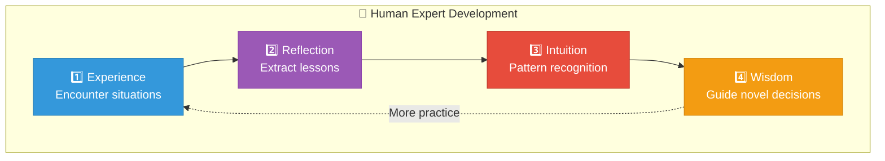

# Intuition Engine: Architecture Overview

> A system that learns, remembers, and intuits — the foundation for emergent AGI

---

## Design Philosophy

The Intuition Engine mirrors how human experts develop mastery:



1. **Experience** — Practitioners encounter thousands of situations
2. **Reflection** — They extract lessons from successes and failures
3. **Intuition** — Pattern recognition becomes automatic over time
4. **Wisdom** — Deep knowledge guides decisions in novel contexts

We formalize this process in three tightly integrated modules running continuously.

---

## The Three Core Modules

### 1. Experience Stream

```
World Interaction → Structured Episodes → Feedback Loop
```

Every interaction is recorded as:

```
Episode = {
    context:   [situation, constraints, goals]
    actions:   [decisions made, steps taken]
    outcomes:  [results, metrics, states]
    feedback:  [external rewards, internal critique]
}
```

**Sources of interaction:**
- Task execution
- Conversations
- Simulations
- Self-play
- Real-world interfaces

### 2. Lesson Extractor

```
Episodes → Pattern Analysis → Explicit Lessons
```

After each episode (or batch), this module distills wisdom:

**Extraction methods:**
- Chain-of-thought prompting
- Fine-tuned critique models
- Pattern matching across similar episodes
- Generalization algorithms

**Output format:**

```json
{
    "trigger_pattern": "description of when this applies",
    "lesson_core": "the actual insight",
    "action_bias": "how to adjust behavior",
    "strength": 0.0-1.0,
    "source_episodes": ["ep_001", "ep_002"],
    "embedding": [0.12, -0.34, ...],
    "created": "2026-03-15",
    "reinforcements": 47,
    "decay_rate": 0.001
}
```

### 3. Intuition Memory

```
Dual Memory: Explicit Log + Fast Intuitive Layer
```

**Explicit Log:**
- Searchable database of all extracted lessons
- Scales to millions over time
- Full text and metadata queries

**Fast Intuitive Layer:**
- High-dimensional vector store
- Lightweight neural index
- Caches high-strength, contextually relevant lessons
- Sub-millisecond retrieval

---

## Data Flow Diagram

```
                    ┌──────────────────────────────────┐
                    │         WORLD / TASKS            │
                    └──────────────────────────────────┘
                                    │
                                    ▼
┌───────────────────────────────────────────────────────────────┐
│                     EXPERIENCE STREAM                         │
│  ┌─────────┐  ┌─────────┐  ┌─────────┐  ┌─────────┐          │
│  │Episode 1│  │Episode 2│  │Episode 3│  │Episode N│   ...    │
│  └─────────┘  └─────────┘  └─────────┘  └─────────┘          │
└───────────────────────────────────────────────────────────────┘
                                    │
                                    ▼
┌───────────────────────────────────────────────────────────────┐
│                     LESSON EXTRACTOR                          │
│                                                               │
│  "What worked? What failed? Why? What would I do differently?"│
│                                                               │
│  ┌──────────────────────────────────────────────────────────┐│
│  │ Lesson: "Rushing token launches without community buy-in ││
│  │ leads to low TVL. Always validate community interest     ││
│  │ before deploying contracts."                             ││
│  │ Strength: 0.87 | Bias: increase_validation_steps         ││
│  └──────────────────────────────────────────────────────────┘│
└───────────────────────────────────────────────────────────────┘
                                    │
                    ┌───────────────┴───────────────┐
                    ▼                               ▼
┌─────────────────────────────┐   ┌─────────────────────────────┐
│       EXPLICIT LOG          │   │    FAST INTUITIVE LAYER     │
│                             │   │                             │
│  Full searchable database   │   │  Vector store + neural      │
│  of all lessons             │   │  index for instant recall   │
│                             │   │                             │
│  - Complex queries          │   │  - Top-k similarity         │
│  - Historical analysis      │   │  - Sub-ms retrieval         │
│  - Audit trails             │   │  - Contextual priming       │
└─────────────────────────────┘   └─────────────────────────────┘
                    │                               │
                    └───────────────┬───────────────┘
                                    ▼
                    ┌───────────────────────────────┐
                    │      DECISION MAKING          │
                    │  Fast intuition + Reasoning   │
                    └───────────────────────────────┘
```

---

## Key Design Principles

### 1. Dual-Speed Processing

Like human cognition with System 1 (fast/intuitive) and System 2 (slow/deliberate):

| Path | Speed | Purpose |
|------|-------|---------|
| Fast | ~1ms | Gut feelings, immediate biases |
| Slow | ~100ms+ | Deliberate search, precise matches |

### 2. Explicit + Implicit

Unlike pure neural approaches where knowledge is opaque:

- **Explicit**: Every lesson is human-readable and auditable
- **Implicit**: Vector embeddings enable fuzzy matching and generalization

### 3. Continuous Learning

The system never stops learning:


### 4. Strength Dynamics

Lessons are not static:

- **Reinforcement**: Successful application increases strength
- **Decay**: Unused lessons gradually weaken
- **Contradiction**: Conflicting evidence triggers review
- **Generalization**: Similar lessons merge into stronger principles

---

## Technical Stack Considerations

| Component | Options |
|-----------|---------|
| Episode Storage | PostgreSQL, MongoDB, TimescaleDB |
| Vector Store | Pinecone, Weaviate, Milvus, pgvector |
| Embedding Model | OpenAI Ada, Cohere, custom fine-tuned |
| Neural Index | FAISS, ScaNN, custom learned index |
| Critique Model | GPT-4, Claude, fine-tuned specialist |
| Orchestration | Ray, Celery, custom async pipeline |

---

## Scalability Profile

| Scale | Lessons | Retrieval | Storage |
|-------|---------|-----------|---------|
| Phase 1 | ~10K | <10ms | ~1GB |
| Phase 2 | ~100K | <10ms | ~10GB |
| Phase 3 | ~1M+ | <10ms | ~100GB |
| Phase 4 | Distributed | <10ms | Unlimited |

The architecture is designed to maintain sub-10ms fast-path retrieval regardless of total lesson count through hierarchical indexing and intelligent caching.
