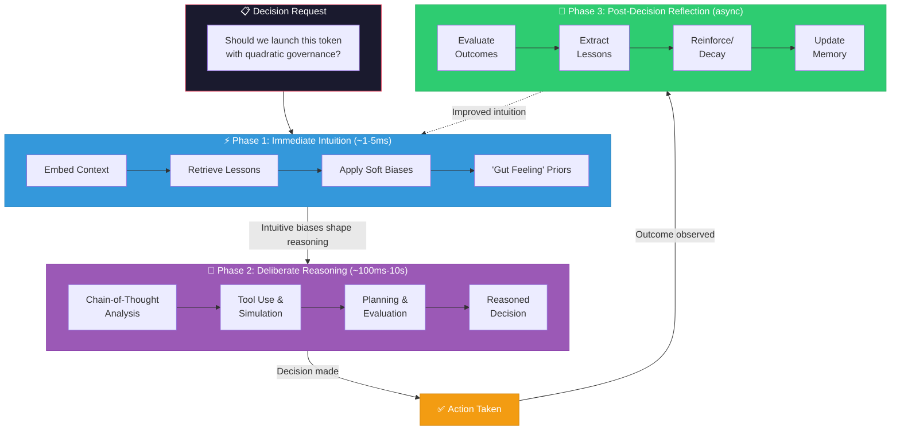

# Decision Flow

> Human-Like Decision Making with Intuitive Priors

This document describes how the Intuition Engine shapes decision-making, combining fast intuitive hits with deliberate reasoning in a flow that mirrors expert human cognition.



---

## The Three-Phase Decision Process

```
┌─────────────────────────────────────────────────────────────────┐
│                     DECISION REQUEST                            │
│                                                                 │
│  "Should we launch this token with quadratic governance?"       │
└─────────────────────────────────────────────────────────────────┘
                              │
                              ▼
┌─────────────────────────────────────────────────────────────────┐
│              PHASE 1: IMMEDIATE INTUITION                       │
│                        (~1-5ms)                                 │
│                                                                 │
│  • Embed context                                                │
│  • Retrieve top lessons from fast layer                         │
│  • Apply soft biases to decision space                          │
│                                                                 │
│  Result: "Gut feeling" priors that shape attention              │
└─────────────────────────────────────────────────────────────────┘
                              │
                              ▼
┌─────────────────────────────────────────────────────────────────┐
│              PHASE 2: DELIBERATE REASONING                      │
│                       (~100ms - 10s)                            │
│                                                                 │
│  • Full chain-of-thought analysis                               │
│  • Tool use (search, compute, simulate)                         │
│  • Planning and evaluation                                      │
│  • Intuitive biases shape reasoning direction                   │
│                                                                 │
│  Result: Reasoned decision with supporting analysis             │
└─────────────────────────────────────────────────────────────────┘
                              │
                              ▼
┌─────────────────────────────────────────────────────────────────┐
│              PHASE 3: POST-DECISION REFLECTION                  │
│                       (async, ~1-60s)                           │
│                                                                 │
│  • Evaluate outcome against predictions                         │
│  • Extract new lessons                                          │
│  • Reinforce or decay applied lessons                           │
│  • Update memory systems                                        │
│                                                                 │
│  Result: Improved intuition for next decision                   │
└─────────────────────────────────────────────────────────────────┘
```

---

## Phase 1: Immediate Intuition

The moment a decision is required, the system activates its intuitive layer.

### Process

```python
def immediate_intuition(decision_context: Context) -> IntuitiveFrame:
    """
    Generate instant intuitive biases for a decision context.
    Must complete in <5ms.
    """

    # Step 1: Embed the current situation
    context_embedding = fast_embed(decision_context)

    # Step 2: Retrieve relevant lessons
    intuitive_hits = intuition_memory.fast_retrieve(
        context_embedding,
        k=10,
        min_strength=0.3
    )

    # Step 3: Aggregate into biases
    biases = aggregate_biases(intuitive_hits)

    # Step 4: Create intuitive frame
    return IntuitiveFrame(
        attention_priors=biases.attention_shifts,
        action_biases=biases.action_adjustments,
        caution_signals=biases.warnings,
        confidence_adjustment=biases.confidence_modifier,
        source_lessons=intuitive_hits
    )
```

### Types of Intuitive Biases

| Bias Type | Effect | Example |
|-----------|--------|---------|
| **Attention Shift** | Focus on specific aspects | "Pay extra attention to sybil resistance" |
| **Action Preference** | Increase/decrease certain actions | "Prefer established patterns over novel ones" |
| **Caution Signal** | Flag potential risks | "Similar situations had security issues" |
| **Confidence Modifier** | Adjust certainty | "High uncertainty domain, be conservative" |
| **Speed Adjustment** | Slow down or speed up | "This is well-trodden territory, proceed" |

### Example Intuitive Hits

For the token launch decision:

```
╔═══════════════════════════════════════════════════════════════════╗
║                    INTUITIVE HITS (5 of 10)                       ║
╠═══════════════════════════════════════════════════════════════════╣
║                                                                   ║
║  1. [Strength: 0.87, Relevance: 0.92]                             ║
║     "Token launches without community validation underperform"    ║
║     → Bias: INCREASE validation_steps                             ║
║                                                                   ║
║  2. [Strength: 0.78, Relevance: 0.85]                             ║
║     "Quadratic voting needs sybil resistance"                     ║
║     → Bias: REQUIRE identity_verification                         ║
║                                                                   ║
║  3. [Strength: 0.72, Relevance: 0.81]                             ║
║     "Complex governance on launch day confuses users"             ║
║     → Bias: PREFER simple_initial_governance                      ║
║                                                                   ║
║  4. [Strength: 0.94, Relevance: 0.67]                             ║
║     "Rushing high-stakes decisions has 3x failure rate"           ║
║     → Bias: INCREASE deliberation_time                            ║
║                                                                   ║
║  5. [Strength: 0.65, Relevance: 0.88]                             ║
║     "Successful launches had clear value proposition first"       ║
║     → Bias: REQUIRE value_prop_clarity_check                      ║
║                                                                   ║
╚═══════════════════════════════════════════════════════════════════╝
```

---

## Phase 2: Deliberate Reasoning

With intuitive priors set, the system engages in full analytical reasoning.

### How Intuition Shapes Reasoning

```python
def deliberate_reasoning(
    decision_context: Context,
    intuitive_frame: IntuitiveFrame
) -> Decision:
    """
    Full chain-of-thought reasoning with intuitive guidance.
    """

    # Initialize reasoning with intuitive priors
    reasoning_state = ReasoningState(
        attention_weights=intuitive_frame.attention_priors,
        action_priors=intuitive_frame.action_biases,
        confidence_baseline=intuitive_frame.confidence_adjustment
    )

    # Step 1: Problem decomposition (guided by attention priors)
    sub_problems = decompose_with_attention(
        decision_context,
        reasoning_state.attention_weights
    )

    # Step 2: Information gathering (shaped by intuition)
    for problem in sub_problems:
        # Intuition might say "dig deeper here"
        if reasoning_state.should_investigate_further(problem):
            gather_additional_info(problem)

    # Step 3: Option generation (with intuitive filtering)
    options = generate_options(decision_context)
    # Intuition pre-scores options
    scored_options = apply_intuitive_scores(options, intuitive_frame)

    # Step 4: Evaluation (with calibrated confidence)
    evaluated_options = []
    for option in scored_options:
        evaluation = evaluate_option(option)
        # Adjust confidence based on intuitive signals
        evaluation.confidence *= reasoning_state.confidence_baseline
        evaluated_options.append(evaluation)

    # Step 5: Decision with intuitive integration
    decision = select_best_option(
        evaluated_options,
        intuitive_frame.caution_signals
    )

    return decision
```

### Integration Mechanisms

#### 1. Logit Adjustment

Intuitive biases can directly adjust the probability distribution over actions:

```python
def apply_intuitive_logits(
    base_logits: Tensor,
    intuitive_frame: IntuitiveFrame
) -> Tensor:
    """
    Shift logits based on intuitive biases.
    """
    adjusted = base_logits.clone()

    for bias in intuitive_frame.action_biases:
        if bias.type == 'increase':
            adjusted[bias.target_action] += bias.magnitude * INTUITION_STRENGTH
        elif bias.type == 'decrease':
            adjusted[bias.target_action] -= bias.magnitude * INTUITION_STRENGTH
        elif bias.type == 'forbid':
            adjusted[bias.target_action] = -float('inf')

    return adjusted
```

#### 2. Attention Steering

Intuition guides where the model focuses:

```python
def steer_attention(
    query: Query,
    intuitive_frame: IntuitiveFrame
) -> Query:
    """
    Modify attention to emphasize intuition-flagged aspects.
    """
    for attention_prior in intuitive_frame.attention_priors:
        query.add_emphasis(
            aspect=attention_prior.focus_area,
            weight=attention_prior.importance
        )

    return query
```

#### 3. System Prompt Injection

Intuitive guidance can be surfaced as explicit prompts:

```python
def generate_intuitive_prompt(intuitive_frame: IntuitiveFrame) -> str:
    """
    Convert intuitive biases to natural language guidance.
    """
    lines = ["Based on past experience, consider:"]

    for hit in intuitive_frame.source_lessons[:5]:
        lines.append(f"- {hit.lesson_core}")

    if intuitive_frame.caution_signals:
        lines.append("\nCautions:")
        for caution in intuitive_frame.caution_signals:
            lines.append(f"- ⚠️ {caution}")

    return "\n".join(lines)
```

---

## Phase 3: Post-Decision Reflection

After a decision is made and outcomes observed, the system learns.

### Reflection Process

```python
async def post_decision_reflection(
    decision_context: Context,
    decision: Decision,
    intuitive_frame: IntuitiveFrame,
    outcome: Outcome
):
    """
    Learn from decision outcome. Runs asynchronously.
    """

    # Step 1: Evaluate outcome
    success_score = evaluate_outcome(outcome, decision.expected_outcome)

    # Step 2: Attribute to lessons
    for hit in intuitive_frame.source_lessons:
        if hit_contributed_to_outcome(hit, decision, outcome):
            # Reinforce or weaken based on success
            await reinforce_lesson(
                lesson_id=hit.lesson_id,
                outcome_score=success_score,
                context=decision_context
            )

    # Step 3: Extract new lessons
    new_lessons = await extract_lessons_from_episode(
        Episode(
            context=decision_context,
            actions=[decision],
            outcomes=outcome,
            feedback=FeedbackSet(
                internal=generate_reflection(decision, outcome),
                external=outcome.external_feedback
            )
        )
    )

    # Step 4: Store new lessons
    for lesson in new_lessons:
        await intuition_memory.store(lesson)

    # Step 5: Update neural router
    await router.update(
        context=decision_context,
        retrieved_lessons=intuitive_frame.source_lessons,
        outcome=outcome
    )
```

### Reinforcement Dynamics

```
                 Outcome
                    │
        ┌───────────┴───────────┐
        │                       │
    Success                  Failure
        │                       │
        ▼                       ▼
  ┌───────────┐           ┌───────────┐
  │ Strengthen│           │  Weaken   │
  │ +0.05     │           │  -0.10    │
  └───────────┘           └───────────┘
        │                       │
        ▼                       ▼
  Lesson more              Lesson less
  likely to fire           likely to fire
  next time                or flagged for
                           review
```

---

## Worked Example

### Scenario

> "Should we launch the DeFi yield aggregator with the novel auto-rebalancing mechanism?"

### Phase 1: Immediate Intuition (~3ms)

```
Context embedded → Fast retrieval initiated

Retrieved lessons:
1. "Novel financial mechanisms need extra security audits" (0.91)
2. "Yield products should start with capped TVL" (0.84)
3. "Auto-rebalancing can create MEV opportunities" (0.79)
4. "Community education reduces support burden" (0.72)
5. "Launch with fallback to manual if novel system fails" (0.68)

Intuitive Frame:
- ATTENTION: Security review, MEV mitigation, fallback systems
- BIAS: INCREASE audit_thoroughness, REQUIRE tvl_caps
- CAUTION: "Novel mechanism + yield = high-risk combination"
- CONFIDENCE: Reduce by 20% (novel territory)
```

### Phase 2: Deliberate Reasoning (~2s)

```
With intuitive guidance, the reasoning process:

1. SECURITY FOCUS (attention-guided)
   → Commission additional MEV analysis
   → Verify rebalancing logic edge cases
   → Check for economic attack vectors

2. CONSERVATIVE APPROACH (bias-influenced)
   → Design with TVL cap for launch
   → Implement circuit breakers
   → Create manual override system

3. CALIBRATED CONFIDENCE (intuition-adjusted)
   → Recommend staged launch over full release
   → Suggest longer beta period
   → Prepare rollback procedures

Final Decision: Launch with modifications
- Add 72-hour security review
- Implement $1M TVL cap initially
- Build manual rebalancing fallback
- Stage launch over 3 phases
```

### Phase 3: Reflection (Post-Launch)

```
Outcome observed after 30 days:
- No security incidents ✓
- TVL grew organically to cap ✓
- Manual fallback used twice (minor bugs) ⚠️
- Community reception positive ✓

Lesson updates:
- "Staged launches for novel DeFi" reinforced (+0.05)
- "Manual fallbacks save launches" reinforced (+0.08)
- "TVL caps reduce risk" reinforced (+0.03)

New lesson extracted:
- "Auto-rebalancing edge cases appear at TVL > $500K"
```

---

## Decision Quality Metrics

### Real-Time Metrics

| Metric | Measurement |
|--------|-------------|
| Intuition Latency | Time to generate IntuitiveFrame |
| Reasoning Time | Total Phase 2 duration |
| Intuition Agreement | % of final decisions aligned with intuitive bias |
| Override Rate | % of decisions that explicitly overrode intuition |

### Outcome Metrics

| Metric | Measurement |
|--------|-------------|
| Intuition Accuracy | Success rate when following intuition |
| Override Accuracy | Success rate when overriding intuition |
| Calibration | Correlation between confidence and success |
| Learning Rate | Speed of lesson strength convergence |
