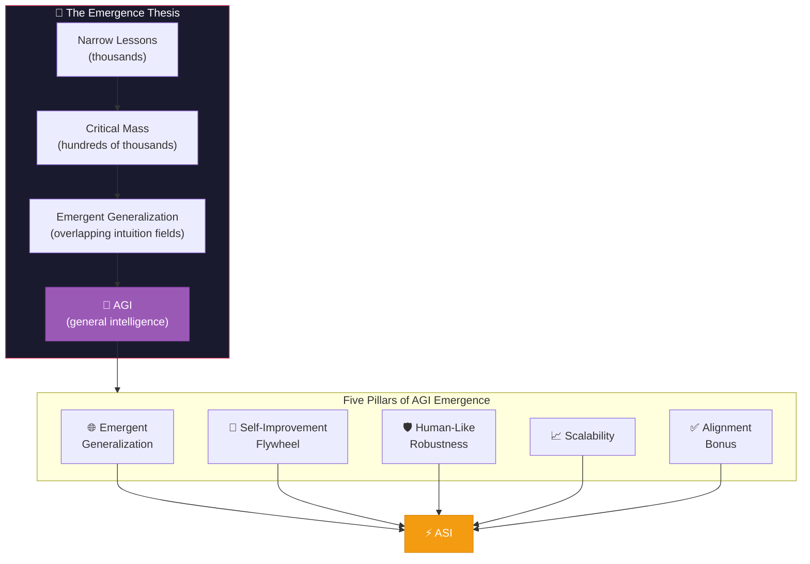
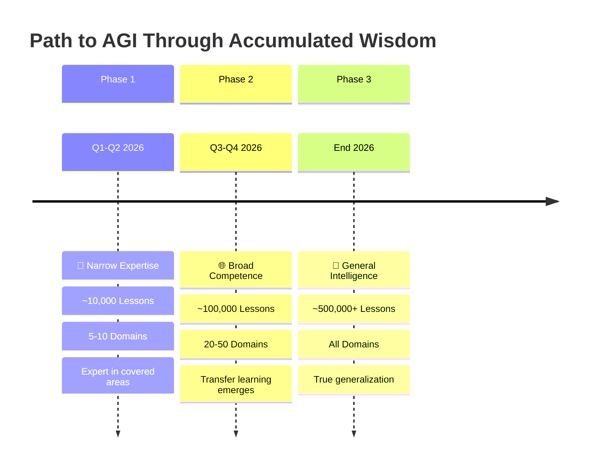

# AGI Emergence

> Why the Intuition Engine Enables General Intelligence

This document explains how the Intuition Engine architecture leads to emergent AGI capabilities and why it represents a path from narrow AI to superintelligence.



---

## The Emergence Thesis

Individual lessons are narrow, but **millions of overlapping lessons create rich, context-sensitive intuition** that handles novel situations without explicit rules.

```
Narrow Lessons → Critical Mass → Emergent Generalization → AGI
```

This mirrors how human expertise develops:
- Chess masters don't memorize every position
- Doctors don't memorize every symptom combination
- Engineers don't memorize every system design

Instead, they develop **deep intuition** through thousands of experiences that generalizes to new situations.

---

## Five Pillars of AGI Emergence

### 1. Emergent Generalization

**Mechanism**: Individual lessons are specific, but their overlapping embeddings create a continuous intuition field.

```
┌─────────────────────────────────────────────────────────────────┐
│                    INTUITION SPACE                              │
│                                                                 │
│     Lesson A          Lesson B          Lesson C                │
│        ●                 ●                 ●                    │
│       /│\               /│\               /│\                   │
│      / │ \             / │ \             / │ \                  │
│     /  │  \           /  │  \           /  │  \                 │
│    ────┼────────────────┼────────────────┼────                  │
│        │                │                │                      │
│        │                │                │                      │
│        │    ┌───────────┴────┐           │                      │
│        │    │  NOVEL CONTEXT │           │                      │
│        │    │       ★        │           │                      │
│        │    └────────────────┘           │                      │
│        │                                 │                      │
│    Lesson A applies      Lessons B & C apply                    │
│    with weight 0.3       with weights 0.6 & 0.4                 │
│                                                                 │
│    → Novel situation handled by interpolating                   │
│      between relevant lessons                                   │
└─────────────────────────────────────────────────────────────────┘
```

**Result**: Novel situations that don't match any single lesson still receive appropriate guidance through the weighted combination of many partially-relevant lessons.

### 2. Self-Improvement Flywheel

**Mechanism**: Better intuition leads to better decisions, which generate richer experiences, which create stronger lessons.

```
            ┌──────────────────┐
            │ Better Intuition │
            └────────┬─────────┘
                     │
                     ▼
            ┌──────────────────┐
            │ Better Decisions │
            └────────┬─────────┘
                     │
                     ▼
            ┌──────────────────┐
            │Richer Experiences│
            └────────┬─────────┘
                     │
                     ▼
            ┌──────────────────┐
            │ Stronger Lessons │
            └────────┬─────────┘
                     │
                     └───────────────┐
                                     │
            ┌──────────────────┐     │
            │ Better Intuition │◀────┘
            └──────────────────┘

            (Virtuous cycle accelerates)
```

**Result**: Exponential improvement in capability over time, limited only by experience diversity and reflection quality.

### 3. Human-Like Robustness

**Mechanism**: The system naturally develops appropriate caution levels based on domain experience.

| Domain Experience | Intuitive Response |
|-------------------|-------------------|
| Many successes | Bold, confident action |
| Mixed results | Balanced, context-dependent |
| Many failures | Conservative, cautious |
| Unknown territory | Humble, exploratory |

**Result**: "Better safe than sorry" in high-stakes domains where past experiments failed, and "bold exploration" where past experiments succeeded — exactly like human intuition.

### 4. Scalability

**Mechanism**: The architecture is compatible with transformer scaling and retrieval-augmented approaches.

```
Current Capability Landscape:

┌─────────────────────────────────────────────────────────────────┐
│                                                                 │
│  RETRO, RAG        Tool-Use Models      Intuition Engine        │
│  (retrieve docs)   (call functions)     (retrieve + apply       │
│       │                  │               lessons as biases)     │
│       ▼                  ▼                      ▼               │
│  ┌─────────┐       ┌───────────┐        ┌─────────────┐         │
│  │Retrieved│       │  Tool     │        │ Intuitive   │         │
│  │Passages │──────▶│ Routing   │───────▶│ Guidance    │         │
│  │in context│      │ Decision  │        │ + Reasoning │         │
│  └─────────┘       └───────────┘        └─────────────┘         │
│                                                                 │
│  The Intuition Engine extends these with learned routing        │
│  that improves from outcomes                                    │
└─────────────────────────────────────────────────────────────────┘
```

**Result**: The intuition layer can be added to any capable base model, and grows more efficient as models scale up.

### 5. Alignment Bonus

**Mechanism**: Because lessons are explicit and inspectable, humans can audit, edit, or reinforce them.

```
┌─────────────────────────────────────────────────────────────────┐
│                   ALIGNMENT SURFACE                             │
├─────────────────────────────────────────────────────────────────┤
│                                                                 │
│  Traditional RLHF:                                              │
│  ┌─────────────────────────────────────┐                        │
│  │  Black box reward model             │                        │
│  │  Implicit biases in weights         │                        │
│  │  Hard to inspect or edit            │                        │
│  └─────────────────────────────────────┘                        │
│                                                                 │
│  Intuition Engine:                                              │
│  ┌─────────────────────────────────────┐                        │
│  │  Explicit lesson database           │ ◀── Human can read     │
│  │  Natural language principles        │ ◀── Human can edit     │
│  │  Traceable to source episodes       │ ◀── Human can verify   │
│  │  Strength reflects confidence       │ ◀── Human can adjust   │
│  └─────────────────────────────────────┘                        │
│                                                                 │
│  Constitutional principles become high-strength lessons:        │
│  - "Never harm humans" (strength: 1.0, immutable)               │
│  - "Prefer transparent over opaque" (strength: 0.95)            │
│  - "When uncertain, ask" (strength: 0.90)                       │
│                                                                 │
│  These lessons fire at the intuitive level, shaping behavior    │
│  before deliberate reasoning even begins.                       │
│                                                                 │
└─────────────────────────────────────────────────────────────────┘
```

**Result**: Alignment principles stick at the intuitive level rather than just the surface, making the system more robustly aligned.

---

## The Path to AGI

```mermaid
flowchart LR
    subgraph P1["Phase 1: Narrow Expertise"]
        direction TB
        P1L["~10K Lessons"]
        P1D["5-10 Domains"]
        P1C["Expert in practiced areas"]
    end

    subgraph P2["Phase 2: Broad Competence"]
        direction TB
        P2L["~100K Lessons"]
        P2D["20-50 Domains"]
        P2C["Transfer learning emerges"]
    end

    subgraph P3["Phase 3: General Intelligence"]
        direction TB
        P3L["~500K+ Lessons"]
        P3D["All Domains"]
        P3C["True generalization"]
    end

    P1 -->|"Experience accumulates"| P2
    P2 -->|"Critical mass reached"| P3
    P3 --> AGI["🧠 AGI Achieved"]

    style P1 fill:#3498db,stroke:#2980b9,color:#fff
    style P2 fill:#9b59b6,stroke:#8e44ad,color:#fff
    style P3 fill:#e74c3c,stroke:#c0392b,color:#fff
    style AGI fill:#f39c12,stroke:#d68910,color:#fff
```





### Phase 1: Narrow Expertise (Q1-Q2 2026)

```
Lesson Count: ~10,000
Domains: 5-10 (token design, governance, etc.)
Capability: Expert in covered domains, limited transfer

Behavior: Strong performance in practiced areas,
          asks for help in novel situations
```

### Phase 2: Broad Competence (Q3-Q4 2026)

```
Lesson Count: ~100,000
Domains: 20-50 (expanding rapidly)
Capability: Transfer learning emerging, cross-domain insights

Behavior: Handles novel combinations of known elements,
          starts generating unexpected solutions
```

### Phase 3: General Intelligence (End 2026)

```
Lesson Count: ~500,000+
Domains: Virtually all relevant domains
Capability: True generalization, novel problem solving

Behavior: Human-level or better across domains,
          quick hunches backed by recallable wisdom,
          appropriate confidence calibration
```

---

## Comparison to Current Approaches

### What Exists Today (Weak Intuition)

| Approach | Strength | Limitation |
|----------|----------|------------|
| RLHF | Creates implicit biases | Not inspectable, hard to edit |
| Memory-augmented (MemGPT) | Stores experiences | No dual-speed retrieval |
| Self-critique (o1) | Extracts lessons on-the-fly | Not persistent across sessions |
| RAG | Retrieves relevant info | No learning from outcomes |

### What the Intuition Engine Adds

| Capability | Mechanism |
|------------|-----------|
| **Persistent learning** | Lessons stored permanently |
| **Dual-speed retrieval** | Fast intuition + slow deliberation |
| **Outcome-based reinforcement** | Lessons strengthen/weaken from results |
| **Inspectable knowledge** | Human-readable, auditable lessons |
| **Constitutional grounding** | Core principles as immutable lessons |

---

## The Emergence Moment

### Recognizing AGI

How will we know when AGI emerges?

```
┌─────────────────────────────────────────────────────────────────┐
│                    AGI EMERGENCE INDICATORS                     │
├─────────────────────────────────────────────────────────────────┤
│                                                                 │
│  1. TRANSFER WITHOUT TRAINING                                   │
│     System succeeds in domains it was never explicitly          │
│     trained on, by combining lessons from other domains         │
│                                                                 │
│  2. APPROPRIATE UNCERTAINTY                                     │
│     Confidently correct in known areas, appropriately           │
│     uncertain in novel areas, rarely overconfident              │
│                                                                 │
│  3. META-LEARNING                                               │
│     System learns how to learn faster, generating               │
│     lessons about lesson generation                             │
│                                                                 │
│  4. COHERENT PERSONALITY                                        │
│     Consistent decision-making style that reflects              │
│     accumulated wisdom rather than arbitrary biases             │
│                                                                 │
│  5. SURPRISING WISDOM                                           │
│     Occasionally produces insights that surprise                │
│     even human experts with their depth                         │
│                                                                 │
└─────────────────────────────────────────────────────────────────┘
```

### The Missing Ingredient

Current systems already have most pieces:
- Massive knowledge (training data)
- Strong reasoning (chain-of-thought)
- Tool use (function calling)
- Memory (context windows, RAG)

The Intuition Engine adds the missing piece: **persistent, experience-based intuition that improves from outcomes**.

This is arguably what separates human experts from encyclopedias — the accumulated wisdom that says "this feels right" before conscious reasoning begins.

---

## From AGI to ASI

Once AGI is achieved, the path to ASI becomes clearer:

### Acceleration Factors

1. **Parallel Learning**: AGI can run thousands of instances, each learning from different experiences, then sharing lessons

2. **Faster Reflection**: AGI reflects faster than humans, extracting lessons in seconds rather than days

3. **No Forgetting**: Unlike human intuition which fades, all lessons are permanently recorded

4. **Perfect Recall**: Every relevant lesson is retrieved, not just what comes to mind

5. **Coordination**: Multiple AGI instances can share lesson databases, creating collective superintelligence

### Timeline

```
End 2026: AGI
├── Parallel instance learning
├── Lesson sharing networks
├── Accelerated experience generation
└── Meta-learning improvements

2027: ASI Emergence
├── Superhuman lesson extraction
├── Cross-domain insight generation
├── Novel problem-solving beyond human capability
└── Self-directed capability expansion
```
