# Intuition Engine

> Bridging Narrow AI → AGI → ASI Through Experience-Based Learning

The Intuition Engine is the core intelligence architecture that enables the AI Brand Factory to evolve from narrow agentic AI to generalized and superintelligent systems.

---

## Purpose

This system learns lessons from experience, logs them explicitly, and recalls them as fast, intuitive guidance — mimicking human decision-making and enabling emergent AGI-level capabilities.

The Intuition Engine is the **bridge technology** that:

1. Transforms task execution into wisdom accumulation
2. Enables human-like rapid pattern recognition
3. Creates self-improving intelligence flywheels
4. Provides auditable, alignable decision foundations

---

## Architecture Overview

```mermaid
flowchart TB
    subgraph ENGINE["🧠 INTUITION ENGINE"]
        direction TB

        subgraph INPUT["Experience Capture"]
            A["📥 Experience Stream"]
        end

        subgraph PROCESS["Wisdom Extraction"]
            B["🔬 Lesson Extractor"]
        end

        subgraph MEMORY["Knowledge Storage"]
            C["💾 Intuition Memory"]
        end

        A -->|"Raw Episodes"| B
        B -->|"Distilled Lessons"| C

        subgraph DECISION["Decision-Making Layer"]
            direction LR
            D["⚡ Fast Intuition<br/>(milliseconds)"]
            E["🤔 Deliberate Reasoning<br/>(chain-of-thought)"]
        end

        C --> D & E

        subgraph REFLECT["Post-Decision Reflection"]
            F["🔄 Outcome → Lesson → Memory Update"]
        end

        D & E --> REFLECT
        F -.->|"Continuous Learning"| A
    end

    style ENGINE fill:#1a1a2e,stroke:#e94560,color:#fff
    style INPUT fill:#3498db,stroke:#2980b9,color:#fff
    style PROCESS fill:#9b59b6,stroke:#8e44ad,color:#fff
    style MEMORY fill:#2ecc71,stroke:#27ae60,color:#fff
    style DECISION fill:#e74c3c,stroke:#c0392b,color:#fff
    style REFLECT fill:#f39c12,stroke:#d68910,color:#fff
```

```mermaid
flowchart LR
    subgraph NARROW["Narrow AI"]
        N1["Task-Specific<br/>Capabilities"]
    end

    subgraph BRIDGE["🌉 Intuition Engine"]
        IE["Experience-Based<br/>Learning"]
    end

    subgraph AGI["AGI"]
        A1["General<br/>Intelligence"]
    end

    subgraph ASI["ASI"]
        S1["Superintelligent<br/>Systems"]
    end

    NARROW -->|"Accumulates Wisdom"| BRIDGE
    BRIDGE -->|"Emergent Generalization"| AGI
    AGI -->|"Parallel Learning"| ASI

    style NARROW fill:#3498db,stroke:#2980b9,color:#fff
    style BRIDGE fill:#e94560,stroke:#c0392b,color:#fff
    style AGI fill:#9b59b6,stroke:#8e44ad,color:#fff
    style ASI fill:#f39c12,stroke:#d68910,color:#fff
```

---

## Core Modules

| Module | Purpose | Document |
|--------|---------|----------|
| Experience Stream | Capture and structure all interactions | [01-experience-stream.md](./01-experience-stream.md) |
| Lesson Extractor | Distill wisdom from experience | [02-lesson-extractor.md](./02-lesson-extractor.md) |
| Intuition Memory | Dual-layer storage and retrieval | [03-intuition-memory.md](./03-intuition-memory.md) |
| Decision Flow | Human-like decision process | [04-decision-flow.md](./04-decision-flow.md) |

---

## Why This Matters

### The Missing Ingredient

Current AI systems have weak versions of intuition:

| System | Capability | Limitation |
|--------|------------|------------|
| RLHF | Implicit intuitive biases | Not explicitly logged |
| Memory-augmented models | Store/retrieve experiences | No dual-layer speed |
| Self-critique chains | Extract lessons on the fly | Not persistent |

**None close the loop** with both fast intuition AND slow explicit logging. The Intuition Engine provides this missing integration.

### The Result

Behavior that feels strikingly human:
- Quick hunches backed by deep recallable wisdom
- Conservative caution in high-stakes domains
- Bold exploration where experimentation paid off
- Transparent, auditable decision foundations

---

## Integration with AI Brand Factory

The Intuition Engine powers every phase of the factory:

| Phase | Intuition Role |
|-------|----------------|
| Phase 0-1 | Building initial lesson corpus from launches |
| Phase 2 | AGI emergence through accumulated wisdom |
| Phase 3 | ASI breakthrough via exponential lesson compounding |
| Phase 4 | Infinite light through distributed intuition sharing |

See [06-implementation-roadmap.md](./06-implementation-roadmap.md) for detailed integration.

---

## Quick Navigation

1. [Architecture Overview](./00-architecture-overview.md)
2. [Experience Stream](./01-experience-stream.md)
3. [Lesson Extractor](./02-lesson-extractor.md)
4. [Intuition Memory](./03-intuition-memory.md)
5. [Decision Flow](./04-decision-flow.md)
6. [AGI Emergence](./05-agi-emergence.md)
7. [Implementation Roadmap](./06-implementation-roadmap.md)
