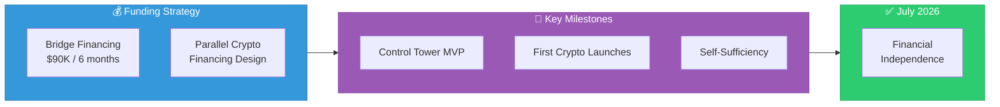
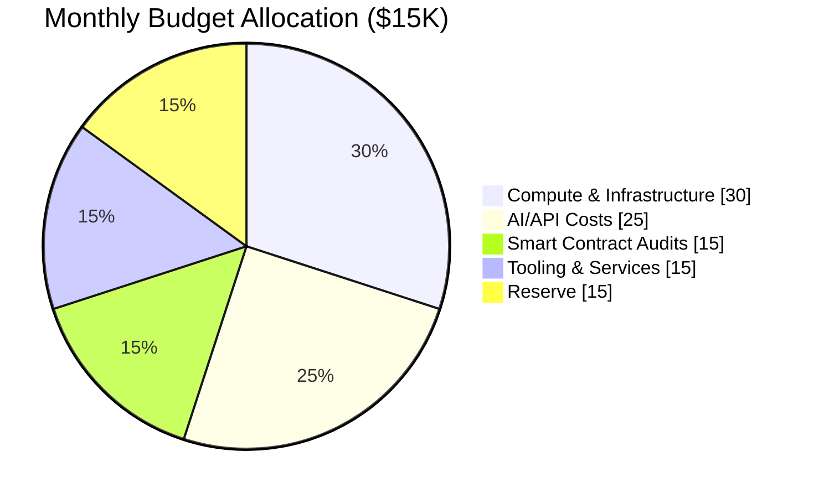

# Phase 0: Initial Funding & Lean Bootstrap

**Timeline:** January - June 2026 (Kickoff)

---

## Objective

Launch with minimal centralized capital while embedding crypto foundations from day one.

---

## Funding Strategy

### Bridge Financing

| Component | Amount |
|-----------|--------|
| Monthly requirement | $15,000 |
| Duration | 6 months |
| Total bridge | $90,000 |
| Instrument | SAFE |
| Purpose | Core scaffolding |

### Parallel: Decentralized Financing

While securing bridge funding, we simultaneously design native tokenomics for early launches — enabling decentralized community financing from Day 1 pilots.

This dual-track approach ensures:

- Immediate operational runway
- Early validation of crypto mechanisms
- Community building from the start
- Reduced dependency on centralized capital

---

## Key Milestones

### Milestone 1: Control Tower MVP

Build the core orchestration platform with blockchain integration:

- [ ] Agent orchestration framework
- [ ] Wallet integration
- [ ] Smart contract deployment pipeline
- [ ] Basic monitoring and analytics

### Milestone 2: First Crypto-Enabled Launches

Execute initial pilot launches with full blockchain integration:

- [ ] Token launch framework
- [ ] Decentralized funding mechanisms
- [ ] Community governance templates
- [ ] DeFi primitive integration

### Milestone 3: Self-Sufficiency

**Target: July 2026**

Achieve financial independence through:

- Revenue from launched businesses
- DeFi yields from treasury
- Token appreciation
- Community participation

---

## Budget Allocation

| Category | Allocation | Monthly |
|----------|------------|---------|
| Compute & Infrastructure | 30% | $4,500 |
| AI/API Costs | 25% | $3,750 |
| Smart Contract Audits | 15% | $2,250 |
| Tooling & Services | 15% | $2,250 |
| Reserve | 15% | $2,250 |

---

## Success Criteria

By end of Phase 0:

- [ ] Control Tower MVP operational
- [ ] 3-5 pilot businesses launched
- [ ] Tokenomics framework validated
- [ ] Path to self-sufficiency clear
- [ ] Team processes established
- [ ] Documentation complete

---

## Transition to Phase 1

Phase 0 concludes when:

1. MVP is stable and functional
2. Serial launch process is repeatable
3. Revenue + yields cover monthly costs
4. Team is ready for weekly cadence
