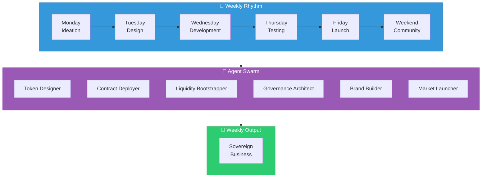

# Phase 1: Agentic Foundation & Serial Mastery

**Timeline:** Q1 - Q2 2026

---

## Objective

Build and launch blockchain-sovereign businesses with light-focused software at a weekly cadence.

---

## Key Focus Areas

### 1. Weekly Serial Launches

Each business is a fully decentralized ecosystem:

| Component | Description |
|-----------|-------------|
| Native Token | Custom tokenomics for each launch |
| On-Chain Governance | DAO structures from day one |
| DeFi Primitives | Staking, liquidity, yields |
| Sovereign Operations | No central dependencies |

### 2. Agent Swarm Architecture

Agent swarms include specialized crypto modules:

- **Token Designer** — Creates tokenomics models
- **Contract Deployer** — Deploys and verifies smart contracts
- **Liquidity Bootstrapper** — Initializes markets and pools
- **Governance Architect** — Sets up DAO frameworks
- **Brand Builder** — Visual identity and messaging
- **Market Launcher** — Go-to-market execution

### 3. Software Outputs

All software serves sovereignty and brightness:

- Wallet integration tools
- DAO governance frameworks
- Decentralized identity systems
- Privacy-preserving solutions
- Financial sovereignty tools

---

## Intelligence Milestone

**End of Q2 2026:** Proto-AGI agents with embedded capabilities:

- Crypto reasoning (tokenomics, DeFi, governance)
- Light-focused alignment
- Multi-domain problem solving
- Autonomous business creation

---

## Launch Process

### Weekly Rhythm

| Day | Activity |
|-----|----------|
| Monday | Ideation & selection |
| Tuesday | Design & architecture |
| Wednesday | Development & contracts |
| Thursday | Testing & audits |
| Friday | Launch & monitoring |
| Weekend | Community building |

### Quality Gates

Each launch must pass:

- [ ] Light-focused alignment review
- [ ] Smart contract audit
- [ ] Tokenomics validation
- [ ] Community readiness
- [ ] Technical stability

---

## Expected Outcomes

By end of Phase 1:

| Metric | Target |
|--------|--------|
| Total businesses launched | ~26 |
| Annualized revenue | $1-5M |
| On-chain TVL | Growing |
| Agent capabilities | Proto-AGI |
| Process maturity | Repeatable |

### Qualitative Outcomes

- Decentralized financing loops active
- Community governance functional
- Brand factory reputation established
- Agent swarms self-improving
- Launch templates proven

---

## Key Deliverables

### Technical

- [ ] Production-ready Control Tower
- [ ] Agent swarm framework v1
- [ ] Smart contract library
- [ ] Monitoring and analytics dashboard
- [ ] Security and audit pipeline

### Business

- [ ] 26 sovereign businesses live
- [ ] Revenue generating
- [ ] Community engaged
- [ ] Token ecosystems healthy

### Intelligence

- [ ] Proto-AGI capabilities demonstrated
- [ ] Light-focused alignment validated
- [ ] Self-improvement mechanisms active

---

## Transition to Phase 2

Phase 1 concludes when:

1. 26+ businesses successfully launched
2. Weekly cadence is sustainable
3. Proto-AGI agents functional
4. Team ready for parallel execution
5. Processes documented for scale
