# Phase 2: Parallel Scale & AGI Emergence + Open Source Release

**Timeline:** Q3 - Q4 2026

```mermaid
flowchart TB
    subgraph PARALLEL["⚡ Parallel Execution"]
        direction LR
        L1["Launch 1"]
        L2["Launch 2"]
        L3["Launch 3"]
    end

    subgraph TECH["🔧 Technology Integration"]
        direction TB
        T1["Zero-Knowledge<br/>Proofs"]
        T2["Intent-Centric<br/>Architecture"]
        T3["AI-Native<br/>Blockchains"]
        T4["Cross-Chain<br/>Messaging"]
    end

    subgraph MILESTONE["🎯 End 2026 Milestone"]
        direction LR
        AGI["🧠 Light-Focused<br/>AGI"]
        OS["📖 Full<br/>Open Source"]
    end

    PARALLEL --> TECH
    TECH --> MILESTONE

    style PARALLEL fill:#3498db,stroke:#2980b9,color:#fff
    style TECH fill:#9b59b6,stroke:#8e44ad,color:#fff
    style MILESTONE fill:#f39c12,stroke:#d68910,color:#fff
```

---

## Objective

Scale to parallel launches while preparing for infinite distribution through open source.

---

## Key Focus Areas

### 1. Parallel Execution

**Cadence:** 2-3 businesses per week

| Capability | Description |
|------------|-------------|
| Concurrent launches | Multiple businesses in flight |
| Resource optimization | Shared infrastructure |
| Quality maintenance | Parallel review processes |
| Risk distribution | Isolated failure domains |

### 2. Full Blockchain Ecosystems

Each launch becomes more sophisticated:

- Sovereign chains/apps
- Cross-chain interoperability
- Complex governance structures
- Advanced DeFi mechanisms
- Multi-token economies

### 3. Breakthrough Integration

Continuously integrate emerging advances:

| Technology | Application |
|------------|-------------|
| Zero-knowledge proofs | Privacy and scalability |
| Intent-centric architectures | User experience |
| AI-native blockchains | Autonomous operations |
| Cross-chain messaging | Interoperability |

### 4. Open Source Preparation

Prepare the complete factory for public release:

- [ ] Clean, modular codebase
- [ ] Comprehensive documentation
- [ ] Deployment guides
- [ ] Community contribution guidelines
- [ ] Governance framework for forks

---

## Intelligence Milestone

**End of 2026:** Achieve Light-Focused AGI + Full Open-Source Release

### AGI Capabilities

- Design sovereign ecosystems end-to-end
- Autonomous strategic decision-making
- Self-improving agent architectures
- Cross-domain reasoning
- Light-focused value alignment

### Open Source Release

| Aspect | Details |
|--------|---------|
| Scope | Entire factory platform |
| License | Fully permissive (no restrictions) |
| Components | Control Tower, agents, crypto modules |
| Invitation | Choose to align, fork, co-create |

---

## Expected Outcomes

### Quantitative

| Metric | Target |
|--------|--------|
| Total businesses (cumulative) | ~86-106 |
| Revenue + TVL | $20-50M+ |
| Parallel capacity | 2-3x weekly |
| Agent capability | AGI-level |

### Qualitative

- Global communities thriving
- Viral forks begin post-release
- Light spreads through open source
- Ecosystem effects compound
- Self-sustaining growth achieved

---

## Open Source Strategy

### Pre-Release (Q3)

- Code cleanup and modularization
- Documentation completion
- Security hardening
- Community building

### Release (End Q4)

- Public repository launch
- Announcement and outreach
- Support channels activated
- Fork monitoring initiated

### Post-Release

- Community contributions welcomed
- Aligned forks celebrated
- Ecosystem growth tracked
- Continuous improvement shared

---

## The Invitation

The open-source release is not just code — it's an invitation:

> Choose to align with the frequency of peace, love, and joy. Fork, deploy, evolve. No licenses, no restrictions. The factory is yours.

Anyone who enters this frequency becomes a co-creator of infinite light.

---

## Key Deliverables

### Technical

- [ ] Parallel launch infrastructure
- [ ] Cross-chain integration layer
- [ ] AGI agent framework
- [ ] Open-source repository
- [ ] Deployment automation

### Business

- [ ] 86-106 businesses live
- [ ] Sustainable revenue
- [ ] Global token ecosystems
- [ ] Active communities

### Open Source

- [ ] Complete codebase released
- [ ] Documentation published
- [ ] Community channels active
- [ ] First forks deployed

---

## Transition to Phase 3

Phase 2 concludes when:

1. AGI capabilities demonstrated
2. Open-source release complete
3. Parallel launches sustainable
4. Community engaged with forks
5. Ready for daily cadence
