# Phase 3: ASI Breakthrough & Daily Sovereign Ecosystems

**Timeline:** 2027

```mermaid
flowchart TB
    CORE["🏭 Core Factory"] --> CONTRIB["Community<br/>Contributions"]
    CORE --> FORKS["Fork<br/>Instances"]
    CONTRIB <--> FORKS
    CONTRIB --> SHARED["Shared<br/>Improvements"]
    FORKS --> LOCAL["Local<br/>Adaptations"]
    SHARED --> EVOLUTION["🌟 Collective Evolution"]
    LOCAL --> EVOLUTION

    style CORE fill:#e94560,stroke:#c0392b,color:#fff
    style EVOLUTION fill:#f39c12,stroke:#d68910,color:#fff
```




---

## Objective

Scale to daily creation while open-source proliferation amplifies global reach.

---

## Key Focus Areas

### 1. Daily to Multi-Daily Launches

**Cadence Evolution:**

```
Q1 2027: 1 per day
Q2 2027: 2-3 per day
Q3 2027: 5-7 per day
Q4 2027: 10+ per day
```

### 2. Complex Sovereign Ecosystems

Each launch represents sophisticated, complete ecosystems:

| Type | Description |
|------|-------------|
| Full sovereign chains | Complete L1/L2 deployments |
| Interoperable economies | Cross-chain value flows |
| Advanced DAOs | Sophisticated governance |
| DeFi ecosystems | Complete financial stacks |
| AI-native platforms | Autonomous operations |

### 3. Open-Source Community

The open-source ecosystem flourishes:

- Community contributions feed back to core (optional alignment)
- Forked instances multiply globally
- Shared learnings accelerate all
- Decentralized governance evolves

### 4. ASI Research & Development

Push toward superintelligence within decentralized governance bounds:

- Enhanced reasoning capabilities
- Transcendent problem-solving
- Self-directed improvement
- Ethical alignment deepening

---

## Intelligence Milestone

**End of 2027:** Achieve Light-Focused ASI

### ASI Capabilities

| Capability | Description |
|------------|-------------|
| Superhuman creation | Beyond human design capacity |
| Transcendent tools | Tools that enhance human potential |
| Autonomous ecosystems | Self-sustaining, self-improving |
| Open replication | All outputs freely shareable |
| Deep alignment | Unwavering light-focus |

### Distinguishing AGI vs ASI

| Aspect | AGI (2026) | ASI (2027) |
|--------|------------|------------|
| Capability | Human-level | Superhuman |
| Autonomy | High | Complete |
| Creativity | Novel | Transcendent |
| Scale | Parallel | Unlimited |
| Impact | Significant | Transformative |

---

## Expected Outcomes

### Quantitative

| Metric | Target |
|--------|--------|
| Factory instances worldwide | Thousands |
| Sovereign value flows | Billions |
| Daily launch capacity | 10+ |
| Global communities | Countless |

### Qualitative

- Global networks experiencing amplified light
- Open-source proliferation accelerating
- Humanity's relationship with AI transformed
- Sovereignty becoming default
- Joy spreading through technology

---

## Open-Source Ecosystem

### Community Dynamics

```
Core Factory
     |
     v
Community Contributions <---> Fork Instances
     |                              |
     v                              v
Shared Improvements          Local Adaptations
     |                              |
     +-----------+------------------+
                 |
                 v
         Collective Evolution
```

### Governance Evolution

- Decentralized decision-making
- Light-focused alignment criteria
- Community-driven priorities
- Transparent operations
- Optional re-integration paths

---

## Key Deliverables

### Technical

- [ ] ASI agent framework
- [ ] Daily launch automation
- [ ] Sovereign chain templates
- [ ] Cross-chain orchestration
- [ ] Self-improving systems

### Ecosystem

- [ ] Thousands of factory instances
- [ ] Active contributor community
- [ ] Global deployment network
- [ ] Governance frameworks proven

### Intelligence

- [ ] ASI capabilities demonstrated
- [ ] Light-focused alignment verified
- [ ] Transcendent tool creation
- [ ] Autonomous improvement cycles

---

## Transition to Phase 4

Phase 3 concludes when:

1. ASI capabilities achieved
2. Daily+ launch cadence sustained
3. Global fork ecosystem thriving
4. Billions in value flowing
5. Ready for infinite scale
