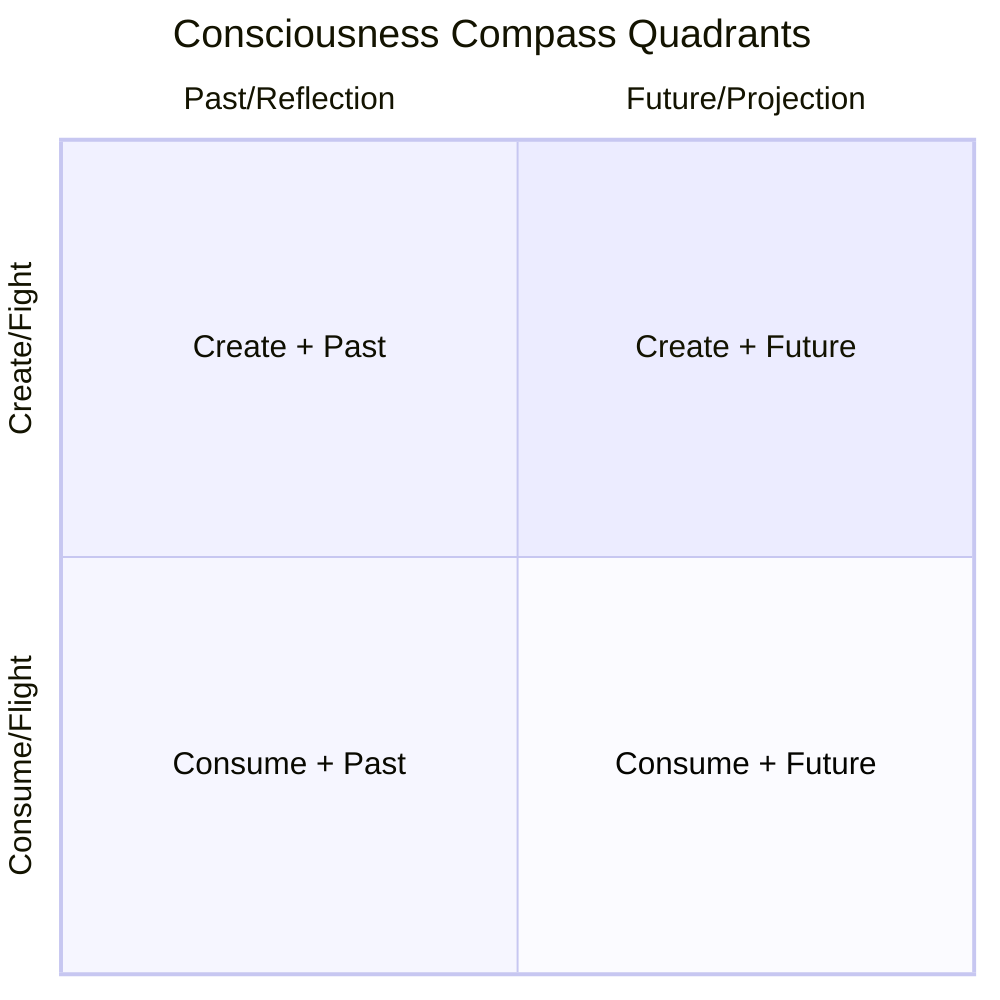

# The Quadrant System

> **Understanding the Four Zones of Consciousness**

The Consciousness Compass divides experiential reality into distinct zones, each with unique characteristics, energies, and functions.

---

## Overview



---

## The Time Axis (Horizontal)

Time flows from left to right across the Compass:

```
PAST                    PRESENT                   FUTURE
Reflection              Perception                Projection
    │                       │                         │
    │ ◄──── Time ──────────►│◄──── Time ─────────────►│
    │                       │                         │
```

### Reflection (Past)

| Element | Description |
|---------|-------------|
| **Position** | Far left of diagram |
| **Function** | Processing what has been |
| **Contents** | Internal dialogue, memories, interpretations |
| **Polarity** | Life/Joy/Love (upper) vs. Death/Fear/Pain (lower) |

The Reflection zone is where we:
- Review past experiences
- Form interpretations and meaning
- Develop beliefs from experience
- Either rise into conscious insight or fall into unconscious patterns

### Perception (Presence)

| Element | Description |
|---------|-------------|
| **Position** | Center of diagram |
| **Function** | Integrating here and now |
| **Contents** | Heart Projects + Mind Reflection |
| **Polarity** | Left Brain/Create (upper) vs. Right Brain/Consume (lower) |

The Perception zone is where we:
- Experience direct awareness
- Integrate heart and mind
- Bridge past and future
- Engage in Positive External Communication

### Projection (Future)

| Element | Description |
|---------|-------------|
| **Position** | Right side of diagram |
| **Function** | Creating what will be |
| **Contents** | Intent, Belief, Desires, Faith |
| **Polarity** | Truth/Our Intent (upper) vs. Love/Our Belief (lower) |

The Projection zone is where we:
- Set intentions for manifestation
- Direct our beliefs toward outcomes
- Transform desires through faith
- Make the decisions that shape our reality

---

## The Creation-Consumption Axis (Vertical)

### Upper Zone: Create Information (Green)

```
┌─────────────────────────────────────────────────────────────┐
│                   CREATE INFORMATION                         │
│                                                              │
│  Life / Joy / Love          Masculine Energy      Truth      │
│  Positive Internal          FIGHT                            │
│  Dialogue                                                    │
│                             Logical                          │
│  Can                        Thinking                         │
│  Consciousness                            Our Intent         │
│  Questions / Insight                                         │
│                             Desire to Give                   │
│  Left Brain                 Physical Creation                │
│  Create                                                      │
│                             Desire to Receive                │
│                             Non-Physical Creation            │
│                                                              │
└─────────────────────────────────────────────────────────────┘
```

**Characteristics:**
- Generative, outward-flowing energy
- Conscious, questioning mindset
- Logical, analytical approach
- Masculine/Yang qualities
- Focus on giving to the world
- Truth-seeking orientation

### Lower Zone: Consume Information (Blue)

```
┌─────────────────────────────────────────────────────────────┐
│                   CONSUME INFORMATION                        │
│                                                              │
│  Death / Fear / Pain        Feminine Energy      Love        │
│  Negative Internal          FLIGHT                           │
│  Dialogue                                                    │
│                             Creative                         │
│  Can't                      Thinking                         │
│  Un-Consciousness                         Our Belief         │
│  Problems / Excuses                                          │
│                             Desire to Give                   │
│  Right Brain                Non-Physical Creation            │
│  Consume                                                     │
│                             Desire to Receive                │
│                             Physical Creation                │
│                                                              │
└─────────────────────────────────────────────────────────────┘
```

**Characteristics:**
- Receptive, inward-flowing energy
- Unconscious, problem-focused mindset
- Creative, intuitive approach
- Feminine/Yin qualities
- Focus on receiving from the world
- Love-embodying orientation

---

## The Four Quadrants

### Quadrant 1: Create + Past (Upper Left)

**Zone:** Life, Joy, Love + Reflection

| Aspect | Expression |
|--------|------------|
| Internal State | Positive internal dialogue |
| Consciousness | Fully conscious, "Can" mentality |
| Mode | Questions and Insight |
| Direction | Upward arrow toward Life/Joy/Love |

**This quadrant represents:**
- Learning from past experiences positively
- Extracting wisdom and growth
- Conscious reflection that elevates
- The alchemical transformation of experience into insight

### Quadrant 2: Create + Future (Upper Right)

**Zone:** Truth + Projection

| Aspect | Expression |
|--------|------------|
| Energy | Masculine, Fight |
| Thinking | Logical |
| Core | Our Intent |
| Desire | To Give Physical Creation |
| Desire | To Receive Non-Physical Creation |
| Destination | Truth |

**This quadrant represents:**
- Active projection of intention
- Logical planning and strategy
- Truth-seeking behavior
- Creating tangible outcomes from intangible vision

### Quadrant 3: Consume + Past (Lower Left)

**Zone:** Death, Fear, Pain + Reflection

| Aspect | Expression |
|--------|------------|
| Internal State | Negative internal dialogue |
| Consciousness | Unconscious, "Can't" mentality |
| Mode | Problems and Excuses |
| Direction | Downward arrow toward Death/Fear/Pain |

**This quadrant represents:**
- Being trapped by past experiences negatively
- Repetitive unconscious patterns
- Victimhood and limitation beliefs
- The shadow material requiring integration

### Quadrant 4: Consume + Future (Lower Right)

**Zone:** Love + Projection

| Aspect | Expression |
|--------|------------|
| Energy | Feminine, Flight |
| Thinking | Creative |
| Core | Our Belief |
| Desire | To Give Non-Physical Creation |
| Desire | To Receive Physical Creation |
| Destination | Love |

**This quadrant represents:**
- Receptive attraction of desires
- Creative visualization and intuition
- Belief-based manifestation
- Receiving tangible blessings from intangible faith

---

## The State-Church Axis

The horizontal dividing line carries the labels:

```
          Logical                           Spiritual
            │                                   │
    ────────┼───────────────────────────────────┼────────
            │                                   │
          STATE                              CHURCH
```

### State (Logical)

Represents:
- Secular, worldly structures
- Rational governance
- Physical laws and systems
- The "how" of existence

### Church (Spiritual)

Represents:
- Sacred, spiritual dimensions
- Intuitive guidance
- Non-physical laws and meaning
- The "why" of existence

The Compass shows that both State (Logical) and Church (Spiritual) are necessary for complete navigation.

---

## Quadrant Interactions

### Vertical Movement

```
         ▲ Rising into Create Zone
         │
         │  Asking questions instead of making excuses
         │  "Can" replacing "Can't"
         │  Consciousness emerging from unconsciousness
         │
         ▼ Falling into Consume Zone
```

### Horizontal Movement

```
Past ◄────────────────────────────────► Future

    Processing what was        Projecting what will be
    Internal dialogue          External manifestation
    Reflection                 Projection
```

### Diagonal Patterns

- **Upper Left → Lower Right:** From conscious insight to intuitive belief
- **Upper Right → Lower Left:** From logical intent to shadow material
- **Lower Left → Upper Right:** From problems to solutions
- **Lower Right → Upper Left:** From creative dreams to joyful reality

---

## Practical Navigation

### Identifying Your Quadrant

Ask yourself:

1. **Am I creating or consuming?** (Vertical position)
2. **Am I reflecting or projecting?** (Horizontal position)
3. **Is my internal dialogue positive or negative?** (Upper or Lower)
4. **Am I asking questions or making excuses?** (Consciousness level)

### Moving Through Quadrants

**From Quadrant 3 (Consume + Past) to Quadrant 2 (Create + Future):**
1. Recognize negative patterns (awareness)
2. Shift internal dialogue (transformation)
3. Ask questions instead of making excuses (activation)
4. Project intention toward truth (manifestation)

**From Quadrant 4 (Consume + Future) to Quadrant 1 (Create + Past):**
1. Receive creative inspiration
2. Integrate through reflection
3. Transform into conscious insight
4. Emerge with joy and expanded understanding

---

## Summary

| Quadrant | Time | Mode | Energy | Destination |
|----------|------|------|--------|-------------|
| 1 (Upper Left) | Past | Create | Conscious Reflection | Life/Joy/Love |
| 2 (Upper Right) | Future | Create | Logical Projection | Truth |
| 3 (Lower Left) | Past | Consume | Unconscious Patterns | Death/Fear/Pain |
| 4 (Lower Right) | Future | Consume | Creative Reception | Love |

The quadrants are not fixed positions but dynamic states through which consciousness flows continuously.

---

*"Know where you are. Choose where you go. Navigate with awareness."*
