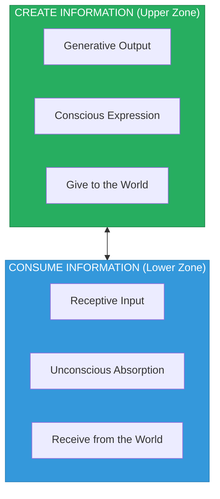
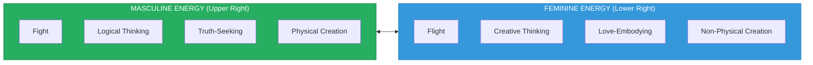
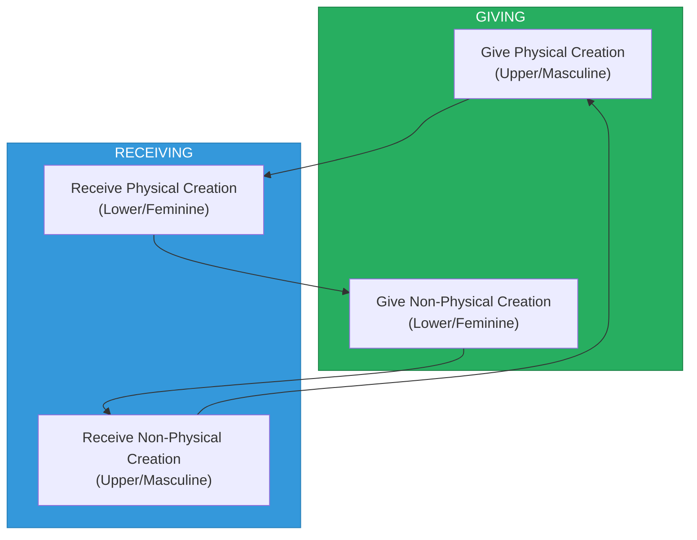

# Energy Dynamics

> **Understanding Create vs Consume, Masculine vs Feminine Energies**

The Consciousness Compass maps the fundamental energy polarities that drive human experience and manifestation.

---

## The Primary Polarity: Create vs. Consume

### Overview



---

### Create Energy (Upper Zone - Green)

**Definition:** The outward flow of consciousness that adds to reality.

| Attribute | Description |
|-----------|-------------|
| **Direction** | Outward, giving, projecting |
| **Mode** | Active, initiating, pushing |
| **Consciousness** | Aware, questioning, seeking |
| **Result** | Information, ideas, creations added to the world |

**Characteristics:**
- Asks "How can I contribute?"
- Generates new patterns, ideas, solutions
- Expands the field of possibility
- Associated with consciousness and insight
- Internal dialogue: "I can"

**When Balanced:**
- Productive creativity
- Meaningful contribution
- Healthy self-expression
- Problem-solving orientation

**When Imbalanced (Excess):**
- Burnout from over-giving
- Neglecting self-care and receptivity
- Creating without purpose
- Inability to receive

---

### Consume Energy (Lower Zone - Blue)

**Definition:** The inward flow of consciousness that receives from reality.

| Attribute | Description |
|-----------|-------------|
| **Direction** | Inward, receiving, absorbing |
| **Mode** | Receptive, responding, pulling |
| **Consciousness** | Processing, integrating, being |
| **Result** | Information, experience, nourishment absorbed from the world |

**Characteristics:**
- Asks "What can I receive?"
- Integrates existing patterns, ideas, resources
- Contracts into specific experience
- Associated with unconscious processing
- Can default to: "I can't"

**When Balanced:**
- Healthy receptivity
- Learning and growth
- Nourishment and rest
- Integration of experience

**When Imbalanced (Excess):**
- Passive consumption without action
- Victimhood and excuse-making
- Fear-based avoidance
- Unconscious pattern repetition

---

## The Secondary Polarity: Masculine vs. Feminine

### Overview



---

### Masculine Energy (Fight)

**Position:** Upper right zone, associated with Create + Future

| Attribute | Expression |
|-----------|------------|
| **Response Pattern** | Fight (engage, confront, pursue) |
| **Thinking Style** | Logical, analytical, sequential |
| **Target** | Truth |
| **Action** | Give Physical Creation |
| **Reception** | Receive Non-Physical Creation |

**Characteristics:**
- Direct, focused, goal-oriented
- Penetrating awareness that seeks truth
- Structures, builds, manifests tangibly
- Associated with the Left Brain
- Expresses through action and accomplishment

**Balanced Masculine:**
- Protective without dominating
- Decisive without being rigid
- Strong without being aggressive
- Logical without dismissing feeling

**Shadow Masculine:**
- Aggression, violence, domination
- Over-rationalization, emotional suppression
- Control, manipulation, force
- Truth-seeking that becomes dogmatic

---

### Feminine Energy (Flight)

**Position:** Lower right zone, associated with Consume + Future

| Attribute | Expression |
|-----------|------------|
| **Response Pattern** | Flight (receive, yield, attract) |
| **Thinking Style** | Creative, intuitive, holistic |
| **Target** | Love |
| **Action** | Give Non-Physical Creation |
| **Reception** | Receive Physical Creation |

**Characteristics:**
- Receptive, flowing, process-oriented
- Embracing awareness that embodies love
- Inspires, nurtures, attracts abundance
- Associated with the Right Brain
- Expresses through being and relationship

**Balanced Feminine:**
- Receptive without being passive
- Intuitive without being irrational
- Nurturing without being smothering
- Creative without being chaotic

**Shadow Feminine:**
- Manipulation, passive aggression
- Over-emotionality, irrationality
- Dependence, victimhood, helplessness
- Love-seeking that becomes attachment

---

## The Desire Matrix

The Compass reveals four types of desire based on the intersection of energy and manifestation:

### 1. Desire to Give Physical Creation (Upper Zone)

```
Masculine Energy → Desire to Give Physical Creation → Truth
```

**Meaning:** The drive to contribute tangible work, products, structures, and solutions to the world.

**Examples:**
- Building businesses, systems, infrastructure
- Creating art, products, inventions
- Writing books, code, documentation
- Physical acts of service

---

### 2. Desire to Receive Non-Physical Creation (Upper Zone)

```
Masculine Energy ← Desire to Receive Non-Physical Creation ← Truth
```

**Meaning:** The openness to receive inspiration, insight, vision, and understanding.

**Examples:**
- Receiving creative downloads
- Understanding abstract concepts
- Gaining wisdom from experience
- Accepting guidance and feedback

---

### 3. Desire to Give Non-Physical Creation (Lower Zone)

```
Feminine Energy → Desire to Give Non-Physical Creation → Love
```

**Meaning:** The drive to contribute energy, love, presence, and spiritual support.

**Examples:**
- Holding space for others
- Offering prayers, intentions, blessings
- Sharing emotional support and presence
- Teaching through being, not just doing

---

### 4. Desire to Receive Physical Creation (Lower Zone)

```
Feminine Energy ← Desire to Receive Physical Creation ← Love
```

**Meaning:** The openness to receive tangible abundance, resources, and physical support.

**Examples:**
- Accepting gifts, money, resources
- Receiving physical care and nurturing
- Allowing others to build for you
- Opening to material abundance

---

## The Complete Energy Flow



**The cycle:**
1. Masculine energy gives physical creation (builds, makes, does)
2. Feminine energy receives physical creation (accepts, uses, benefits)
3. Feminine energy gives non-physical creation (loves, nurtures, inspires)
4. Masculine energy receives non-physical creation (is inspired, healed, directed)
5. Cycle continues...

---

## Left Brain vs. Right Brain

The Compass maps brain hemisphere associations:

| Left Brain (Create Zone) | Right Brain (Consume Zone) |
|-------------------------|---------------------------|
| Logical, analytical | Creative, intuitive |
| Sequential processing | Holistic processing |
| Language, math | Art, music, emotion |
| Detail-focused | Pattern-focused |
| Conscious processing | Unconscious processing |

### Integration Point

At the center of the Compass:
- **Our Heart Projects** (Right Brain contribution)
- **Our Minds Reflection** (Left Brain contribution)

True intelligence emerges from the integration of both hemispheres.

---

## Fight vs. Flight Dynamics

### Fight (Masculine)

**When appropriate:**
- Defending truth, boundaries, loved ones
- Confronting challenges directly
- Taking decisive action
- Engaging with problems to solve them

**When inappropriate:**
- Aggression without purpose
- Fighting against natural flow
- Resistance that creates more conflict
- Attacking instead of protecting

### Flight (Feminine)

**When appropriate:**
- Strategic withdrawal to regroup
- Allowing space for natural resolution
- Receiving rather than forcing
- Graceful release of what doesn't serve

**When inappropriate:**
- Avoidance of necessary confrontation
- Escapism from growth opportunities
- Passivity when action is required
- Fear-based retreat

---

## Balancing the Energies

### Signs of Imbalance

| Too Much Create | Too Much Consume |
|----------------|------------------|
| Exhaustion, burnout | Stagnation, depression |
| Giving without receiving | Taking without contributing |
| Over-activity | Passivity |
| Can't stop, won't rest | Can't start, won't move |

| Too Much Masculine | Too Much Feminine |
|-------------------|-------------------|
| Rigid, controlling | Chaotic, unfocused |
| Emotionally cut off | Emotionally overwhelmed |
| Always doing, never being | Always being, never doing |
| Truth without love | Love without truth |

### Practices for Balance

**To increase Create energy:**
- Set clear intentions
- Take action on ideas
- Express yourself outwardly
- Ask questions, seek insight

**To increase Consume energy:**
- Practice receptivity
- Allow yourself to be helped
- Rest and integrate
- Listen more than speak

**To balance Masculine/Feminine:**
- Alternate between logical analysis and creative intuition
- Practice both giving and receiving
- Honor both truth and love as equal values
- Integrate fight and flight as situation requires

---

## Summary Table

| Energy | Zone | Direction | Quality | Target |
|--------|------|-----------|---------|--------|
| Create | Upper (Green) | Outward | Giving | Information |
| Consume | Lower (Blue) | Inward | Receiving | Information |
| Masculine | Upper Right | Projecting | Logical | Truth |
| Feminine | Lower Right | Attracting | Creative | Love |

---

*"The dance of energies is the dance of life itself. Master the balance, and you master your reality."*
