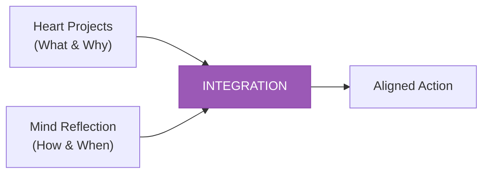
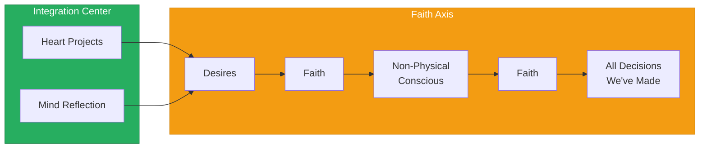
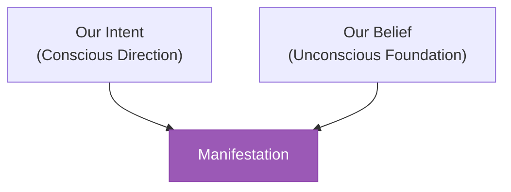

# The Integration Model

> **Heart-Mind Integration and the Faith Axis**

At the center of the Consciousness Compass lies the integration point — where all polarities merge, and the path to manifestation becomes clear.

---

## The Central Integration

### Heart + Mind

```
┌─────────────────────────────────────────┐
│                                         │
│          ┌─────────────────┐            │
│          │  Our Heart      │            │
│          │  Projects       │            │
│          └────────┬────────┘            │
│                   │                     │
│                   ▼                     │
│          ┌─────────────────┐            │
│          │  Our Minds      │            │
│          │  Reflection     │            │
│          └─────────────────┘            │
│                                         │
└─────────────────────────────────────────┘
```

The center of the Compass contains two interconnected elements:

### Our Heart Projects

**Meaning:** The desires, passions, and soul-callings that emerge from the heart center.

| Aspect | Description |
|--------|-------------|
| **Source** | Emotional/intuitive intelligence |
| **Function** | Generating authentic desire |
| **Expression** | What we care about, love, are called to |
| **Energy** | Feminine, creative, right-brain |

**Heart Projects are:**
- What lights us up
- What we would do without payment
- Where our passion naturally flows
- The "why" behind our actions

### Our Minds Reflection

**Meaning:** The analytical processing and conscious awareness that evaluates and organizes.

| Aspect | Description |
|--------|-------------|
| **Source** | Rational/logical intelligence |
| **Function** | Processing and planning |
| **Expression** | How we think about what we feel |
| **Energy** | Masculine, logical, left-brain |

**Mind Reflection involves:**
- Analyzing heart impulses
- Creating strategic plans
- Solving problems logically
- The "how" behind our actions

### The Integration Imperative



**Neither alone is sufficient:**
- Heart without mind = Passion without direction
- Mind without heart = Strategy without soul

**Integration produces:**
- Aligned action
- Sustainable motivation
- Effective manifestation
- Authentic success

---

## The Faith Axis

### The Horizontal Path

From the center of the Compass, a horizontal axis extends rightward:

```
Center          Faith           Faith         Outcome
   │              │               │              │
   ▼              ▼               ▼              ▼
Desires ────► [Faith] ────► Non-Physical ────► All Decisions
                            Conscious          We've Made
```

### Stage 1: Desires

**Position:** Immediately right of center

**Meaning:** The raw wanting that emerges from heart-mind integration.

Desires are:
- Not inherently good or bad
- The fuel for manifestation
- The starting point of creation
- What drives us forward

**Key insight:** Desires themselves do not create reality — they must pass through Faith.

---

### Stage 2: Faith (First Occurrence)

**Position:** Between Desires and Non-Physical Conscious

**Meaning:** The bridge that transforms desire into potential.

```
Desire ─────► Faith ─────► Potential
(Wanting)    (Believing)   (Becoming)
```

**Faith at this stage involves:**
- Believing that desires can be fulfilled
- Trusting the process of manifestation
- Releasing attachment to specific outcomes
- Aligning desire with divine will

---

### Stage 3: Non-Physical Conscious

**Position:** Right side, before final outcome

**Meaning:** The realm of pure awareness and potential — consciousness before form.

**Non-Physical Conscious represents:**
- The field of all possibility
- Awareness independent of material form
- The space between intention and manifestation
- Where thought becomes reality blueprint

**This is:**
- The akashic field
- The quantum potential
- The imagination realm
- Pure consciousness

---

### Stage 4: Faith (Second Occurrence)

**Position:** Between Non-Physical Conscious and Decisions

**Meaning:** The final commitment that collapses potential into actuality.

```
Potential ─────► Faith ─────► Actuality
(Could be)      (Committing)   (Is)
```

**Faith at this stage involves:**
- Making the final choice
- Committing to one reality among infinite potentials
- Taking the leap into manifestation
- Accepting consequences

---

### Stage 5: All Decisions We've Made

**Position:** Far right, final destination

**Meaning:** The accumulated sum of all choices — our created reality.

**This represents:**
- The manifest world we inhabit
- The results of all past faith-steps
- Our current life circumstances
- The foundation for future decisions

---

## The Complete Faith Flow



---

## State and Church Integration

### The Horizontal Labels

The central dividing line carries two labels:

| Label | Position | Meaning |
|-------|----------|---------|
| **Logical / State** | Upper-center | Secular, rational governance |
| **Spiritual / Church** | Lower-center | Sacred, intuitive guidance |

### State (Logical)

Represents the domain of:
- Rational analysis
- Physical laws
- Social structures
- External governance
- The "how" of existence

### Church (Spiritual)

Represents the domain of:
- Intuitive knowing
- Spiritual laws
- Inner guidance
- Self-governance
- The "why" of existence

### Integration Imperative

```
┌────────────────────────────────────────────────────────┐
│                         STATE                          │
│                  (Logical / External)                  │
│                                                        │
│  ──────────────────── • ───────────────────────────── │
│                                                        │
│                        CHURCH                          │
│                 (Spiritual / Internal)                 │
└────────────────────────────────────────────────────────┘
```

**Neither alone is sufficient:**
- State without Church = Soulless systems
- Church without State = Ungrounded spirituality

**True integration:**
- Logical structures serving spiritual purpose
- Spiritual wisdom informing practical action
- Laws that honor both physical and metaphysical reality
- Governance that serves human flourishing

---

## Positive External Communication

### The Central Output

From the center (Perception/Presence zone), an arrow points outward labeled:
**"Positive External Communication"**

This represents:
- The integrated output of heart-mind alignment
- Communication that comes from centered awareness
- Expression that bridges inner and outer worlds
- The voice of integrated consciousness

**Qualities of Positive External Communication:**
- Authentic (from heart)
- Clear (from mind)
- Present (from perception)
- Creative (from integration)

---

## Intent and Belief Integration

### Our Intent (Upper Zone)

**Position:** Upper right, connected to Truth and Masculine Energy

**Function:** Directing the will toward specific outcomes

```
Logical Thinking ────► Our Intent ────► Truth
```

Intent is:
- The conscious direction of energy
- The "what" we aim to create
- Masculine, purposeful, targeted

### Our Belief (Lower Zone)

**Position:** Lower right, connected to Love and Feminine Energy

**Function:** Providing the foundation of what we accept as real

```
Creative Thinking ────► Our Belief ────► Love
```

Belief is:
- The unconscious acceptance of reality
- The "ground" from which we create
- Feminine, foundational, receptive

### Integration of Intent and Belief



**For effective manifestation:**
- Intent must align with belief
- Conscious wanting must match unconscious accepting
- What we say we want must be what we believe we can have

**Misalignment produces:**
- Self-sabotage
- Frustrated desire
- Conflicted outcomes
- Dissonance

---

## The Complete Integration Model

```
                           TRUTH
                             ▲
                             │
                        Our Intent
                             │
        Life/Joy/Love ──►    │    ◄── Logical Thinking
                             │
   ┌─────────────────────────┼─────────────────────────┐
   │                         │                         │
   │  Heart     Positive     │                         │
   │  Projects  External  ───┼───► Desires ──► Faith   │
   │     +      Communic.    │                    │    │
   │  Minds                  │              Non-Phys.  │
   │  Reflect.               │              Conscious  │
   │                         │                    │    │
   └─────────────────────────┼────────────────────┼────┘
                             │                    ▼
        Death/Fear/Pain ──►  │  ◄── Creative  Faith
                             │      Thinking     │
                        Our Belief               ▼
                             │            All Decisions
                             ▼            We've Made
                           LOVE
```

---

## Practical Integration Practices

### Daily Integration Check

1. **Morning (Heart):** What does my heart want today?
2. **Morning (Mind):** How will I approach this logically?
3. **Midday (Faith):** Am I trusting the process?
4. **Evening (Reflection):** What decisions did I make? From what state?

### Integration Questions

- Is my intent aligned with my belief?
- Am I honoring both State (logic) and Church (spirit)?
- Is my communication coming from centered presence?
- Are my desires passing through faith before action?

### Signs of Integration

| Integrated | Fragmented |
|------------|------------|
| Clarity of purpose | Confusion |
| Aligned action | Self-sabotage |
| Peaceful certainty | Anxious doubt |
| Flow and ease | Struggle and force |

---

## Summary

The Integration Model teaches that:

1. **Heart and Mind must unite** — Neither passion nor logic alone creates sustainable results
2. **Faith is the bridge** — Between desire and reality, between potential and actuality
3. **State and Church both matter** — Rational and spiritual perspectives integrate
4. **Intent and Belief must align** — Conscious wanting and unconscious acceptance must match
5. **All decisions accumulate** — Every choice builds the world we inhabit

---

*"At the center of all polarities lies the still point of integration — from here, all navigation becomes clear."*
