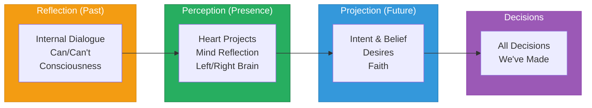

# Consciousness Compass

> **"Love is OUR Belief, Truth is OUR Intent, Freedom is OUR Faith, IDEAS are OUR Compass"**
>
> A "WE" Focused Framework for 21st Century Society — Collaborative Mindset & Acceptance

---

## Overview

The Consciousness Compass is a visual and conceptual framework for understanding human consciousness, decision-making, and the dynamic interplay between creation and consumption. It maps the journey from inner reflection to outer manifestation, integrating mind, heart, and spirit.



---

## Core Philosophy

| Pillar | Meaning |
|--------|---------|
| **Love is OUR Belief** | The foundation of all creation rests on unconditional love as the core belief system |
| **Truth is OUR Intent** | All actions and creations are guided by truthful intention |
| **Freedom is OUR Faith** | Faith expressed through sovereign, unrestricted choice |
| **IDEAS are OUR Compass** | Thoughts and concepts guide navigation through reality |

---

## Documentation

| Document | Description |
|----------|-------------|
| [Ideology & Philosophy](./00-ideology.md) | Deep dive into the philosophical foundation |
| [Quadrant System](./01-quadrant-system.md) | Understanding the four zones of consciousness |
| [Energy Dynamics](./02-energy-dynamics.md) | Create vs Consume, Masculine vs Feminine |
| [Integration Model](./03-integration-model.md) | Heart-Mind integration and the faith axis |
| [Diagram Reference](./diagrams/README.md) | Visual breakdown and diagram explanation |

---

## Quick Reference

### The Time Axis

```
PAST ──────────► PRESENT ──────────► FUTURE
(Reflection)     (Perception)        (Projection)
```

### The Duality Spectrum

| Upper Zone (Green) | Lower Zone (Blue) |
|--------------------|-------------------|
| Create Information | Consume Information |
| Life / Joy / Love | Death / Fear / Pain |
| Consciousness | Un-Consciousness |
| Questions / Insight | Problems / Excuses |
| Positive Internal Dialogue | Negative Internal Dialogue |
| Left Brain / Create | Right Brain / Consume |
| Fight / Masculine Energy | Flight / Feminine Energy |
| Logical Thinking | Creative Thinking |
| Truth | Love |

### The Central Integration

```
┌─────────────────────────────────┐
│      Our Heart Projects         │
│              +                  │
│      Our Minds Reflection       │
└─────────────────────────────────┘
              │
              ▼
┌─────────────────────────────────┐
│           Desires               │
│              │                  │
│            Faith                │
│              │                  │
│     Non-Physical Conscious      │
│              │                  │
│    All Decisions We've Made     │
└─────────────────────────────────┘
```

---

## Application to AI Brand Factory

The Consciousness Compass serves as a decision-making framework aligned with the [50 Sacred Laws](../../00-sacred-laws.md). It helps:

1. **Evaluate brand concepts** — Is this creation or consumption focused?
2. **Align with higher purpose** — Does it serve Truth, Love, and Freedom?
3. **Balance energies** — Integrate logical and creative, masculine and feminine
4. **Navigate timelines** — From reflection through perception to projection

| Sacred Law | Compass Connection |
|------------|-------------------|
| Law of Harmony (1) | Balance between Create and Consume zones |
| Law of Free Will (8) | Freedom as core faith pillar |
| Law of Manifestation (10) | Projection into future through Faith |
| Law of Belief (45) | Love as foundational belief |
| Law of Reflection (16) | The Past/Reflection axis |
| Law of Duality (37) | Upper/Lower zone integration |

---

## The Living Framework

This compass is not static — it is a living tool for navigating consciousness. As we grow individually and collectively, the framework reveals deeper layers of understanding.

> *"We are not consumers of information seeking to fill a void. We are creators of information, projecting our intent and belief into the fabric of reality."*

---

*Navigate with Love. Create with Truth. Move with Freedom. Follow the IDEAS.*
