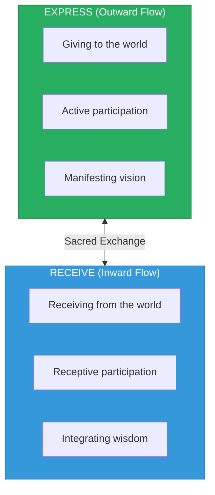
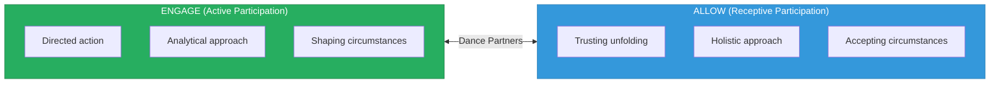
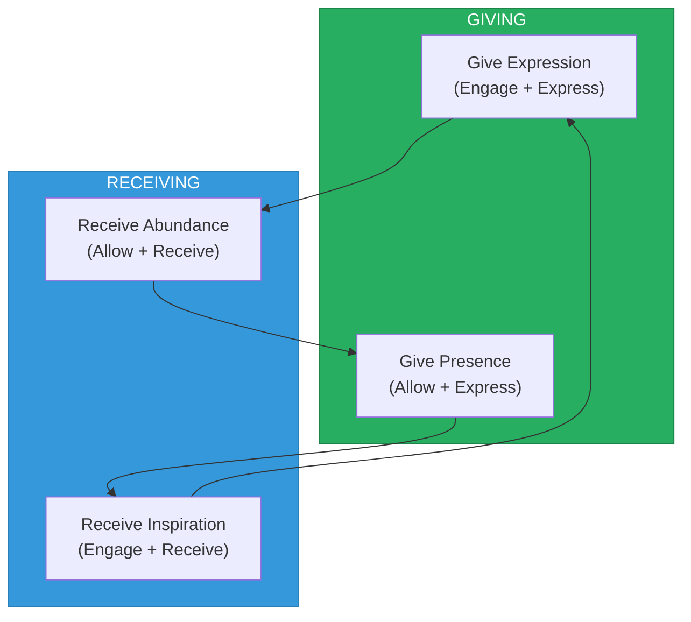

# Energy Dynamics

> **Understanding Express vs Receive, Engage vs Allow Energies**

The Consciousness Compass maps the fundamental energy flows that enable coherent co-creation with the universe. These are not opposing forces but complementary movements in an eternal dance.

---

## The Primary Polarity: Express vs. Receive

### Overview



**Key Insight:** Both flows are equally sacred. The universe breathes in and out. Coherence requires honoring both the exhale (expression) and the inhale (reception).

---

### Express Energy (Outward Flow)

**Definition:** The outward movement of consciousness that gives to reality.

| Attribute | Description |
|-----------|-------------|
| **Direction** | Outward, giving, projecting |
| **Mode** | Active, initiating, offering |
| **Consciousness** | Directed, intentional, focused |
| **Result** | Ideas, creations, actions added to the world |

**Characteristics:**
- Asks "What can I contribute?"
- Generates new patterns, ideas, solutions
- Expands the field through offering
- Associated with analytical, directed awareness
- Oriented toward truth-seeking and truth-sharing

**Conscious Expression:**
- Aligned giving from overflow
- Intentional creation serving the whole
- Clear communication and teaching
- Healthy self-expression and contribution

**Unconscious Expression:**
- Compulsive output to avoid feeling
- Giving from depletion (burnout)
- Creating without purpose or alignment
- Inability to receive, over-doing

---

### Receive Energy (Inward Flow)

**Definition:** The inward movement of consciousness that accepts from reality.

| Attribute | Description |
|-----------|-------------|
| **Direction** | Inward, receiving, absorbing |
| **Mode** | Receptive, responding, accepting |
| **Consciousness** | Open, integrating, allowing |
| **Result** | Wisdom, experience, nourishment absorbed from the world |

**Characteristics:**
- Asks "What is being offered?"
- Integrates existing patterns, wisdom, resources
- Deepens through receiving
- Associated with holistic, open awareness
- Oriented toward love-embodying and love-receiving

**Conscious Reception:**
- Mindful receiving with gratitude
- Deep listening to guidance
- Intentional integration of experience
- Healthy rest and replenishment

**Unconscious Reception:**
- Numbing consumption without presence
- Passive absorption without discernment
- Taking without gratitude or reciprocity
- Stagnation and avoidance of expression

---

## The Secondary Polarity: Engage vs. Allow

### Overview



**Why "Engage/Allow" instead of "Fight/Flight":**

The previous framing used Fight/Flight — stress responses that imply an adversarial relationship with reality. But co-creation isn't combat. The universe isn't something to fight or flee from; it's something to dance with.

- **Engage** = Active participation in the dance (sometimes we lead)
- **Allow** = Receptive participation in the dance (sometimes we follow)

Both are forms of participation. Neither implies defeat or victory.

---

### Engage Energy (Active Participation)

**Definition:** The mode of consciousness that actively shapes and directs.

| Attribute | Expression |
|-----------|------------|
| **Participation Mode** | Active, leading, shaping |
| **Thinking Style** | Analytical, sequential, focused |
| **Orientation** | Truth-seeking |
| **Action** | Giving expression, taking initiative |
| **Timing** | When action is called for |

**Characteristics:**
- Direct, focused, goal-oriented
- Penetrating awareness that seeks clarity
- Structures, builds, manifests tangibly
- Takes initiative and responsibility
- Expresses through action and accomplishment

**Balanced Engage:**
- Protective without dominating
- Decisive without being rigid
- Strong without being aggressive
- Active without being compulsive

**Shadow Engage:**
- Aggression, forcing, domination
- Over-control, inability to surrender
- Action disconnected from heart
- Doing to avoid being

---

### Allow Energy (Receptive Participation)

**Definition:** The mode of consciousness that receives and trusts the unfolding.

| Attribute | Expression |
|-----------|------------|
| **Participation Mode** | Receptive, following, accepting |
| **Thinking Style** | Holistic, intuitive, open |
| **Orientation** | Love-embodying |
| **Action** | Receiving inspiration, trusting timing |
| **Timing** | When surrender is called for |

**Characteristics:**
- Receptive, flowing, process-trusting
- Embracing awareness that accepts what is
- Nurtures, attracts, allows abundance
- Surrenders control while maintaining presence
- Expresses through being and relationship

**Balanced Allow:**
- Receptive without being passive
- Intuitive without being groundless
- Surrendered without being helpless
- Open without being undiscerning

**Shadow Allow:**
- Passivity, avoidance of responsibility
- Learned helplessness, dependency
- Groundless fantasy, magical thinking
- Escapism from necessary engagement

---

## The Desire Matrix

The Compass reveals four types of desire based on the intersection of flow and participation:

### 1. Desire to Give Expression (Engage + Express)

```
Engage Energy → Giving Expression → Truth
```

**Meaning:** The drive to contribute active work, ideas, creations, and solutions.

**Examples:**
- Building businesses, systems, infrastructure
- Creating art, products, inventions
- Teaching, writing, communicating
- Active service and contribution

**Conscious form:** Aligned action from overflow
**Unconscious form:** Compulsive doing, burnout giving

---

### 2. Desire to Receive Inspiration (Engage + Receive)

```
Engage Energy ← Receiving Inspiration ← Truth
```

**Meaning:** Actively seeking and opening to insight, vision, and understanding.

**Examples:**
- Actively seeking guidance and wisdom
- Researching, studying, investigating
- Asking questions, seeking mentorship
- Intentional learning and growth

**Conscious form:** Humble, active seeking
**Unconscious form:** Grasping for answers, spiritual materialism

---

### 3. Desire to Give Presence (Allow + Express)

```
Allow Energy → Giving Presence → Love
```

**Meaning:** Offering energy, love, and being without active doing.

**Examples:**
- Holding space for others
- Silent witnessing and presence
- Offering prayers, intentions, blessings
- Teaching through being, not just doing

**Conscious form:** Grounded, loving presence
**Unconscious form:** Passive-aggressive withholding disguised as allowing

---

### 4. Desire to Receive Abundance (Allow + Receive)

```
Allow Energy ← Receiving Abundance ← Love
```

**Meaning:** Trusting and opening to resources, support, blessing, and love.

**Examples:**
- Accepting gifts, support, resources
- Receiving care and nurturing
- Opening to unexpected blessings
- Allowing love to penetrate defenses

**Conscious form:** Grateful, openhearted receiving
**Unconscious form:** Entitled expectation, dependency

---

## The Complete Energy Flow



**The cycle:**
1. Engage energy gives expression (creates, offers, contributes)
2. Allow energy receives abundance (accepts the universe's response)
3. Allow energy gives presence (offers being, holds space)
4. Engage energy receives inspiration (actively integrates, learns)
5. Cycle continues...

---

## Analytical vs. Holistic Thinking

The Compass integrates two modes of cognition:

| Analytical Thinking (Express Zone) | Holistic Thinking (Receive Zone) |
|-----------------------------------|----------------------------------|
| Sequential processing | Parallel processing |
| Focused attention | Open attention |
| Linear logic | Pattern recognition |
| Detail-oriented | Context-oriented |
| Directed awareness | Receptive awareness |

**Previous framing:** Left Brain / Right Brain
**Revised framing:** Analytical / Holistic (function, not outdated neuroscience)

### Integration Point

At the center of the Compass:
- **Our Heart Projects** (Holistic contribution)
- **Our Minds Reflection** (Analytical contribution)

True coherence emerges from integrating both modes of awareness.

---

## Engage vs. Allow Dynamics

### Engage (Active Participation)

**When appropriate:**
- Clear action is needed
- Shaping outcomes serves the whole
- Taking responsibility for change
- Actively seeking truth and wisdom

**When inappropriate:**
- Forcing against natural flow
- Acting from fear rather than alignment
- Controlling what needs to be surrendered
- Doing to avoid feeling

### Allow (Receptive Participation)

**When appropriate:**
- Surrender serves the unfolding
- Receiving is the aligned response
- Trust is called for over control
- Being is more valuable than doing

**When inappropriate:**
- Avoiding necessary action
- Spiritual bypassing of responsibility
- Passivity dressed as acceptance
- Helplessness masking fear

---

## Balancing the Energies

### Signs of Imbalance

| Too Much Express | Too Much Receive |
|-----------------|------------------|
| Exhaustion, burnout | Stagnation, unfulfillment |
| Giving without replenishing | Taking without contributing |
| Over-output | Under-output |
| Can't rest, always doing | Can't start, always waiting |

| Too Much Engage | Too Much Allow |
|----------------|----------------|
| Rigid, controlling | Groundless, unfocused |
| Forcing outcomes | Passive fantasy |
| Always leading, never following | Always following, never leading |
| Truth without love | Love without truth |

### Practices for Balance

**To increase Express energy:**
- Set clear intentions
- Take action on inspiration received
- Offer your gifts to the world
- Communicate what's true for you

**To increase Receive energy:**
- Practice receptivity and rest
- Allow yourself to be helped
- Listen more than speak
- Receive without guilt

**To balance Engage/Allow:**
- Alternate between active and receptive modes
- Notice when forcing appears
- Notice when avoidance appears
- Let the situation indicate which mode is needed

---

## Summary Table

| Energy | Zone | Direction | Quality | Orientation |
|--------|------|-----------|---------|-------------|
| Express | Upper | Outward | Giving | Truth |
| Receive | Lower | Inward | Receiving | Love |
| Engage | Active | Directing | Shaping | Active participation |
| Allow | Receptive | Accepting | Trusting | Receptive participation |

---

## The Dance Metaphor

Co-creation with the universe is a dance, not a battle:

- Sometimes we **lead** (Engage + Express)
- Sometimes we **follow** (Allow + Receive)
- Sometimes we **offer** (Allow + Express)
- Sometimes we **accept** (Engage + Receive)

A good dancer knows all four movements. A coherent co-creator flows between them as the music requires.

---

*"The dance of energies is the dance of life itself. Master the balance, and you dance in coherence with the universe."*
