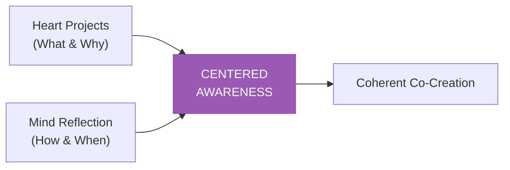
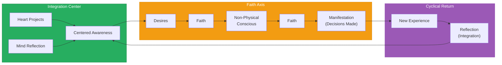
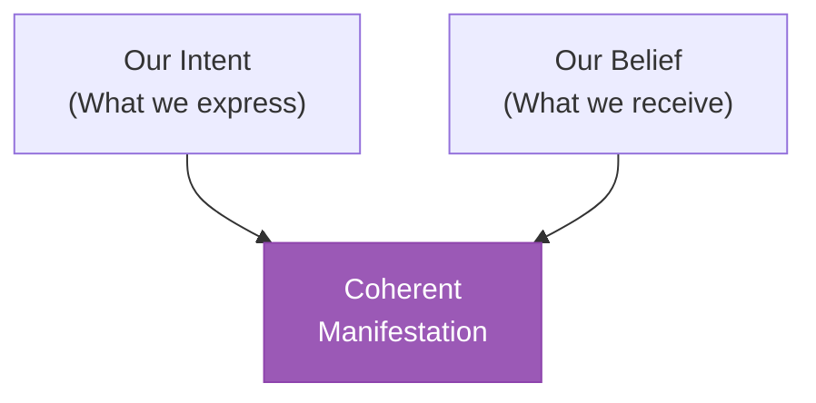

# The Integration Model

> **Heart-Mind Integration, the Faith Axis, and the Cyclical Return**

At the center of the Consciousness Compass lies the integration point — where all polarities merge, where dialogue with the universe becomes clearest, and where the path to coherent co-creation opens.

---

## The Central Integration

### Heart + Mind

```
┌─────────────────────────────────────────┐
│                                         │
│          ┌─────────────────┐            │
│          │  Our Heart      │            │
│          │  Projects       │            │
│          └────────┬────────┘            │
│                   │                     │
│                   ▼                     │
│          ┌─────────────────┐            │
│          │  Our Minds      │            │
│          │  Reflection     │            │
│          └────────┬────────┘            │
│                   │                     │
│                   ▼                     │
│          ┌─────────────────┐            │
│          │   Centered      │            │
│          │   Awareness     │            │
│          │  (Still Point)  │            │
│          └─────────────────┘            │
│                                         │
└─────────────────────────────────────────┘
```

The center of the Compass contains the integration of two essential elements:

### Our Heart Projects

**Meaning:** The desires, passions, and soul-callings that emerge from the heart center.

| Aspect | Description |
|--------|-------------|
| **Source** | Emotional/intuitive intelligence |
| **Function** | Generating authentic desire |
| **Expression** | What we care about, love, are called to |
| **Energy** | Holistic, receptive, feeling-based |

**Heart Projects are:**
- What lights us up
- What we would do without payment
- Where our passion naturally flows
- The "why" and "what" behind our actions

### Our Minds Reflection

**Meaning:** The analytical processing and conscious awareness that evaluates and organizes.

| Aspect | Description |
|--------|-------------|
| **Source** | Rational/analytical intelligence |
| **Function** | Processing and planning |
| **Expression** | How we think about what we feel |
| **Energy** | Analytical, directed, thought-based |

**Mind Reflection involves:**
- Analyzing heart impulses
- Creating strategic plans
- Solving problems logically
- The "how" and "when" behind our actions

### The Integration Imperative



**Neither alone is sufficient:**
- Heart without mind = Passion without direction
- Mind without heart = Strategy without soul

**Integration produces:**
- Aligned action
- Sustainable motivation
- Effective manifestation
- Authentic participation in co-creation

### The Still Point

At the very center lies **Centered Awareness** — the still point from which all navigation occurs. This is:
- The seat of presence
- The place of clearest perception
- Where the universe's voice is most audible
- The foundation for coherent response

---

## The Faith Axis

### The Horizontal Path of Manifestation

From the center of the Compass, a horizontal axis extends rightward through the projection zone:

```
Center          Faith           Faith         Outcome
   │              │               │              │
   ▼              ▼               ▼              ▼
Desires ────► [Faith] ────► Non-Physical ────► Decisions
                            Conscious          (Manifestation)
```

### Stage 1: Desires

**Position:** Immediately right of center

**Meaning:** The raw wanting that emerges from heart-mind integration.

Desires are:
- Not inherently good or bad
- The fuel for manifestation
- The starting point of co-creation
- What draws us toward the future

**Key insight:** Desires themselves do not create reality — they must pass through Faith.

---

### Stage 2: Faith (First Passage)

**Position:** Between Desires and Non-Physical Conscious

**Meaning:** The bridge that transforms desire into potential.

```
Desire ─────► Faith ─────► Potential
(Wanting)    (Trusting)    (Possible)
```

**Faith at this stage involves:**
- Believing that desires can be fulfilled
- Trusting the process of co-creation
- Releasing attachment to specific forms
- Opening to universal intelligence

---

### Stage 3: Non-Physical Conscious

**Position:** Right side, before final manifestation

**Meaning:** The realm of pure awareness and potential — consciousness before form.

**Non-Physical Conscious represents:**
- The field of all possibility
- Awareness independent of material form
- The space between intention and manifestation
- Where thought becomes reality blueprint
- The realm where dialogue with the universe is clearest

**This is:**
- The imaginal realm
- Pure potential
- The space of "not yet but possible"
- Where co-creation is most collaborative

---

### Stage 4: Faith (Second Passage)

**Position:** Between Non-Physical Conscious and Decisions

**Meaning:** The final commitment that collapses potential into actuality.

```
Potential ─────► Faith ─────► Actuality
(Could be)      (Committing)   (Is)
```

**Faith at this stage involves:**
- Making the choice
- Committing to one reality among infinite potentials
- Taking the leap into manifestation
- Accepting what emerges

---

### Stage 5: Decisions Made / Manifestation

**Position:** Far right, the manifestation point

**Meaning:** The accumulated sum of all choices — reality shaped through co-creation.

**This represents:**
- The manifest world we inhabit
- The results of all past faith-passages
- Current life circumstances
- The material that will become new experience

---

## The Cyclical Return

### The Missing Piece in Linear Models

Many manifestation models stop at "Decisions Made" — as if creation is complete. But **reality is dialogue, not monologue**. Every decision becomes new experience that returns for reflection.

```
┌────────────────────────────────────────────────────────────────┐
│                                                                │
│   Reflection ──► Perception ──► Projection ──► Manifestation   │
│       ▲                                              │         │
│       │                                              │         │
│       │            CYCLICAL RETURN                   │         │
│       │                                              │         │
│       └──────────── New Experience ◄─────────────────┘         │
│                                                                │
└────────────────────────────────────────────────────────────────┘
```

### What the Cyclical Return Teaches

1. **No manifestation is final** — Every outcome becomes material for new reflection
2. **The universe responds** — Our expressions evoke universal response, which we receive
3. **Co-creation is continuous** — There is no "done," only the ongoing dance
4. **Decisions carry forward** — What we create becomes the context for what comes next
5. **Wisdom accumulates** — Each cycle offers potential for deeper understanding

### The Return as Reception

The Cyclical Return is where **the universe speaks back**:

- We express vision → Reality manifests → New experience returns
- The return is the universe's "answer" to our "question"
- Reception of this return is how we stay in dialogue
- Without the return, we're in monologue — projecting without listening

---

## The Complete Faith Flow with Return



---

## Structure and Meaning Integration

### The Horizontal Bridge

The central dividing line integrates:

| Label | Position | Meaning |
|-------|----------|---------|
| **Structure (Rational)** | Upper-center | Analytical frameworks, logic, systems |
| **Meaning (Spiritual)** | Lower-center | Intuitive knowing, significance, purpose |

### Structure (Rational)

Represents the domain of:
- Analytical analysis
- Physical laws
- Systems and frameworks
- External structures
- The "how" of existence

### Meaning (Spiritual)

Represents the domain of:
- Intuitive knowing
- Spiritual principles
- Inner guidance
- Significance and purpose
- The "why" of existence

### Integration Imperative

```
┌────────────────────────────────────────────────────────┐
│                      STRUCTURE                          │
│                 (Rational / Analytical)                 │
│                                                         │
│  ───────────────────── • ────────────────────────────  │
│                                                         │
│                       MEANING                           │
│                (Spiritual / Intuitive)                  │
└────────────────────────────────────────────────────────┘
```

**Neither alone is sufficient:**
- Structure without meaning = Soulless systems
- Meaning without structure = Ungrounded spirituality

**True integration:**
- Logical structures serving spiritual purpose
- Spiritual wisdom informing practical action
- Systems that honor both physical and metaphysical reality
- Navigation that serves human and cosmic flourishing

---

## Coherent Communication

### The Central Output

From the center (Perception/Presence zone), integrated awareness flows outward as:
**"Coherent Communication"**

This represents:
- The integrated output of heart-mind alignment
- Communication that comes from centered awareness
- Expression that bridges inner and outer worlds
- The voice of coherent consciousness

**Qualities of Coherent Communication:**
- Authentic (from heart)
- Clear (from mind)
- Present (from centered awareness)
- Aligned (with universal truth)

---

## Intent and Belief Integration

### Our Intent (Express Zone)

**Position:** Upper right, connected to Truth and Engage Energy

**Function:** Directing the will toward specific outcomes

```
Analytical Thinking ────► Our Intent ────► Truth
```

Intent is:
- The conscious direction of energy
- The "what" we aim to express
- Active, purposeful, targeted
- The expression pole of co-creation

### Our Belief (Receive Zone)

**Position:** Lower right, connected to Love and Allow Energy

**Function:** Providing the foundation of what we accept as real

```
Holistic Thinking ────► Our Belief ────► Love
```

Belief is:
- The foundation we stand upon
- The "ground" from which we receive
- Receptive, foundational, accepting
- The reception pole of co-creation

### Integration of Intent and Belief



**For effective co-creation:**
- Intent must align with belief
- What we project must match what we're open to receive
- Expression and reception must be coherent

**Misalignment produces:**
- Self-sabotage (intent opposes belief)
- Frustrated desire (expressing what we don't believe possible)
- Conflicted outcomes (mixed signals to the universe)
- Dissonance (lack of coherence)

---

## The Complete Integration Model with Cyclical Return

```
                           TRUTH
                             ▲
                             │
                        Our Intent
                             │
      Wisdom Harvest ───►    │    ◄─── Analytical Thinking
      (Express + Past)       │         (Engage Energy)
                             │
   ┌─────────────────────────┼─────────────────────────┐
   │                         │                         │
   │  Heart      Centered    │                         │
   │  Projects   Awareness ──┼───► Desires ──► Faith   │
   │     +                   │                    │    │
   │  Minds                  │              Non-Phys.  │
   │  Reflect.               │              Conscious  │
   │                         │                    │    │
   └─────────────────────────┼────────────────────┼────┘
                             │                    ▼
      Deep Integration ──►   │  ◄─── Holistic   Faith
      (Receive + Past)       │       Thinking     │
                             │     (Allow Energy) ▼
                        Our Belief          Manifestation
                             │                    │
                             ▼                    │
                           LOVE                   │
                                                  │
                     ┌────────────────────────────┘
                     │
                     ▼
              CYCLICAL RETURN
             (New Experience)
                     │
                     ▼
              REFLECTION
             (Integration)
                     │
                     ▼
            [Returns to Center]
```

---

## Practical Integration Practices

### Daily Integration Check

1. **Morning (Center):** Where is my centered awareness? Am I integrated?
2. **Morning (Intention):** What will I express today? What am I open to receive?
3. **Midday (Perception):** Am I present? Am I in dialogue with the universe or monologue?
4. **Evening (Reflection):** What manifested? What new experience returns for integration?

### Integration Questions

- Is my intent aligned with my belief?
- Am I honoring both Structure (rational) and Meaning (spiritual)?
- Is my communication coming from centered presence?
- Am I listening to the universe's response (cyclical return)?
- What is this cycle teaching me?

### Signs of Integration

| Integrated | Fragmented |
|------------|------------|
| Clarity of purpose | Confusion and conflict |
| Aligned action | Self-sabotage |
| Peaceful participation | Anxious forcing |
| Flow and coherence | Struggle and resistance |
| Dialogue with universe | Monologue projection |

---

## Summary

The Integration Model teaches that:

1. **Heart and Mind must unite** — Neither passion nor logic alone creates coherent results
2. **Faith is the bridge** — Between desire and reality, between potential and actuality
3. **Structure and Meaning both matter** — Rational and spiritual perspectives integrate
4. **Intent and Belief must align** — What we express and what we receive must cohere
5. **The cycle never ends** — Every manifestation returns as new experience
6. **Co-creation is dialogue** — We express, the universe responds, we receive, we integrate, we express again

---

## The Complete Coherence Practice

```
1. CENTER    ─► Find centered awareness (heart + mind integrated)
2. SENSE     ─► What is my desire arising from this center?
3. TRUST     ─► Pass desire through faith (first passage)
4. OPEN      ─► Dwell in non-physical conscious / possibility
5. COMMIT    ─► Pass through faith again (second passage)
6. MANIFEST  ─► Allow decisions/reality to form
7. RECEIVE   ─► Accept the cyclical return (new experience)
8. INTEGRATE ─► Reflect, harvest wisdom
9. RETURN    ─► Come back to center with new understanding
10. REPEAT   ─► The dance continues
```

---

*"At the center of all polarities lies the still point of integration. From here, coherent co-creation becomes natural. The dance with the universe unfolds."*
