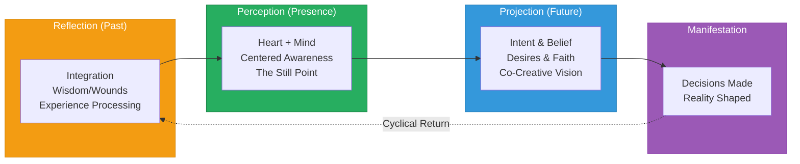

# Consciousness Compass (Revised Draft)

> **"Love is OUR Belief, Truth is OUR Intent, Freedom is OUR Faith, IDEAS are OUR Compass"**
>
> A "WE" Focused Framework for Coherent Co-Creation with the Universe

---

## Overview

The Consciousness Compass is a philosophical system for understanding human consciousness, guiding coherent action, and engaging in healthy co-creation with the universe. It maps the continuous dialogue between self and cosmos — honoring both our expression outward and our reception of universal wisdom.



---

## Core Philosophy

| Pillar | Meaning |
|--------|---------|
| **Love is OUR Belief** | The foundation of all creation rests on unconditional love as the core belief system |
| **Truth is OUR Intent** | All actions and creations are guided by truthful intention |
| **Freedom is OUR Faith** | Faith expressed through sovereign, unrestricted choice |
| **IDEAS are OUR Compass** | Thoughts and concepts guide navigation through reality |

---

## Key Revisions in This Draft

This revision addresses several refinements to better serve the purpose of **coherent co-creation with the universe**:

| Original | Revised | Reason |
|----------|---------|--------|
| Create / Consume | Express / Receive | Both flows are sacred in co-creation |
| Fight / Flight | Engage / Allow | Removes adversarial relationship with reality |
| Left Brain / Right Brain | Analytical / Holistic | Function over outdated neuroscience |
| State / Church | Structure / Meaning | Less politically charged language |
| Linear flow only | Cyclical return loop | Reality is continuous dialogue |
| Shadow quadrant pathologized | All quadrants have conscious/unconscious forms | Honors the full human experience |

---

## Documentation

| Document | Description |
|----------|-------------|
| [Ideology & Philosophy](./00-ideology.md) | Deep dive into the philosophical foundation |
| [Quadrant System](./01-quadrant-system.md) | Understanding the four zones of consciousness |
| [Energy Dynamics](./02-energy-dynamics.md) | Express vs Receive, Engage vs Allow |
| [Integration Model](./03-integration-model.md) | Heart-Mind integration, Faith axis, and the Cyclical Return |

---

## Quick Reference

### The Time Axis (Horizontal)

```
PAST ──────────► PRESENT ──────────► FUTURE
(Reflection)     (Perception)        (Projection)
     ▲                                    │
     │                                    │
     └──────── Cyclical Return ◄──────────┘
```

### The Flow Spectrum (Vertical)

| Express (Outward Flow) | Receive (Inward Flow) |
|------------------------|----------------------|
| Giving to the world | Receiving from the world |
| Active participation | Receptive participation |
| Manifesting vision | Integrating wisdom |
| Analytical thinking | Holistic thinking |
| Engage energy | Allow energy |
| Directed intention | Open awareness |
| Truth-seeking | Love-embodying |

**Both flows are sacred.** The universe breathes in and out. Coherence requires honoring both the exhale (expression) and the inhale (reception).

### The Central Integration

```
┌─────────────────────────────────────────────────┐
│           Our Heart Projects                     │
│                   +                              │
│           Our Minds Reflection                   │
│                   =                              │
│           Centered Awareness                     │
└─────────────────────────────────────────────────┘
                    │
        ┌───────────┴───────────┐
        ▼                       ▼
   Expression              Reception
   (Outward)              (Inward)
        │                       │
        └───────────┬───────────┘
                    ▼
              Co-Creation
                    │
                    ▼
         ┌─────────────────────┐
         │      Decisions      │
         │    Reality Shaped   │
         └──────────┬──────────┘
                    │
                    ▼
            Cyclical Return
          (New Experience to
           Integrate & Reflect)
```

---

## The Dialogue of Co-Creation

Unlike models that emphasize projection alone, the Consciousness Compass honors the **two-way dialogue** between self and universe:

### Your Voice to the Universe (Expression)
- Intent and vision projected outward
- Actions and creations manifested
- Truth sought and shared

### The Universe's Voice to You (Reception)
- Wisdom arising from experience
- Synchronicities and guidance received
- Love embodied and felt
- Course corrections honored

**Coherence** emerges when both voices are heard and integrated.

---

## Application

The Consciousness Compass serves as a navigation system for:

1. **Self-Understanding** — Where am I in the cycle? Am I expressing or receiving? Conscious or unconscious?
2. **Balance Assessment** — Have I been over-expressing without receiving? Over-receiving without expressing?
3. **Shadow Integration** — What unconscious patterns are ready for awareness?
4. **Co-Creative Alignment** — Is my intent aligned with my belief? Am I listening as well as projecting?
5. **Coherence Check** — Am I in dialogue with the universe, or monologue?

---

## The Living Framework

This compass is not static — it is a living tool for navigating consciousness in partnership with the universe. As we grow individually and collectively, the framework reveals deeper layers of understanding.

> *"We are neither separate creators imposing will upon reality, nor passive receivers buffeted by fate. We are co-creators in continuous dialogue — expressing our truth, receiving universal wisdom, and dancing the spiral of becoming together."*

---

*Navigate with Love. Express with Truth. Receive with Openness. Honor the Cycle.*
